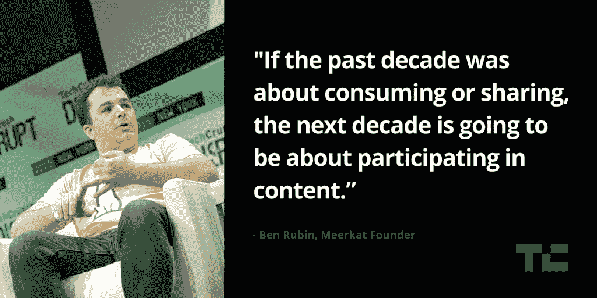

# Meerkat 创始人收到 Twitter TechCrunch 的封杀电话

> 原文：<https://web.archive.org/web/https://techcrunch.com/2015/05/06/meerkat-founder-on-getting-the-kill-call-from-twitter/>

Meerkat 创始人本·鲁宾(Ben Rubin)批评 Twitter 在关闭其社交图之前只给了直播初创公司两个小时的通知。鲁宾在 Disrupt NY 的舞台上与 TechCrunch 的 Josh Constine 交谈时说:“大平台应该从勇气而不是恐惧中获得领导力。”

他补充说，接到 Twitter 的电话，仅仅提前两个小时通知更换产品，“糟透了”

“你接到这个电话，他们说‘嘿，我们真的很喜欢这个产品，但是……根据规则，你不能以竞争的方式使用图表，我们刚刚推出了 Periscope 的测试版，我们将关闭它’。”

“那天是周六，所有团队成员都回到办公室准备投入工作，”他补充道。

鲁宾并没有批评 Twitter 做出的实际决定，指出它只是遵循自己的规则，关闭对竞争对手产品的访问。作为背景，Twitter 收购了直播初创公司 Periscope，并在 Meerkat 推出自己的应用程序后不久推出了测试服务。

在 Periscope 到来之前，Meerkat 在苹果将其列入最佳新应用类别后获得了关注和关注。但事实证明，即使是这种青睐也是变化无常的——苹果随后利用这一类别来推广闪亮的新直播应用 Periscope。这就是科技的飞速发展。

虽然 Meerkat 在获得早期财富后毫无疑问地下降了应用程序下载排名——鲁宾证实舞台下载率确实下降了——但他透露，它现在有大约 200 万用户。他否认了直播市场将无法容纳一个以上大玩家的观点。

“我们团队认为有一种新的媒介叫做一对多同步。旧的媒介或者我们现在知道的是一对多异步。还有脸书、Twitter、Instagram、YouTube、Yik Yak、Snapchat Stories……因此，在一对多异步的情况下，有许多不同的通信产品，如果说 Twitter 不能因为你在你的脸书上发布状态而存在，那就太可笑了。或者 Instagram 不能存在，因为你在你的脸书上发布照片。

“说一对多同步中只有一个赢家是荒谬的。因为那里会有多种产品，就像我们在一对多异步中看到的一样。”

“灵媒——他们的工作是支持自我表达，”他补充道。“如果你观察一对多同步，就会发现有抽动，仅此而已。游戏垂直市场上有一家 10 亿美元的公司，仅此而已。剩下的就是广播和电视直播了。”

鲁宾表示，Meerkat 打算在直播领域实现差异化，他称之为“多对一”，而不是“一对多”，就像 Periscope 和 Twitter 等竞争产品一样。他对猫鼬的看法是参与和合作。

“我们认为我们的产品是一种多对一参与的产品。即使你现在打开它，你会看到观众在内容的前面，而不是在内容的后面。我们认为，当我们改变内容的类型时，媒体将会取得成功——内容的类型也应该改变，因为这是直播，”他说。

“当你让观众参与到内容中，而不是消费时，你就可以改变内容。如果说过去十年是消费或分享，那么未来十年将是参与内容的十年。”

“我们刚刚推出了一个表情符号功能，评论就在那里，所以你可以进行对话，我们还将推出更多的协作流媒体内容，”他补充道。

鲁宾还暗示了他对直播商业模式的长期愿景——超越三到五年:即创造一种人们愿意付费的媒体，因为它感觉如此身临其境，并为他们提供他们在其他地方无法获得的互动选项。

不过现在， [Meerkat 正在推出一个开发者平台和 API](https://web.archive.org/web/20230214173642/https://techcrunch.com/2015/05/06/meerkat-api/)，这样局外人就可以为 Meerkat 建立配套工具。

“当我们作为观众开始参与内容时，我们会有更多的情感承诺，与内容的情感联系……从长远来看，当格式演变为其他东西(意味着人们愿意付费)时，这一点最终会实现，”他说。

“当你参与其中时，这种形式将会非常令人兴奋，而且它是以高质量的制作方式制作的，你会真正为之付费……当它是高质量的制作方式时，我可以感觉到我实际上就在那里，这是一个我们还没有谈到的虚拟现实的整个垂直领域。我可以感觉到我真的在那里，我可以改变他们的内容，我想你会为此付出比每次观看多得多的钱。但我说的不是近期。”

*更多关于 Meerkat 的信息，请查看我们的后续报道:*

" **[Meerkat 推出开发者平台区别于潜望镜](https://web.archive.org/web/20230214173642/https://techcrunch.com/2015/05/06/meerkat-api/)** "