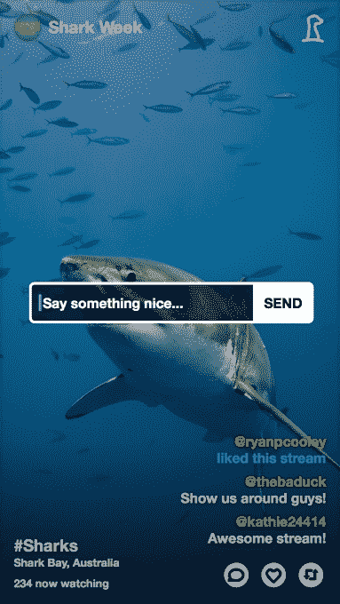

# Meerkat 推出了一款嵌入式播放器，钩住了探索频道的鲨鱼周 

> 原文：<https://web.archive.org/web/https://techcrunch.com/2015/06/26/meerkat-outs-an-embeddable-player-hooks-discovery-channels-shark-week/>

# Meerkat 推出了一个嵌入式播放器，钩住了探索频道的鲨鱼周

直播应用程序 [Meerkat](https://web.archive.org/web/20221207134909/https://beta.techcrunch.com/topic/company/meerkat/) 已经推出了一款嵌入式播放器，因此向该应用程序播放的内容可以嵌入到其他数字服务中并在其上观看。该播放器的第一次实现是在*探索频道*，为其一年一度的鲨鱼周多平台活动——从 7 月 5 日开始。

Meerkat 播放器将用于在该频道的 [DLive](https://web.archive.org/web/20221207134909/http://www.discovery.com/live/) 门户网站上添加幕后内容，作为流媒体内容综述的一部分。鲨鱼周的内容也将通过@SharkWeek 账户向 Meerkat 用户推送，给*探索频道的*节目提供了另一个数字渠道。

流媒体内容 *Discovery* 正在排队制作 Meerkat 也在(如果我可以这么说的话)——鲨鱼周包括对鲨鱼专家的采访，巴尔的摩国家水族馆的现场鲨鱼喂食，与鲨鱼相关的 vox pops，以及一系列与鲨鱼周喜剧演员一起“观看”的观看派对。

快速回顾一下直播应用程序之战: [Meerkat 今年通过搭载 Twitter 网络](https://web.archive.org/web/20221207134909/https://beta.techcrunch.com/2015/03/17/meerkat-and-twitter-the-weasel-and-the-woodpecker/)发布时占了先机。在[之前，Twitter 介入](https://web.archive.org/web/20221207134909/https://beta.techcrunch.com/2015/04/16/twitters-periscope-widens-lead-over-rival-meerkat/#.us1imr:lLQX)，而[开始用自己的应用 Periscope](https://web.archive.org/web/20221207134909/https://beta.techcrunch.com/2015/04/12/this-stream-aint-big-enough-for-the-both-of-us/) 耀武扬威。提示猫鼬[带着](https://web.archive.org/web/20221207134909/https://beta.techcrunch.com/2015/04/16/twitters-periscope-widens-lead-over-rival-meerkat/#.us1imr:lLQX)[的撞击](https://web.archive.org/web/20221207134909/https://beta.techcrunch.com/2015/03/30/schrodingers-meerkat/)落回地球。

猫鼬还没有认输。它打得更聪明，也必须对抗重量级的 Twitter。在这场大卫和歌利亚之战中，Meerkat 的武器是通过公共 API 的开放性。开发者可以将 Meerkat 集成到他们的服务中——这就是为什么已经有一架 Meerkat 无人机在工作，而不是潜望镜无人机。

这家初创公司早在 5 月份就发布了官方公共 API，但已经允许开发者私下参与。Meerkat API 允许开发者获取所有当前或预定流的数组，以及评论和观察者等细节。新的嵌入特性消除了更多的摩擦，鼓励开发人员参与进来。

联合创始人本·鲁宾说，Meerkat 想要“一个很好的例子”来实现嵌入功能，因此推出了 *Discovery* 。他补充称，“其他合作伙伴对此非常感兴趣”。还不知道还有谁上钩了。

Meerkat 也没有透露活跃用户，但 Rubin 重申，5 月是其流量最高的一个月，是 3 月份的 3 倍多。