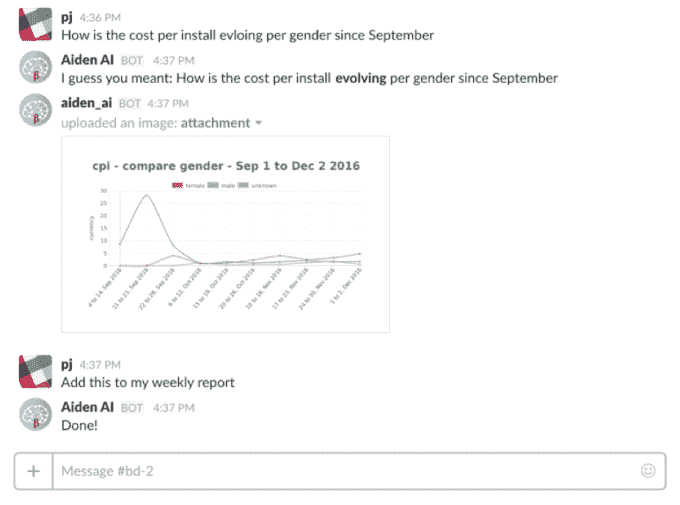

# 认识一下 Aiden，你的新人工智能同事 

> 原文：<https://web.archive.org/web/https://techcrunch.com/2016/12/05/meet-aiden-your-new-ai-coworker/>

比方说，你想知道你的数字营销活动在哪里最受欢迎:Twitter 还是脸书。你可能需要检查你的社交账户和谷歌分析的几个仪表盘来汇编数据——即使你得出结论，一个平台优于另一个平台，下周随着用户将注意力转移到 Instagram，这种情况可能会发生变化。

“作为一名营销人员，你会在支离破碎的仪表盘上花费大量时间。人们每周花将近 10 个小时搜索数据。我们发现的另一点是，60%的广告支出实际上被浪费了。如今营销人员面临的两大挑战是:a)我的数据中什么是重要的，b)我下一步该做什么，”皮埃尔-让·卡米莱里说，他与玛丽·奥特蒂尔共同创立了[艾登](https://web.archive.org/web/20230107153758/https://aiden.ai/)。

艾登是解决这种营销浪费的人工智能解决方案。它旨在让人感觉就像另一个同事一样，依靠自然语言处理来使交流变得轻松愉快。Aiden 从多个仪表板中查询数据，并快速将其编译成精美的图表，便于查找和消化。营销人员可以在他们所在的地方见到艾登，无论是 Slack、短信还是电子邮件。

Outtier 在数字营销领域工作了八年，因此她直接了解管理营销数据是多么令人沮丧。她说，Aiden 可以帮助保持对大量数据集的掌控，甚至可以在耗尽营销预算之前发现市场的变化。

“我们还将插入许多其他工具，因此我们有一个整体视图。艾登打算建议将部分预算从这个渠道转移到那个渠道。我们的目标是让 it 部门提出随时间变化的建议。”

尽管许多人工智能解决方案的目标是成为普通的个人助理，可以查看天气和管理日历，但 Aiden 特别适合营销，所以它可以找出营销技巧——即使与 Aiden 聊天的同事没有放弃特定的术语。

艾登还使用模式识别来检测变化并提出建议——因此，如果你公司的网站从媒体文章中获得了大量流量，艾登会注意到这种变化，并建议开展营销活动，包括媒体提及。

Aiden 目前以订阅模式提供，明年将推出企业级。

Camillieri 解释说:“今天，许多营销支出根本没有优化。"艾登将在这方面提供巨大的帮助."

**战场判官 Q & A(为清晰起见进行了浓缩和编辑):**

**您能简单介绍一下您的市场路线吗？**

除非广告能给他们带来更多业务，否则很难让广告公司付钱。大多数市场分析师用 Aiden 可以管理 50 个客户，而不是 10 个客户。在我们私人测试版的客户样本中，代理商节省了时间，增加了更多的客户。

**到目前为止，你已经构建了多少个集成？**

我们目前在做两件事:广告商的脸书和谷歌分析。我们和我们的客户坐下来，问:“你如何使用它，你需要什么？”现在的问题是根据他们的需求进行优先排序。

**核心产品是更好的仪表板还是优化支出？**

它是帮助你更好地看透数据的混合体。最重要的是，它能握住你的手。这是预测，也是可视化。

你现在有多少客户？

我们在六家公司。他们都在数字营销上花费；他们中的一些人每月花费 8 万美元，一些人每月花费 1 万美元。我们的目标是 2017 年的企业。

**你们的公开发布会是什么时候？**

接下来的两个月里。我们受到缺乏资源的限制，但我们很快就要结束一轮。

**什么是 AI 元素？**

我们想做的第一件事是利用玛丽的专业知识，并将其应用到算法中。她知道如何优化脸书的竞选活动。我们试图预测我们认为将要发生的事情。要做好这一点，我们需要强大的营销领域专业知识和技术专业知识。

**你需要多少数据才能做推荐？**

有些事情没那么难。我们不需要太多时间。花费的钱等于收集的数据。如果你不花很多钱，我们更难拿到那些数字。