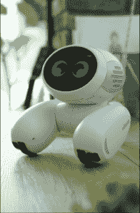

# 认识一下来自北京初创公司 roo bo TechCrunch 的人工智能宠物机器人 Domgy

> 原文：<https://web.archive.org/web/https://techcrunch.com/2016/06/16/meet-domgy-an-ai-pet-robot-from-beijing-startup-roobo/>

总部位于北京的快速增长的硬件和人工智能初创公司北京智能管家科技有限公司(ROOBO)今天推出了其最新产品的原型，即一款名为 Domgy 的“宠物机器人”。

对于不熟悉的人来说，ROOBO 是一个语音控制的儿童教育机器人 [Pudding](https://web.archive.org/web/20221006175028/http://z.jd.com/project/details/24370.html?from=cainixihuan) 的幕后公司。布丁被用来教孩子们词汇、地理、笑话等等。该公司还制造 Idealens 虚拟现实耳机、Skyseries 无人机和 Runbone 耳塞。

自 2014 年成立以来，北京智能管家科技有限公司已发展到 300 名员工，拥有 7 个全球办事处，其中一个位于西雅图。该公司此前筹集了首轮风险资金，但拒绝透露他们筹集了多少资金，他们的投资者是谁，或他们迄今为止创造了多少收入。

据 ROOBO 营销总监 Anthony Chen 介绍，该公司雄心勃勃的新产品 Domgy 旨在成为“让家庭生活更轻松、更有趣的家庭朋友”。

这个名字暗示了一种犬科动物的外形，但 Domgy 并不是艾博的新变种。(还记得索尼的机器狗吗？)

相反，Domgy 会打滚，而不是用四只脚走路。它可以通过家中的普通障碍，或者走下一两步浅台阶，但它不适合通过崎岖或陡峭的地形。有用的是，当电池电量变低时，Domgy 会自动回到充电站。

一个圆形的触摸屏表面展示了 Domgy 的大而生动的眼睛，并作为 Domgy 应用程序菜单和其他设置的接入点。该设备也可以通过智能手机控制。

多姆吉的瞳孔转向心形来表达爱和幸福，它咯咯地笑着。它还可以咆哮、哀鸣或以良好的情绪范围做出反应，例如，如果它被推搡或大喊大叫。

Domgy 使用 ROOBO 专有的人工智能和面部识别系统来识别家庭成员，问候和招待他们，并遵守他们的规则。

*ROOBO 的人工智能宠物机器人 Domgy。*

虽然 ROOBO 创造了支持 Domgy 的人工智能，但该设备及其操作系统最初是由韩国创新的 Play Lab 设计的。据 ROOBO 高管称，IPL 将继续为 Domgy 开发软件开发套件和操作系统，而 ROOBO 将制造宠物机器人，并为它们开发进一步的人工智能和内容。

ROOBO 也是 IPL 的投资者，该公司早些时候由韩国政府资助。

陈说，Dogmy 头上一个 5 米长的摄像头还可以充当某种监视器，当它在家里遇到陌生人时会提醒家人，这使它成为一个“好警卫”。

ROOBO 打算通过中国的众筹网站(包括天猫、京东和美国的 Indiegogo)提供 Domgy 的预购，目标是在 2016 年底前向早期支持者发货。

用户可以决定他们希望 Domgy 的声音是男性还是女性。他们还可以命令 Dogmy 唤醒或进入睡眠模式，播放歌曲，讲故事，或打开和关闭兼容的智能家居设备。

该公司正在与迪士尼英语和其他内容提供商以及语音识别系统制造商科大讯飞集团合作，以在 Domgy 上实现不同的功能。

这个宠物机器人的价格还没有确定。但陈说，该公司打算将硬件成本保持在较低水平，这样美国和其他主要市场的普通家庭就能轻松负担得起。

陈说，北京智能管家将通过其基于 Android 的平台创造额外收入，用户可以在这个平台上购买新的教育课程、音乐、有声书、应用程序或游戏。

陈说，机器人充满电后可以使用 4 到 6 个小时，最高时速可达 5 公里。“这不是一辆赛车，它也赶不上你的其他宠物。”

然而，当人类不在的时候，Domgy 可以逗逗狗或猫，并且可以通过面部识别出它们是家庭成员。
 *更新:这篇文章更新了韩国创新游戏实验室与 ROOBO 合作创建 Domgy 的新信息，以及两家公司未来打算如何合作。*