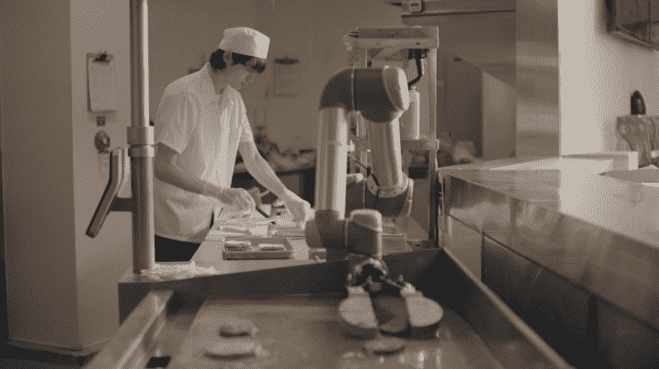

# 来认识一下 Flippy，一个来自 Miso Robotics 和 CaliBurger  的汉堡烧烤机器人

> 原文：<https://web.archive.org/web/http://techcrunch.com/2017/03/07/meet-flippy-a-burger-grilling-robot-from-miso-robotics-and-caliburger/>

烙牛肉饼是一项又热又油腻的工作。滑倒、绊倒、烧伤和割伤是与工作相关的常见危险。但是全球对汉堡的需求是巨大的。2016 年，顶级汉堡连锁店的年销售额超过了 755 亿美元。为了帮助人类厨师远离伤害，同时满足我们对汉堡的集体胃口，总部位于帕萨迪纳[的味增机器人](https://web.archive.org/web/20230404233001/http://misorobotics.com/)推出了一款名为 Flippy 的新“机器人厨房助手”。

Miso Robotics 首席执行官兼联合创始人大卫·济托表示，“我们专注于使用人工智能和自动化来解决餐厅和食物准备中的高痛点。这是围绕烤架、油炸锅和其他准备工作如切洋葱的枯燥、肮脏和危险的工作。这个想法是为了帮助餐馆提高食品质量和安全性，而不需要对厨房进行重大的重新设计。

Miso Robotics 的部分资金由快速服务餐厅[Cali burger](https://web.archive.org/web/20230404233001/https://caliburger.com/)提供，该餐厅制作并销售“加州风味汉堡”，目前在 12 个国家开展业务。Canyon Creek Capital 和个人天使投资者也出资帮助 Miso Robotics 起步。

Miso Robotics 的所有员工在 Flippy 的原始设计之前和工作期间都在 CaliBurger 厨房担任烧烤厨师。这位首席执行官说，不管有没有油嘴滑舌，到烤架后面烹饪是济托工作的一部分。现在，CaliBurger 已经承诺至少在未来两年内，在其 50 家餐厅中使用 Flippy。该公司表示，它已经在帕萨迪纳的一家餐厅测试 Flippy。

这种 Flippy 机器人采用了一种相对较小的轮式推车的形式，配备了一个 6 轴机械臂和 Miso Robotics 所谓的“传感条”。它可以安装在任何标准烤架或油炸锅的前面或旁边。它从热传感器、3D 传感器和不同的机载摄像头获取数据，以感知其环境。将门票从柜台送回厨房的数字系统给 Flippy 下达命令。

*机器人对烤架的观察。*

在其他功能中，Flippy 抓取未包装的汉堡肉饼，将它们移动到热烤架上的位置，跟踪每个汉堡的烹饪时间和温度，然后提醒人类厨师何时该涂抹奶酪或其他配料。Flippy 装汉堡，但不包装它们或添加最后的点缀，如生菜、西红柿、鳄梨或餐馆的招牌酱。

与其他制作汉堡的机器人不同，包括那些由 [Momentum Machines](https://web.archive.org/web/20230404233001/https://www.crunchbase.com/organization/momentum-machines) 制造的机器人，Flippy 由 Miso Robotics 的人工智能软件控制。人工智能和机器学习使机器人厨师能够学习制作新的食物，适应餐厅的季节性菜单变化。

一系列不同的工具，如可拆卸的夹子、钳子和刮刀，帮助 Flippy 烹饪定制的汉堡，并保持烤架顺利运行。气动泵允许机器人更换自己的工具。结合 Miso Robotics 的 AI，随着时间的推移，这一系列工具将允许 Flippy 制作更多的汉堡，包括鸡肉、培根、烤洋葱和其他往往在汉堡餐厅提供的物品。

*一个名为 Flippy 的汉堡烧烤机器人和一名人类厨师一起工作。*

那么，商用厨房的厨师是不是失业了？如果是的话，这将影响到[大约 230 万名受雇的厨师](https://web.archive.org/web/20230404233001/https://www.bls.gov/ooh/food-preparation-and-serving/cooks.htm)，而且往往[工资过低](https://web.archive.org/web/20230404233001/http://laborcenter.berkeley.edu/fast-food-poverty-wages-the-public-cost-of-low-wage-jobs-in-the-fast-food-industry/)。济托承认，像 Flippy 这样的商业服务机器人正在处理比以往任何时候都更复杂的任务，并且似乎准备取代在工作中执行最重复性任务的人。

但与此同时，这位首席执行官说:“品尝食物和创造食谱永远是厨师的职责。餐馆是我们相互交流的聚集地。考虑到食物的社会方面，人类将始终在业务的招待方面发挥非常关键的作用。我们只是不知道这个行业将会出现什么样的新角色。”