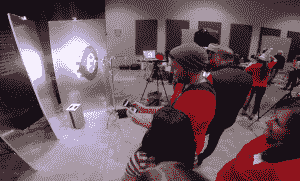

# 见见 Jeremy Cowart，一位用高科技光环和手机拍摄无家可归者的摄影师

> 原文：<https://web.archive.org/web/http://techcrunch.com/2014/12/24/meet-jeremy-cowart-a-photographer-who-snaps-the-homeless-with-a-high-tech-light-ring-and-cellphone/>

# 见见杰里米·科瓦特，一位用高科技光环和手机拍摄无家可归者的摄影师

一些人看起来不再无家可归。[杰瑞米·科瓦特](https://web.archive.org/web/20230129070539/http://jeremycowart.com/humanitarian/help-portrait-3/)直视着它，带着善意。

科瓦特是纳什维尔的一位名人摄影师，他创办了[帮助肖像](https://web.archive.org/web/20230129070539/http://help-portrait.com/)，这是一项全球性活动，邀请摄影师拍摄和印刷无家可归者和有需要的人的肖像，以帮助人们“微笑，走到一起，记住”最后一次活动于 12 月初举行，在全球范围内产生了 40，000 多幅肖像。

Cowart 已经开始使用移动摄影工具——一圈可编程 LED 灯和一部 iPhone——来拍摄他所在城镇的无家可归者。Cowart 的目标是通过拍摄和打印需要帮助的人的美丽肖像，给无家可归者一个面子。

“2008 年，我决定做一些更有意义的事情，”他说。“我只是去了当地，在纳什维尔为他们拍摄了一组照片。我意识到这可能是一件更大的事情，所以我在社交媒体上发布了这个消息。”

2009 年，数十个国家的数千名摄影师做出了回应。最后一次活动汇集了来自 28 个国家的 10，000 名志愿者。

今年，他更新了他的装置，创造了一种稍微不那么具有侵犯性的摄影风格。

“有时候一只又大又肥的 DSLR 会让人望而生畏，”他说。“我只是觉得缩减规模去做一些不那么吓人的事情会很有趣。”

科瓦特用无线灯泡解决方案 [LIFX lights](https://web.archive.org/web/20230129070539/http://lifx.co/) 制作了一个定制的光环。这使得他可以通过手机控制灯光的亮度和颜色。然后，他通过环拍摄肖像。因为他想让事情尽可能快地进行，所以他将照片发送到 Lightroom，甚至直接发送到他在现场的 Epson 打印机。

“我们的目标是不让人们等待，在不牺牲质量的情况下尽可能快地完成，”他说。

他还添加了一个 [OlloClip](https://web.archive.org/web/20230129070539/http://www.olloclip.com/) 来将 iPhone 的 35 毫米镜头变成 75 或 100 毫米。

科瓦特还创建了摄影请求网站 [OKDoThis](https://web.archive.org/web/20230129070539/https://techcrunch.com/2014/06/17/okdothis-tells-you-what-to-photograph-in-the-hopes-of-ending-redundant-latte-pictures/) ，他预计明年，也就是 2015 年 12 月的第一个周六，会有更多的人来参加。

“我在纳什维尔开始这项工作，现在这项工作正在 70 多个国家和美国的每个州开展，”科瓦特惊讶地说。他说，对于一个熟悉拍摄名人魅力的摄影师来说，拍摄普通人并给他们带来骄傲、美丽和关注本身就是一种回报。