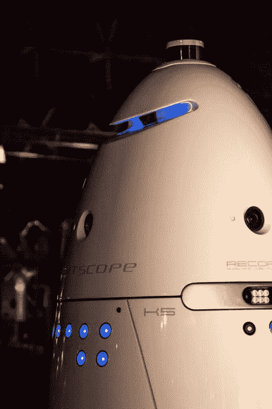

# 认识一下 Knightscope 的打击犯罪机器人 

> 原文：<https://web.archive.org/web/https://techcrunch.com/2015/12/31/meet-knightscopes-crime-fighting-robots/>

# 认识一下 Knightscope 的打击犯罪机器人

机器人可能有一天会站起来接管一切，但山景城一家名为 [Knightscope](https://web.archive.org/web/20221207075449/http://www.knightscope.com/about.html) 的初创公司开发了一系列打击犯罪的机器，希望能保护我们的安全。

Knightscope 的 K5 安全机器人类似于 R2D2 和《神秘博士》中的 Dalek 的混合体，这些机器人背后的系统有点奥威尔式。K5 拥有广播和精密的监控能力，当他们在空旷的地方、大厅和走廊里巡视可疑活动时，可以控制公共场所。

这些装置使用 360 度高清和弱光红外摄像机将他们看到的内容上传到后端安全网络，内置麦克风可用于与路人交流。音频事件检测系统还可以检测到打破玻璃等活动，并向系统发送警报。

商场和写字楼也开始雇佣 K5 部门作为安保助理。Knightscope 不能说出名字，但告诉 TechCrunch，机器人目前正在硅谷的许多科技公司和一家购物中心使用。

联合创始人 Stacey Dean Stephens 曾是一名执法人员，他提出了建立一个预测网络的想法，以防止使用机器人进行犯罪。到目前为止，他和他的联合创始人 William Li 已经从柯尼卡美能达(Konica Minolta)和其他人那里筹集了近 1200 万美元的资金来发展这个想法。

虽然 Knightscope 认为其机器人不会在不久的将来取代商场警察或保安，但该公司确实将它们视为人类安全团队的助手。这家初创公司目前以每小时 6.25 美元(或低于最低工资)的价格出租每个 5 英尺高、300 磅重的 K5 单元。然而，青少年或其他想踢或推机器人的人可能会震惊地发现，机器人可以和他们说话，用电影捕捉他们的行为，并在幕后提醒当局。

当然，这些机器人不仅仅是成为我们未来的安全部队。Stephens 邀请我去 Knightscope 总部，看看该公司正在开发的集成安全网络的幕后情况。根据斯蒂芬斯的说法，这个网络能够根据机器人的观察实时监控和报告公共场所的可疑活动，并可能用于预测紧张和暴力局势(甚至可能是大规模枪击事件)并迅速采取行动。

看看顶端的斯蒂芬斯幕后采访视频，更好地了解这些机器人的能力。