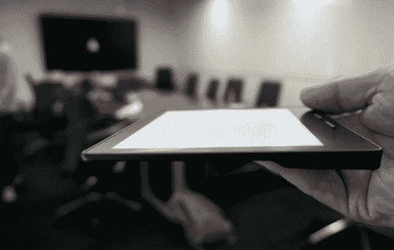

# 见见 Oasis，亚马逊更小、更轻、更便携的 Kindle 

> 原文：<https://web.archive.org/web/https://techcrunch.com/2016/04/13/meet-oasis-amazons-smaller-lighter-grippier-kindle/>

# 见见 Oasis，亚马逊的更小、更轻、更小巧的 Kindle

与之前的报道一致，亚马逊的 T2 Kindle Oasis T3 是迄今为止最小最轻的 Kindle，并配有一个握持手柄。

亚马逊的杰夫·贝索斯[上周调侃](https://web.archive.org/web/20221207145941/https://twitter.com/JeffBezos/status/717033781589204992?ref_src=twsrc%5Etfw)一款“全新、顶级”的 Kindle，而中国网站[Tmall.com](https://web.archive.org/web/20221207145941/http://tmall.com/)在周一意外公布 Kindle 最新成员的细节时，让电子阅读器世界一片混乱。

该网站很快关闭了该页面，但在此之前，科技出版社得到了风声。

最新的 Kindle 更接近真正的书籍感觉，其最薄处只有 3.4 毫米，新的单侧手柄旨在让你在阅读时感觉像是拿着书脊。

左撇子藏书家可能会担心一个新的背部凸起，似乎是为所有的右撇子设计的，如上图所示，但实际上你可以翻转绿洲，从任何一只手握。

新设备上还有两个按钮，用于前后翻页。在几代人之前远离键盘和按钮之后，加入按钮很奇怪。但是，根据亚马逊的说法，人们只是喜欢按钮。所以他们回来了。

如果您愿意，您仍然可以使用触摸屏翻页。亚马逊说这是“关于选择的一切。”

Oasis 明显比 Voyage 小，总重量为 4.6 盎司，大约相当于一副纸牌的重量——这是一个便于携带而不会增加太多负担的重量——比任何其他 Kindle 轻 20%。

更薄更轻的设计仍然保持了高分辨率 300 ppi 的 Paperwhite 显示屏，并配备了更清晰更明亮的前置灯，以改善夜间阅读。灯光也在侧面，而不是像 Voyage 那样在底部，以获得更亮、更均匀的屏幕照明。

[早先的传言](https://web.archive.org/web/20221207145941/http://www.wsj.com/articles/amazon-to-release-new-kindle-with-rechargeable-protective-case-1459888870)也提到了新绿洲的太阳能电池盒。虽然这被证明是一个红鲱鱼，但它确实有一个更持久的双电池系统。更小的内置电池可以持续两周，附带的充电盖可以为最新的 Kindle 增加长达两个月的连续充电时间。

封面将在核桃，梅洛或黑色，可以充电的同时，你正在充电你的 Kindle。Oasis 仍将显示亚马逊的标志性 Bookerly(衬线字体)或 Amazon Ember(无衬线字体)，并将调出您的 GoodReads 列表。

重新设计的 Kindle 商店也将帮助新的 Kindle 阅读器找到并定义他们将来想读的书的类型。我们现在知道新的 Kindle 是什么样子的了，但是它还没有公开发售。

亚马逊告诉我，Oasis“很快”就可以购买，这很可能意味着最新版本将在几周内交付。

绿洲也将比早期版本稍微贵一点——航次零售价为 199 美元。WiFi 版的 Oasis 零售价为 289 美元，3G 版的售价为 359 美元。