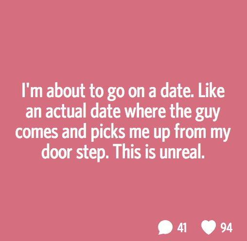

# 见一个技术男，他和那些从纽约飞来见技术男的女人约会过

> 原文：<https://web.archive.org/web/https://techcrunch.com/2014/05/30/meet-one-of-the-tech-dudes-who-dated-those-women-flown-in-from-nyc-to-meet-tech-dudes/>

对于许多人来说，这个想法是令人震惊的——一个在线约会网站——约会圈，从纽约运送女人去和旧金山的技术人员约会。

格雷格·本森是那些技术人员中的一员。他说，在见过那些远道而来的女人后，他就没那么感兴趣了。这位身材魁梧、身高 6 英尺 4 英寸、住在旧金山湾区、实际上想要一段恋情的 34 岁应用程序开发员是一个纸上谈兵。

但是本森，上周末终于见到了这些女人，他说他实际上并不是去约会寻找爱情。“你总有机会遇到某个人，然后完全迷上他。但是长距离不是我想做的事情，”本森说。

本森对他真正想要的东西含糊其辞。有时在我们的谈话中，他在寻找“那个人”，但他会说他“现在只是在寻找乐趣。”这就是这次活动对他的意义。

但是为什么他没有被打动呢？这些女士不仅大老远飞到全国各地来见他，而且据说都是绝代佳人，受过高等教育，多才多艺。其中一个甚至是 T2 的消防员。他停顿了一下，不想承认这一点，然后说，“嗯，只是没有火花。”

根据约会圈的创始人劳伦·凯的说法，甚至让男生承诺出来和这些女生见面也是相当困难的。本森说，他们让他给出了一个铁定的承诺，他一定会出现。

对于女性来说，在出发去旅行之前，她们会收到装满唇膏、避孕套和卸妆水的旅行包。虽然机票可以报销，但他们仍然需要支付自己的酒店和食物费用。

尽管如此，凯和他的团队还是很容易招募到他们。怎么回事？旧金山有太多的男人。[估计](https://web.archive.org/web/20221127234033/http://www.city-data.com/forum/san-francisco-oakland/220829-whats-girl-guy-ratio-sf.html)大约是三个男人对一个女人。尽管如此，对这里男人的抱怨还是很多的。

“SF 就像永不永不着陆。本森说:“你可以在 40 多岁的时候和很多人约会，但很多人都不想放弃。”。

旧金山心理学家克里斯蒂娜·比利亚雷亚尔实际上在她的实践中看到了许多技术专家。她说大多数人都跟她谈论如何与女性约会。

“他们往往没有社会意识来理解问题所在。很多时候，他们缺乏过滤器，或者在约会开始前就在这些约会应用上对女性说不恰当的话。”比如“你真的是 C 罩杯吗？”或者“你有多变态？”对于旧金山的许多单身女性来说，这可能是离家太近的问题。

而且，正如 Kay 之前提到的，男人们也缺乏努力。根据比利亚雷亚尔的说法，这更多的是一代人的事情。

也有可能是许多从事技术工作的人都是在其他社交能力差的人周围社交的；这就是为什么比利亚雷亚尔最终做了大量的性别翻译。“这是一个男性主导的环境，所以他们经常对女性的行为视而不见。”

尽管如此，本森说，他确实感谢这些纽约妇女所付出的努力。但是如果角色互换呢？他承认，如果让他去见纽约的女人，他可能不会这么做。

无论如何，凯想让这种旧金山/纽约朝圣成为一年一度的事情，尽管没有计划运送任何男孩或女孩到纽约做同样的事情。正如她向我澄清的那样，“我们不是一个旅游、双海岸约会网站。”