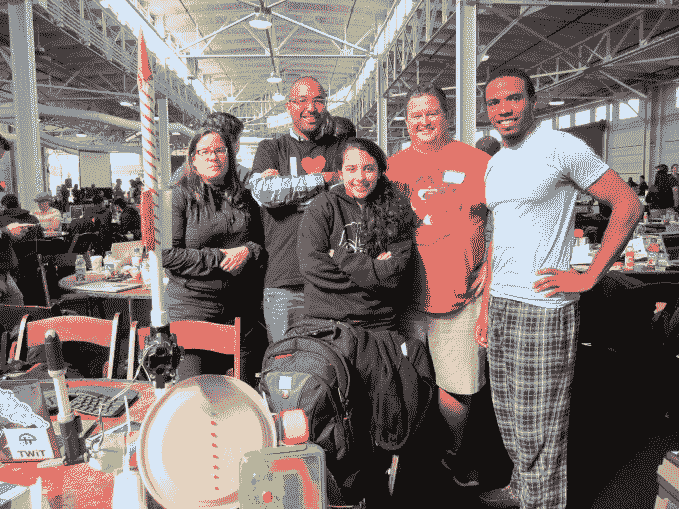
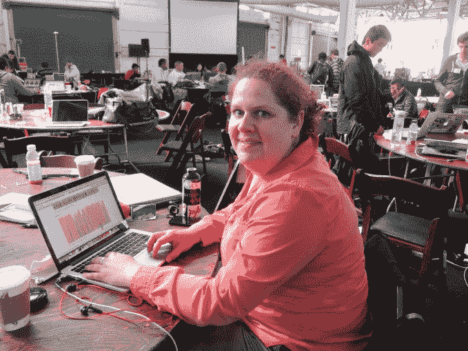
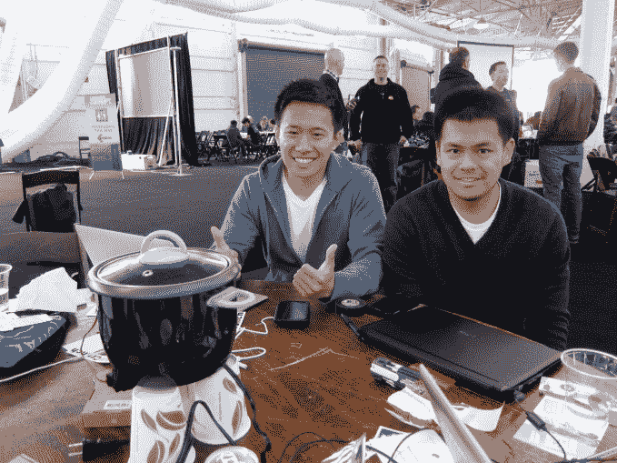
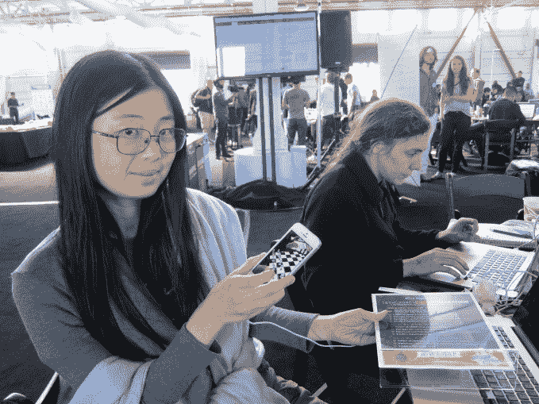

# 在 TechCrunch 上认识一些黑客 Disrupt SF 

> 原文：<https://web.archive.org/web/https://techcrunch.com/2014/09/07/meet-some-of-the-hackers-at-techcrunch-disrupt-sf/>

他们通宵工作，即将在 TechCrunch Disrupt SF 的舞台上亮相。会见一些今年睡眼惺忪(但仍然热情)的黑客，了解他们的项目。

**Brett Stateham，微软黑客团队的一员**

微软黑客团队的一员，从事一个名为 Notifly 的项目。

“我们试图推动 Twitter 标签发射火箭，然后我们想为什么不扩大范围，为什么不能像 Instagram 或脸书一样，这样你就可以监控你何时达到目标，当目标实现时，它会通过多种渠道通知你。所以你可以收到短信通知，还可以激活设备。所以我们要在舞台上发射我们的压缩机火箭。”

“队里有五个人。我能够带来我足够幸运拥有的硬件，我们有人在前端工作，Steven 是我们的 Node.js 向导。因此，我们能够在短时间内构建一个相当完整的解决方案。我们通宵工作，没有一个人睡觉。”

安德烈·巴尔索

正在开发一款名为“离婚破坏”的网络应用，这款应用是基于约翰·戈特曼的研究成果开发的，约翰·戈特曼是一位以研究人际关系和婚姻稳定性而闻名的心理学家。

“我一直在与两个合作伙伴合作，我们所做的是一个网络应用程序，它将根据他们讨论特定话题或争吵时拍摄的视频来评估一对夫妇的关系。然后我们使用一个 API，它会返回视频中看到的情绪，所以我们可以看到它们，像恐惧这样的情绪。所以我们对此进行评估，然后比较两人争吵的视频。然后我们得出他们快乐的频率与不快乐的频率的比值。因此，如果这对夫妇心情好或者应该处理私人事务，我们会从算法中得到一个结果。”

**刘震霆和陈**

“至少对我来说，痛苦点是我真的很喜欢米饭，每天都吃，”刘说。“我在不同的时间下班，如果我下班后做米饭，需要 45 分钟。但是 Rice.io 会让我在下班的时候打开电饭煲，然后我设置流量，它就准备好了。

“我们一起去了加州大学洛杉矶分校。我在圣地亚哥的高通工作，亚瑟在 Altera，所以我们做硬件，他们也做一些软件。”

“我的科技英雄是埃隆·马斯克，我希望他能做他起草的 Hyperloop，因为我在 SoCal 工作，我很想测试一下。”

**Ina Yosun Chang 和 Fren Heintz** 
“我们做了一个叫风险棋的东西。口号基本上不是所有的策略都是市场。基本上，我们建立了一个虚拟现实胸部游戏，人们可以在 Twitter 上与他们的追随者一起玩，也可以与目前不在 Crunchbase 上的人一起玩，所以我们利用这里的 API 赞助商，一起黑客攻击了一种新的基于国际象棋的社交网络。这个想法是，传统的社交网络和认识人的方式不像下棋那样个人化，而且你没有见过很多 Twitter 粉丝。所以你可以和他们下棋，这是一种私人的谈话，你也可以看看他们是怎么想的。和企业家、风险投资家下棋特别有意思。”

“我们就在海湾旁边，晚上的温度是 30 多度。有人留下了吊床，所以我晚上就睡在吊床上。这是一个很好的海湾景观，我们从索玛的这边看到了日落。”