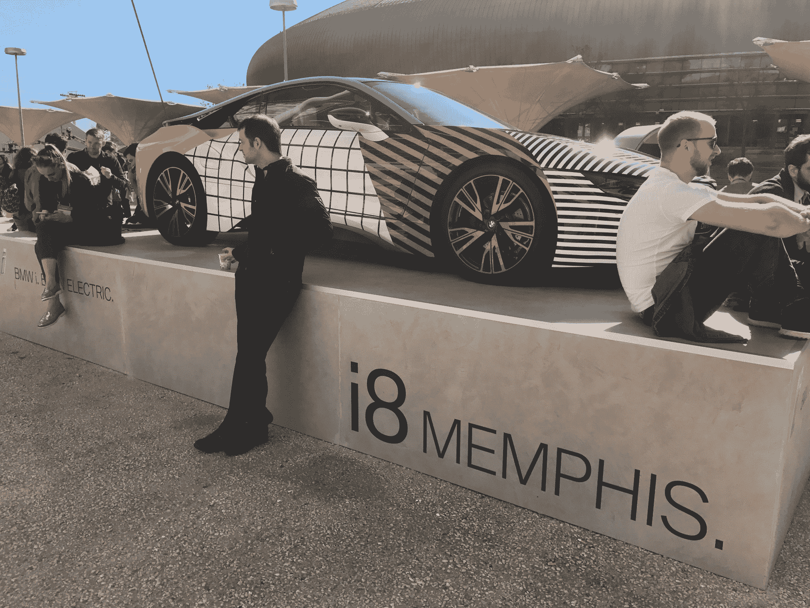

# 在今天下午 4 点的网络峰会上会见 TechCrunch 的 Mike Butcher

> 原文：<https://web.archive.org/web/https://techcrunch.com/2017/11/06/meet-techcrunchs-mike-butcher-at-web-summit-on-tuesday/>

# 在今天下午 4 点的网络峰会上认识一下 TechCrunch 的迈克·布彻

两分钟 TechCrunch！

因为作为一名记者，不可能在网络峰会的所有展台前爬来爬去，所以我认为坐在一个地方和那里的人见面会更容易些！

因此，你将有机会见到我(迈克·布彻)，并在今天下午 4 点的网络峰会上向我推销你的公司两分钟。

相约宝马 i8 汽车，如图所示:

**[请在此输入您的详细信息以注册](https://web.archive.org/web/20221006215156/https://goo.gl/forms/SROnMpqky90z8iEt2)**

我想请你最多跟我谈两分钟，给我你的名片，我们可以稍后跟进。超级简单！

同时，不要忘记[抢到 Techcrunch Disrupt Berlin 的门票！](https://web.archive.org/web/20221006215156/https://beta.techcrunch.com/event-info/disrupt-berlin-2017/?ref=websummitbutcherpost)

谢谢大家！

Mike Butcher，
自由编辑，
[@ Mike Butcher](https://web.archive.org/web/20221006215156/https://twitter.com/mikebutcher)