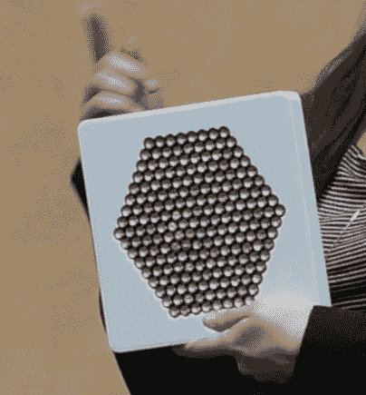
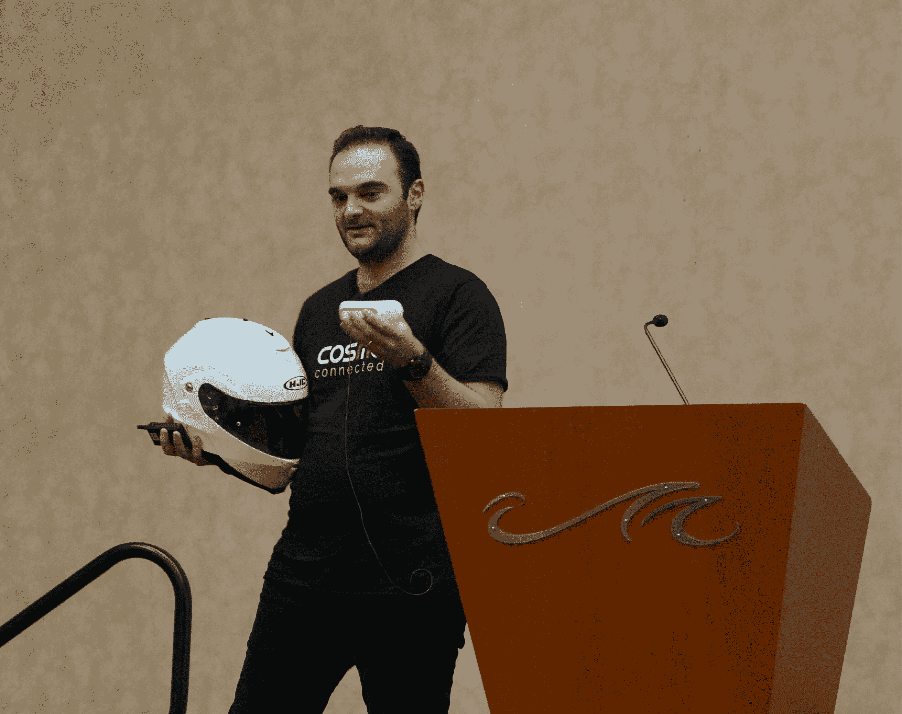
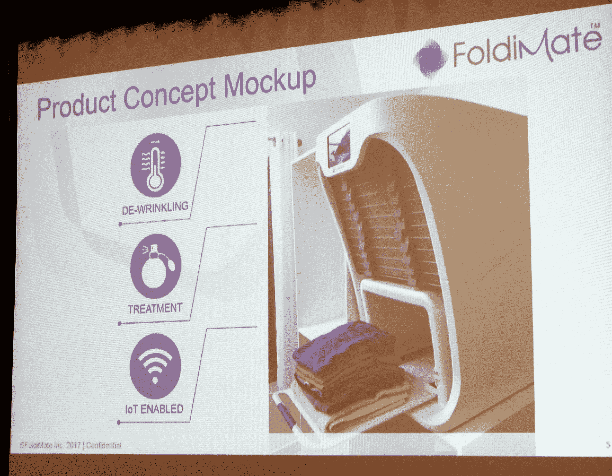
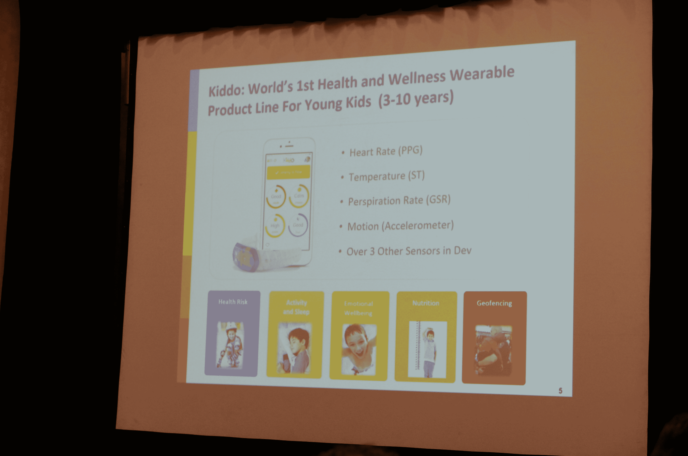
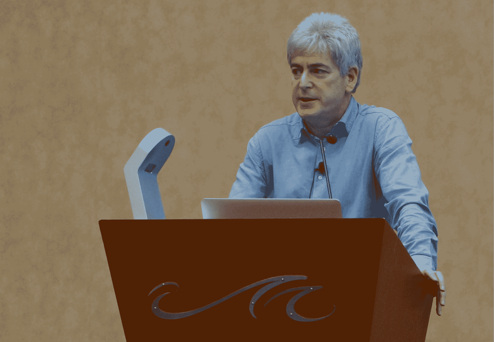
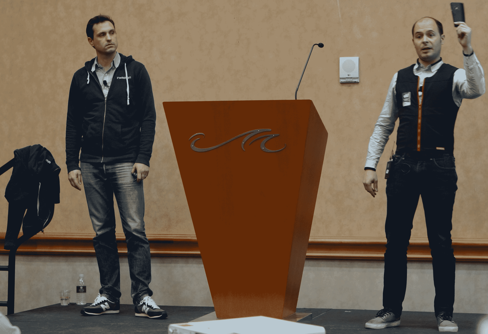
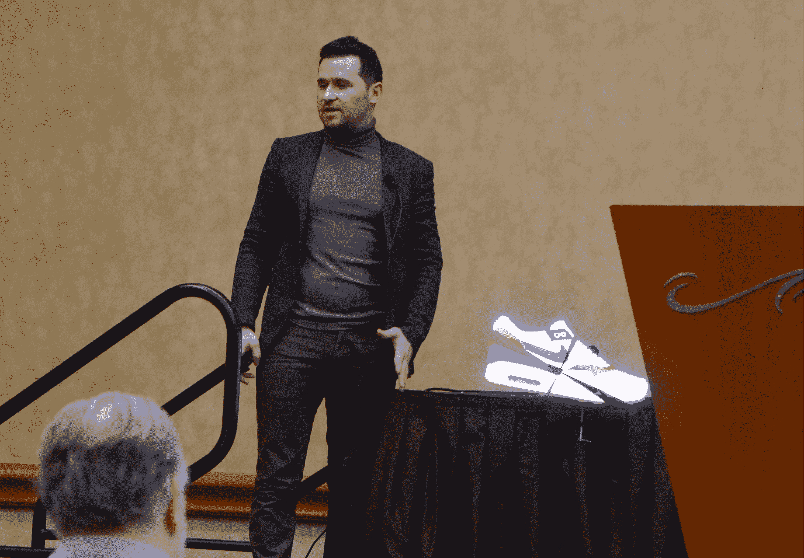
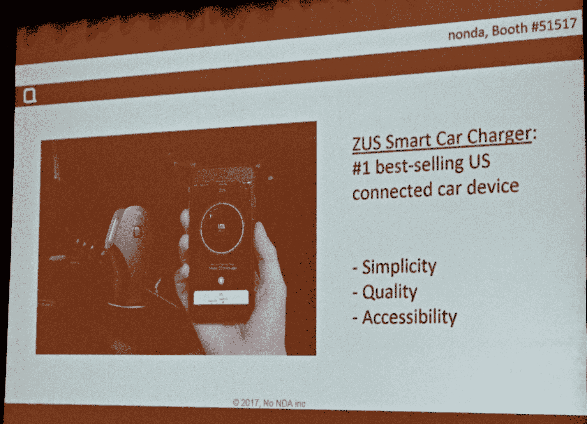
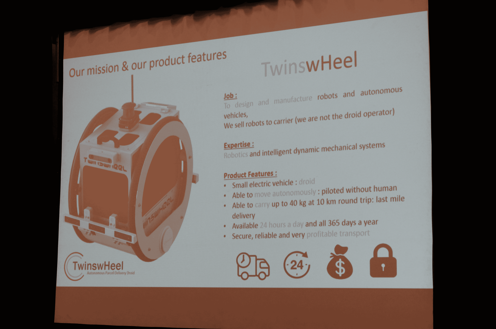

# 在 CES TechCrunch 上的 ShowStoppers' LaunchIt startup 竞赛中与 12 名决赛选手见面

> 原文：<https://web.archive.org/web/https://techcrunch.com/2017/01/04/meet-the-12-finalists-at-showstoppers-launchit-startup-competition-at-ces/>

创业公司正在[接管 CES](https://web.archive.org/web/20221208190935/https://beta.techcrunch.com/2016/01/03/startups-are-taking-over-ces/) 。当消费电子行业的索尼和三星正在[展示他们今天最新最棒的设备时，数百家公司也在前往拉斯韦加斯展示一些漂亮的硬件产品。](https://web.archive.org/web/20221208190935/https://beta.techcrunch.com/events/ces-2017/)

这就是 TechCrunch 组织[硬件战场](https://web.archive.org/web/20221208190935/https://beta.techcrunch.com/event-info/hardware-battlefield-2017/)的原因。这就像 TechCrunch Disrupt 上的战场初创公司竞争，只不过是硬件初创公司。

在过去的五年里，ShowStoppers 还举办了一场创业大赛。我们想看看 LaunchIt 到底是怎么回事，所以我们去看了决赛，并检查了那些公司。事不宜迟，让我们来认识一下 ShowStoppers LaunchIt 创业大赛的 12 名决赛选手 Nonda 赢得了这场比赛。

## 音乐艺术

[ako ustic Arts](https://web.archive.org/web/20221208190935/http://akoustic-arts.com/)是一家六个人的法国创业公司。该公司正在推出一款名为 A 的定向扬声器。它就像一个传统的扬声器，但它创造了一个非常有针对性的声音。你必须站在扬声器前面才能听到声音。

例如，如果你正在看电视，而又不想打扰房子里的其他人，这可能会非常有用。还有其他定向扬声器，但 Akoustic Arts 表示竞争对手的扬声器要大得多。

这家初创公司计划向商场、博物馆、酒店和活动场所出售这种扬声器。例如，你可以站在一幅画前听描述。第二，该公司计划将扬声器与各种原始设备制造商(如电视制造商)进行整合。该公司正在寻求 300 万美元。

Akoustic Arts 已经在与各种合作伙伴进行谈判，如里昂的融合博物馆、Vinci、AccorHotels 等。

我们得到了演讲者的现场演示。这是一个 Mac 迷你设备，它的工作如预期。现在让我们看看他们是否能把一个很酷的产品变成一个利润丰厚的公司。

## Cosmo 已连接

[Cosmo Connected](https://web.archive.org/web/20221208190935/http://cosmoconnected.com/) 是一款连接头盔，适用于自行车手、滑雪者和其他运动爱好者，他们从事的运动和其他活动非常危险，需要保护头部(可能是速降滑板爱好者？).该产品背后的想法是帮助骑手(无论是骑快速摩托车还是小摩托)避免事故。该公司认为，事故的主要原因是由于其他司机没有看到摩托车骑手。

该产品旨在解决两个问题:帮助骑手被看到，以及在不起作用的情况下，提醒紧急响应。因为车手经常在没有踩刹车的情况下减速，头盔包括一个加速度计，当它发现摩托车减速时，就会触发刹车灯。

当你摔倒或发生事故时，内置的陀螺仪会注意到这一点，并在你的手机上触发警报，以检查你是否没事(这也应该有助于避免假警报)。如果骑手在设定的时间内没有响应，应用程序将提醒您的紧急联系人，以及当地政府派遣救护车。

随着时间的推移，该公司计划将其技术推向其他市场。这包括自行车手、滑雪者和其他从事快速和危险活动的运动爱好者。该产品零售价为 99 美元，将于 5 月上市。

## 折叠

[FoldiMate](https://web.archive.org/web/20221208190935/https://foldimate.com/) 是一款衣物折叠机。这基本上就是你需要知道的全部。正如一位同事曾经说过的，许多科技公司正试图用科技取代你的妈妈，这样你就不必做成年人通常会做的事情。

FoldiMate 的概念可以给你的衣服去皱和折叠。该公司 2016 年 6 月的概念视频获得了[大量观看](https://web.archive.org/web/20221208190935/https://www.youtube.com/watch?v=swNgjX0xHC8)。该公司随后设法吸引了 7000 份预购订单。

我们看到了一个原型的视频。你把衣服从上面一件一件地放进机器里。几分钟后，你会看到一堆叠好的衣服。从视频中很难判断这是否是一个实际的工作原型(**更新** : FolidMate 现在已经向我们展示了工作原型。很管用)。FoldiMate 计划 2018 年底出货。

## 好父母的孩子

[好父母](https://web.archive.org/web/20221208190935/http://www.kiddowear.com/)是一家专注于健康和福祉的机器学习初创公司。它的第一款产品是 Kiddo——一款儿童可穿戴设备，本质上是一个贴有可爱贴纸的 Fitbit，而不是一个显示屏。Kiddo 跟踪心率、温度、排汗率和运动。

该公司认为，如今大多数想要监测孩子健康的父母只有非常简陋的工具可供他们使用。正如 Good Parents 首席执行官 CJ Swamy 所说，他的竞争对手根本不关注孩子的福祉，而是专注于跟踪孩子的位置或运动，而不是别的。他还指出，儿童的生物特征非常不同，而且儿童睡觉时翻来覆去的次数也比成年人多得多。

这里的想法是建立一个生态系统，在孩子生病之前为他们提供更好的医疗保健管理。

计划是在三月的第一周发货。它的零售价在 99 美元到 119 美元之间。

目前，老姐只能与 iOS 对话。该公司已经筹集了约 200 万美元，并与美国和亚洲的保险公司合作。

## 全息灯

[HoloLamp](https://web.archive.org/web/20221208190935/http://hololamp.io/) 是一款增强现实设备。它使用一种视错觉来欺骗你的大脑，让你以为你在看三维物体。

这个装置看起来像床头柜上的灯。它使用面部跟踪，因此当你移动头部时，物体会发生变化。这样，你会认为你在看一个三维物体。

有一些有趣的工业应用。如果医生想解释你的心脏发生了什么，这是一种更直观的解释方式。这家初创公司也在考虑桌游。最后，您可以将 HoloLamp 用于通信应用。

这种设备最初的价格大约为 1000 美元。它使用微型投影仪和几个摄像头来跟踪你的脸。

## 动态

[在& Motion](https://web.archive.org/web/20221208190935/https://www.inemotion.com/airbagrevolution/) 中，就像 Cosmo Connected 一样，旨在保证摩托车骑手、滑雪者、骑马者和骑自行车者的安全。该公司制造了一种智能互联的可穿戴安全气囊，当它感应到不可避免的摔倒时会自动展开。这个装置本质上是一件夹克，不断测量穿着者的运动，然后在必要时充气。与其他气囊不同，In &运动气囊可重复使用，用户可以简单地将其放气并更换气囊，以再次使用同一件夹克。

该公司的滑雪者夹克已经在商店出售，该公司正在今年的 CES 上预览其摩托车手夹克。无论市场如何，该系统都包括充气夹克，以及带有所有传感器的“In&box”设备，这些传感器也可以与您的手机通话。

该公司已经与一些滑雪公司合作，向欧洲约 200 家商店分销这种售价约 800€的安全气囊。

在垄断了摩托车市场后，该公司计划进军以喜爱创新而闻名的马术市场。下一个。

## 基诺莫

基诺-莫正在研究全息图。这是一个扇形装置，你可以夹在桌子上。然后它旋转，创造出一种漂浮在空中的显示器。我必须说它看起来相当不错。

它有四个狭窄的屏幕，一旦它旋转，就会欺骗你的大脑，让你以为你在看一个全息图。根据大小不同，价格在 700 美元到 3000 美元之间。

这家初创公司希望帮助公司创建引人入胜的广告活动。所有主要的广告牌广告公司都与 Kino-mo 取得了联系，包括 JC Decaux。

## 隆达巴林蔷薇

[Nonda](https://web.archive.org/web/20221208190935/https://www.nonda.co/) 的目标是让任何汽车——即使是旧车——都成为联网汽车(就像所有其他联网汽车公司一样，比如 Automatic)。正如 Nonda 首席执行官 Nick Staubach 指出的，绝大多数美国汽车(超过 75%)仍然不支持蓝牙(尽管这一数字显然正在迅速下降)。尽管有超过 10 亿辆汽车在路上行驶，这仍然是一个巨大的市场。

该公司表示，由于其 30 美元的 ZUS 智能汽车充电器，它已经成为美国最畅销的联网汽车设备。斯托巴赫认为，该公司对简单性、质量和可访问性(就其支持的汽车和手机而言)的关注，使其垄断了很大一部分市场。

在今年的 CES 上，该公司推出了许多新产品，包括钥匙探测器、轮胎传感器和非常坚固的电缆。

## 帕里拥抱

Parihug 是一种可以让你通过互联网拥抱另一个人的设备。它看起来像一只泰迪熊。你拥抱得越用力，对方的反应就会越强烈。

如果你错过了一个拥抱，你会在手机上收到提醒，因为你可以使用蓝牙将你的 Parihug 连接到手机上。例如，该公司认为军嫂网络是一个很好的市场。这也是父母与孩子保持联系的好方法。

## Revinax

Revinax 希望通过所谓的“沉浸式教程”来帮助人们更好地学习。该公司的首席执行官兼联合创始人 M. Ros 是一名外科医生，他的公司长期以来一直参与使用虚拟现实培训医生。该公司认为，外科劳动力在未来几年将不得不大幅扩张，但在许多国家，缺乏能够授课的医生。

Revinax 使用 3D 摄像机拍摄手术，然后医生可以使用他们的 VR 头盔研究另一位医生的技术。鉴于这些视频可以很容易地在智能手机上播放，该公司的教程也很容易为几乎任何外科医生所用。

该公司已经与百特、波士顿科技、康乐保和史赛克等公司合作，为他们开发教程。

展望未来，Revinax 计划进入美国市场，并筹集第一轮资金。

## 双轮

来自法国的双胞胎兄弟创造了 TwinswHeel。本杰明是汽车和航空工程师，而文森特是汽车系统工程师。

TwinswHeel 是承运人的汽车运输工具。它看起来像一个小机器人，两边各有两个自行车轮子。它可以在 10km 以上携带 40kg，这使得它非常适合投递各种包裹。虽然亚马逊等许多公司都在研究送货无人机，但像这样的地面机器人也可能是一个有用的解决方案。

主要市场显然将是电子商务。用一个机器人，你可以递送相当于三次邮局投递的邮件。而且，显然，它也可以便宜得多。所以，下次你看到有人骑着自行车带着快递袋或邮包时，想想可能取代他们的机器人。

这个机器人有四个摄像头来确保没有人会去偷包裹。

## Wezr

Wezr 是一个移动气象站，可以自动修正覆盖大范围的标准天气预报，以更好地匹配你的确切位置。Wezr 首席执行官夏羽·迪纳认为，天气对美国经济的影响接近 2 万亿美元。

因为当地的天气预报每六个小时才更新一次，所以它们往往不如基于当地数据的定期预报准确。该站测量温度、降雨量、湿度和其他数据。然后，该公司将这些数据与其专有算法相结合

该公司计划首先瞄准户外运动市场。几周后它将在法国推出，目前已经筹集了 80 多万美元。