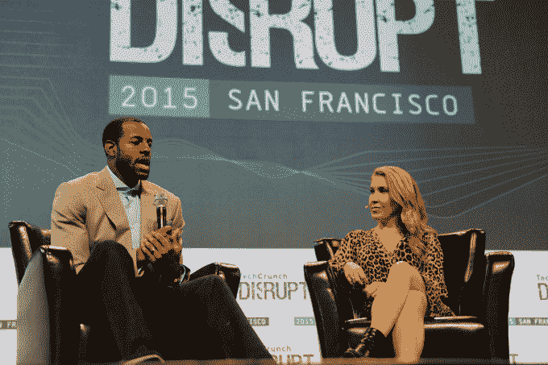

# 与第九届年度嘎吱嘎吱奖的颁奖嘉宾见面 

> 原文：<https://web.archive.org/web/https://techcrunch.com/2016/02/04/meet-the-9th-annual-crunchies-presenters/>

我们正在为第九届年度嘎吱嘎吱奖做准备，该奖项将于 2 月 8 日星期一在旧金山战争纪念歌剧院举行。可以把这个展览想象成“创业和技术的奥斯卡”

切尔西·帕瑞蒂将举办这次活动，我们有一些神话般的技术人物在舞台上展示获胜的创业公司和个人的松脆饼干。这是你可以期待看到的人，以及他们何时登台。你仍然可以在这里买到脆饼干的门票。

[特洛伊·卡特](https://web.archive.org/web/20221007104413/https://www.crunchbase.com/person/troy-carter#/entity)是定义全球流行文化的娱乐管理公司 Atom Factory 的创始人、董事长兼首席执行官。作为一名数字和社会企业家，卡特定义了许多唱片艺术家的职业生涯，包括多白金，格莱美奖获得者 Lady Gaga。卡特将在晚上 8:15 颁发“上升最快的创业公司”奖。

* * *

[德鲁·休斯顿](https://web.archive.org/web/20221007104413/https://www.crunchbase.com/person/drew-houston#/entity)是 Dropbox 的联合创始人兼 CEO。他带领 Dropbox 从一个简单的想法发展成为全球数百万人使用的服务。休斯顿将在晚上 8:20 颁发年度创始人奖。

* * *

Jacquelline Fuller 领导的 Google.org 每年提供超过 1 亿美元的资金支持技术创新者在教育、发展和可再生能源等领域产生变革性影响。杰奎琳于 2007 年加入谷歌，担任董事总经理，负责谷歌的慈善工作和宣传。富勒将在晚上 8:25 颁发包容多样性奖。

* * *

杰西卡·利文斯顿是 Y Combinator 的创始合伙人。她还是大型年度创业会议 Startup School 的组织者，也是《工作中的创始人》(Founders in Work)的作者，该书收集了对成功创业创始人的采访。利文斯顿将在晚上 8:30 颁发最佳硬件奖。

* * *

[戴夫·麦克卢尔](https://web.archive.org/web/20221007104413/https://www.crunchbase.com/person/dave-mcclure#/entity)是 500 Startups 的风险投资家和创始合伙人，500 Startups 是一家风险投资公司&创业孵化器，总部设在硅谷，由 PayPal 和谷歌校友创办，管理着超过 2 亿美元的资产。戴夫作为一名开发人员、企业家、创业顾问、投资者、博客作者和网络营销狂人，已经在硅谷呆了 25 年。麦克卢尔将在晚上 8:35 颁发年度风险投资奖。

* * *

[安德烈·伊戈达拉](https://web.archive.org/web/20221007104413/https://www.crunchbase.com/person/andre-iguodala#/entity)是 NBA 总冠军和总决赛 MVP，目前签约金州勇士队。他为 2015 年被易贝收购的初创公司 Twice 提供咨询。伊戈达拉将在晚上 8:40 颁发最佳新创企业奖。

[Kimberly Bryant](https://web.archive.org/web/20221007104413/https://www.crunchbase.com/person/kimberly-bryant#/entity) 是[黑人女孩代码](https://web.archive.org/web/20221007104413/http://www.blackgirlscode.com/)的创始人和执行董事，这是一个致力于“改变技术面貌”的非营利组织，通过将有色女孩(7-17 岁)引入技术和计算机科学领域，专注于创业概念。布莱恩特将在晚上 8:50 颁发最大社会影响力奖。

* * *

[迈克尔·阿灵顿](https://web.archive.org/web/20221007104413/https://www.crunchbase.com/person/michael-arrington#/entity)是 CrunchFund 的普通合伙人、连续创业者和 TechCrunch 的创始人。阿林顿将在晚上 8:55 颁发年度天使奖。

* * *

[奥姆·马利克](https://web.archive.org/web/20221007104413/https://www.crunchbase.com/person/om-malik#/entity)是 GigaOM 的创始人和 True Ventures 的风险合伙人。他也是一名科技记者。在此之前，他在 Forbes.com 担任高级编辑。他还在 H & Q Asia Pacific 担任投资经理，之后以《红鲱鱼》杂志高级作家的身份重返媒体世界，后来又在 Business 2.0 工作。2003 年，他出版了他的第一本书《广匪:7500 亿美元电信盗窃案内幕》。马利克将在晚上 8:55 颁发年度天使奖。

* * *

[鲁洛夫·博塔](https://web.archive.org/web/20221007104413/https://www.crunchbase.com/person/roelof-botha#/entity)是红杉资本的合伙人，与许多公司合作。一些将技术接入民主化(Square、Eventbrite、Unity、Nimbula)；有的创建全球用户社区(YouTube、Tumblr、insta gram)；还有一些通过创新的商业模式扰乱市场(Evernote、Weebly、Xoom)。博塔将在晚上 9:00 颁发最佳移动应用奖。

* * *

巴斯蒂安·莱曼是按需送货公司 Postmates 的首席执行官，该公司是他在 2011 年联合创立的。Postmates 的想法最初产生于 2005 年，当时 Bastian 从慕尼黑搬到伦敦，他努力寻找一种简单的方法来在城市中运输货物。后来，他通过旧金山的 AngelPad 追求“拼车”的概念，在那里他遇到了他的联合创始人 Sean Plaice 和 Sam Street。Postmates 现在在 40 个美国市场开展业务。莱曼将在晚上 9:05 颁发最佳技术成就奖。

* * *

Marc Benioff 是 Salesforce 的董事长兼首席执行官。作为云计算的先驱之一，Benioff 于 1999 年创建了该公司，其愿景是创建一种按需信息管理服务来取代传统的企业软件技术。在他的领导下，Salesforce 从一个开创性的想法发展成为全球发展最快的十大软件公司和最大的客户关系管理(CRM)公司。贝尼奥夫将在晚上 9:10 颁发年度首席执行官奖。

* * *

[玛丽·米克尔](https://web.archive.org/web/20221007104413/https://www.crunchbase.com/person/mary-meeker#/entity)是凯鹏华盈&拜尔斯律师事务所的普通合伙人。她专注于公司数字实践的投资，并帮助领导 KPCB 的数字增长基金，目标是已经实现快速采用和规模的高增长互联网公司。玛丽在 Square、Lending Club 和 DocuSign 的董事会任职，并参与了 KPCB 对 SoundCloud、LegalZoom、Spotify、Twitter、Instacart、NextDoor、Stance、slack、Bitstrips、Houzz、Affectiva、One Kings Lane、Trendyol 和 Jawbone 的投资。米克将在晚上 9:15 颁发最佳整体创业奖。