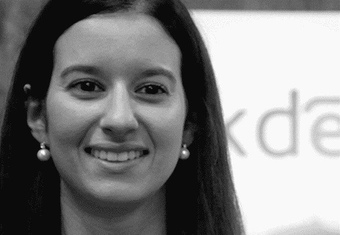

# 认识 Disrupt London 2015 的演讲者和评委 

> 原文：<https://web.archive.org/web/https://techcrunch.com/2015/12/01/meet-the-disrupt-london-2015-speakers-and-judges/>

Disrupt London 就要到了，我们有一些最具标志性的企业家和科技行业的思想领袖在这里排队发言，这肯定是迄今为止最好的 Disrupt Europe。为期两天的会议于 12 月 7 日在奥运村的铜箱竞技场开始，第二天以初创企业战场的决赛结束，一家初创企业将获得 3 万英镑的奖金。你仍然可以在这里购买《扰乱伦敦》的门票。

你可以在这里找到[活动的全部细节](https://web.archive.org/web/20221006104014/https://beta.techcrunch.com/event-info/disrupt-london-2015/)。我们编辑了这份演讲者和评委的名单，我们很自豪地宣布，以及你什么时候能看到他们上台(全部在 GMT)。好好学习！

[蒂姆·阿姆斯特朗](https://web.archive.org/web/20221006104014/https://www.crunchbase.com/person/tim-armstrong#/entity)于 2009 年 3 月被任命为美国在线首席执行官兼董事长。在成为美国在线首席执行官之前，阿姆斯特朗主持了谷歌的北美和拉丁美洲广告销售和运营团队。阿姆斯特朗将于 12 月 8 日星期二上午 10:50 发表演讲。

[亚历山大·巴博萨](https://web.archive.org/web/20221006104014/https://www.crunchbase.com/person/alexandre-barbosa#/entity)是 Faber Ventures 的创始人兼董事总经理。巴博萨将在 12 月 7 日周一下午 3:45 评判 Startup 战地。

[爱丽丝·本廷克](https://web.archive.org/web/20221006104014/https://www.crunchbase.com/person/alice-bentinck-2#/entity)联合创办 EF(企业家至上)。EF 是欧洲顶尖技术人员在伦敦会面和建立改变世界的创业公司的地方。Bentinck 将于 12 月 7 日周一下午 5:00 对 Startup 战地进行评判。

[克里斯·布莱克福特](https://web.archive.org/web/20221006104014/https://www.crunchbase.com/person/chris-blackford#/entity)是天空期货公司的联合创始人和首席运营官。布莱克福特将于 12 月 8 日星期二上午 9:45 发表演讲。

Laurel Bowden 是 83North(前身为 Greylock IL)的普通合伙人，她于 2008 年加入该公司。她关注的领域包括:软件、互联网和金融科技。鲍登将于 12 月 7 日星期一下午 12:25 发表演讲。

Jay Bregman 是 Verifly 的创始人兼首席执行官。Verifly 的使命是成为无人机和机器人的信任和合规权威。Bregman 将于 12 月 8 日星期二上午 9:45 发表演讲。

[尼古拉斯·布鲁森](https://web.archive.org/web/20221006104014/https://www.crunchbase.com/person/nicolas-brusson#/entity)是 BlaBlaCar 的联合创始人&首席运营官，blabla car 是一个领先的拼车社区，将司机和空座位联系起来。他领导公司的全球运营和营销。布鲁松将于 12 月 8 日星期二下午 4:40 发表演讲。

[艾琳·伯比奇](https://web.archive.org/web/20221006104014/https://www.crunchbase.com/person/eileen-burbidge#/entity)是总部位于伦敦的杰出早期风险投资基金 Passion Capital 的合伙人。她将从雅虎的商业和产品角色中获得的丰富运营经验带到了她的投资活动中。、Skype、苹果和其他地方。Burbidge 将在 12 月 7 日星期一下午 12:25 发言，并在 12 月 8 日星期二上午 11:30 评判 Startup 战地决赛。

[加雷斯·卡彭](https://web.archive.org/web/20221006104014/https://www.crunchbase.com/person/gareth-capon#/entity)是伦敦实时视频初创公司 Grabyo 的首席执行官。Capon 在数字、移动和电视领域拥有超过 16 年的经验，涵盖企业和初创企业。在加入 Grabyo 之前，Gareth 是 Sky 的产品开发总监，负责管理 Sky 屡获殊荣的移动应用程序组合，并领导对欧洲和北美科技初创公司的投资。卡彭将于 12 月 7 日星期一下午 2:00 发表演讲。

[Suranga Chandratillake](https://web.archive.org/web/20221006104014/https://www.crunchbase.com/person/suranga-chandratillake#/entity) 于 2014 年成为 Balderton 的合伙人。他之前是一名企业家和工程师。Suranga 于 2004 年在剑桥创建了 blinkx，这是一个视频和音频内容的智能搜索引擎。Chandratillake 将在 12 月 8 日星期二上午 11:30 评判 Startup 战地决赛。

Alex Depledge 是一位直言不讳的英国女商人，以其作为 Hassle.com 背后的驱动力而闻名。Depledge 将在 12 月 8 日星期二上午 9:25 发言，并在 12 月 8 日星期二上午 11:30 评判 Startup 战地决赛。

[弗雷德·德斯坦](https://web.archive.org/web/20221006104014/https://www.crunchbase.com/person/fred-destin#/entity)于 2014 年加入 Accel，专注于消费者和软件投资。他是 Deliveroo、Pillpack 和 KNC 的主要投资者和董事会成员。在 Accel 之前，他是 Atlas Ventures 的合伙人。德斯坦将于 12 月 7 日(周一)上午 11:45 发表演讲，并于 12 月 8 日(周二)上午 11:30 评判 Startup 战地决赛。

[彼得·范德多斯](https://web.archive.org/web/20221006104014/https://www.crunchbase.com/person/pieter-van-der-does#/entity)是艾登公司的联合创始人、总裁兼首席执行官。他是领先的专家，在支付行业拥有超过 15 年的经验。范德多斯将于 12 月 8 日星期二下午 3:10 发表演讲。

[玛丽·埃克兰德](https://web.archive.org/web/20221006104014/https://www.crunchbase.com/person/marie-ekeland#/entity)是 Daphni 的联合创始人，Daphni 是一家总部位于巴黎的新风险投资基金，目前尚未推出。埃克兰德之前是 Elaia 的合伙人。自 1997 年以来，她一直在金融& IT 行业发展:首先是运营方面，然后是风险投资。她将在 12 月 7 日周一下午 2:30 评判 Startup 战地。

[卡洛斯·爱德华多·埃斯皮纳尔](https://web.archive.org/web/20221006104014/https://www.crunchbase.com/person/carlos-espinal)于 2010 年作为合伙人加入首轮基金 Seedcamp。Seedcamp 向种子前期和种子阶段的初创公司投资智能资本。在 Seedcamp 之前，埃斯皮纳尔是位于伦敦的早期投资公司 Doughty Hanson Technology Ventures 的风险投资家。他将在 12 月 7 日周一下午 5:00 评判 Startup 战地。

【2013 年 5 月，阿历克斯·福格森爵士在执掌曼联超过 26 年后退休。在长达 39 年的管理生涯中，他赢得了 49 个主要奖杯，使他成为英国足球历史上最成功的经理。他将在 12 月 7 日星期一上午 9:45 发表演讲。

克莉丝汀娜·丰塞卡是一名软件工程师和企业家。她拥有里斯本技术大学的电信和软件工程硕士学位，在创建 Talkdesk 之前，她是一名研究员，并创建了另外两家在线企业。丰塞卡将在 12 月 8 日星期二下午 2:30 发言，并在 12 月 8 日星期二上午 11:30 评判 Startup 战地决赛。

[奥古斯丁·戈麦斯](https://web.archive.org/web/20221006104014/https://www.crunchbase.com/person/agustin-gomez#/entity)是 Wallapop 的联合创始人兼首席执行官。Gomez 之前在波士顿咨询集团 iSOCO 和埃森哲工作，后来进入了著名的 ESADE 商学院。他和 Wallapop 团队一起，正在开发一种颠覆性的新型移动 P2P 市场。戈麦斯将于 12 月 8 日星期二上午 10:10 发表演讲。

[珍妮·格里菲斯](https://web.archive.org/web/20221006104014/https://www.crunchbase.com/person/jenny-griffiths#/entity)是 Snap Fashion 的创始人兼首席执行官，一名软件工程师转型为企业家。2009 年，她从布里斯托尔大学获得计算机科学工程硕士学位后，创办了 Snap Fashion。格里菲斯将于 12 月 7 日星期一上午 11:20 发表演讲。

[伊莫金·詹妮弗·希普](https://web.archive.org/web/20221006104014/https://www.crunchbase.com/person/imogen-heap#/entity)是一名英国创作歌手兼作曲家。她是著名的音乐二重奏 Frou Frou 的成员，她的个人专辑由她创作、制作和混音。她制作了四张个人专辑。她的 2009 年专辑，椭圆，是北美图表的成功，赢得了两项格莱美提名，赢得了最佳工程专辑，非经典，以承认她的技术和工程工作的记录。2010 年，她获得了英国科学院的艾弗·诺韦洛国际成就奖。她将在 12 月 8 日星期二下午 5:20 发表演讲。

蒂埃里·亨利是一名退役的法国职业足球运动员，踢过前锋。他曾效力于摩纳哥、尤文图斯、巴塞罗那和纽约红牛队，并在阿森纳度过了八年，他是俱乐部历史上的最佳射手。他也是伦敦初创公司 Grabyo 的投资者。亨利将在 12 月 7 日星期一下午 2 点演讲。

[奥斯丁·希尔](https://web.archive.org/web/20221006104014/https://www.crunchbase.com/person/austin-hill#/entity)是一位企业家和积极的投资者。1994 年，Austin 成立了加拿大最早的互联网提供商之一，Total.Net。之后，他共同创立了零知识系统。希尔是蒙特利尔创业公司的风险合伙人，并帮助创建了真正的风险企业。Hill 现在与 Blockstream 在一起，将于 12 月 8 日星期二下午 3:30 在区块链小组上发表演讲。

[Taavet Hinrikus](https://web.archive.org/web/20221006104014/https://www.crunchbase.com/person/taavet-hinrikus#/entity) 是国际转账平台 TransferWise 的联合创始人。这项业务通过完全取消传统银行手续费，让普通人能够获得真实的中间价汇率。Hinrikus 将于 12 月 7 日星期一上午 9:05 发表演讲。

大卫·霍尼克于 2000 年加入八月资本。他广泛投资于信息技术公司，专注于企业应用和基础设施软件以及面向消费者的软件和服务。霍尼克将于 12 月 7 日星期一上午 10:35 发表演讲。

[Charles Hudson](https://web.archive.org/web/20221006104014/https://www.crunchbase.com/person/charles-hudson#/entity) 是 Precursor Ventures 的管理合伙人，Precursor Ventures 是一家早期风险投资公司，专注于投资企业对企业和企业对消费者软件市场的强大团队。在创办 Precursor 之前，Charles 是 SoftTech VC 的合伙人，soft tech VC 是互联网和移动创业公司中最活跃的种子阶段投资者之一。哈德森将在 12 月 7 日周一下午 3:45 对《战地》进行评判。

[Marco Jansen](https://web.archive.org/web/20221006104014/https://www.crunchbase.com/person/marco-jansen#/entity) 是 Catawiki 的创始人兼 CTO 一家快速发展的欧洲在线拍卖行。Jansen 拥有计算机科学硕士学位(特温特大学)。在 2008 年开始 Catawiki 之前，他在伦敦和班加罗尔担任 ThoughtWorks 的敏捷项目和交付经理。詹森将在 12 月 8 日星期二下午 2:50 发表演讲。

[宾迪·卡利亚](https://web.archive.org/web/20221006104014/https://www.crunchbase.com/person/bindi-karia#/entity)对欧洲的所有创业项目以及投资者、创始人和企业之间的联系充满热情。除了之前在硅谷银行担任副总裁之外，她职业生涯的大部分时间都在科技初创公司工作。Karia 将在 12 月 7 日周一下午 2:30 评判 Startup 战地。

Thomas Korte 是 AngelPad 的创始人，angel pad 是一家位于旧金山和纽约的创业加速器。科特将于 12 月 7 日星期一上午 10:35 发表演讲。

[杰夫·劳森](https://web.archive.org/web/20221006104014/https://www.crunchbase.com/person/jeff-lawson#/entity)是 Twilio 的联合创始人兼首席执行官，他在 Twilio 有超过 10 年的创业产品领导经验。在 Twilio 之前，Jeff 担任亚马逊网络服务的产品经理。劳森将于 12 月 8 日星期二上午 9:05 发表演讲。

Bastian Lehmann 是 Postmates 的首席执行官，post mates 是他在 2011 年联合创立的按需送货公司。莱曼将于 12 月 7 日星期一上午 10:15 发表演讲。

[Mattias Ljungman](https://web.archive.org/web/20221006104014/https://www.crunchbase.com/person/mattias-ljungman#/entity) 于 2006 年与 Niklas Zennströ一起创立了 Atomico，寻求投资并建立 Atomico 的专家团队，帮助投资组合公司在全球范围内扩展。永格曼将在 12 月 7 日周一下午 3:45 评判 Startup 战地。

安迪·麦克洛林是 SoftTech VC 的风险合伙人，soft tech VC 是互联网、SaaS 和移动创业公司中最活跃的种子期投资者之一。麦克洛林主要投资 B2B、SaaS、开发者工具和移动应用。麦克洛林将于 12 月 7 日周一上午 10:35 发表演讲，并于 12 月 7 日周一对 Startup 战地进行评判。

[巴迪·米奇尼](https://web.archive.org/web/20221006104014/https://www.crunchbase.com/person/buddy-michini#/entity)是 Airware 的创始成员兼首席技术官。作为首席技术官，Michini 帮助指导长期产品路线图，将来自行业和学术界的新发展纳入 Airware 产品线。他将在 12 月 8 日星期二上午 9:45 发表演讲。

Ambarish Mitra 是 Blippar 的首席执行官和联合创始人，Blippar 是领先的视觉浏览器和快速增长的增强现实播放器。在他的指导下，Blippar 从一个开创性的想法成长为行业领导者。Mitra 将于 12 月 8 日星期二下午 2:10 发表演讲。

[迈克尔·莫里茨爵士](https://web.archive.org/web/20221006104014/https://www.crunchbase.com/person/michael-moritz#/entity)是红杉资本的董事长，他自 1986 年以来一直在红杉资本工作。莫里茨代表红杉投资了谷歌、雅虎、贝宝、伟创力、Kayak、Pure Digital 和 Zappos.com。莫里茨将于 12 月 7 日星期一上午 9:45 发表演讲。

Filipa Neto 是欧洲奢侈品租赁市场 Chic by Choice 的联合创始人兼首席执行官，该市场允许女性以零售价的一小部分租赁来自品牌和电子商务平台的物品。Neto 将于 12 月 7 日星期一上午 11:20 发表演讲。

[José Neves](https://web.archive.org/web/20221006104014/https://www.crunchbase.com/person/jose-neves#/entity) 于 2008 年创立了 Farfetch，将他对时尚和技术的兴趣，以及他在设计、批发和零售方面的经验结合在一起，创建了一个庆祝和支持全球时尚产业多样性的企业。内维斯将于 12 月 7 日星期一上午 11:20 发表演讲。

[尼克拉斯·奥斯特伯格](https://web.archive.org/web/20221006104014/https://www.crunchbase.com/person/niklas-stberg#/entity)是瑞典企业家，也是 Delivery Hero 的联合创始人兼首席执行官。他拥有 T4 皇家理工学院的工业工程管理硕士学位。奥斯特伯格将于 12 月 7 日星期一下午 12:05 发表演讲。

丹尼·里默是总部位于三藩市的指数风险投资公司的普通合伙人。他目前在 Flipboard、Patreon、1stdibs、Farfetch、Sky、Good Eggs、Nasty Gal、Viagogo、Dropbox、Anki 和 SFMOMA 的董事会任职。Rimer 将于 12 月 7 日星期一上午 9:25 发表演讲。

尼尔·里默于 1996 年与朱塞佩·佐科和大卫·里默共同创立了 Index Ventures。此前，他在旧金山的蒙哥马利证券公司工作了 4 年。Rimer 将于 12 月 7 日星期一上午 9:25 发表演讲。

[Sonali De Rycker](https://web.archive.org/web/20221006104014/https://www.crunchbase.com/person/sonali-de-rycker#/entity) 于 2008 年加入 Accel，帮助领导伦敦办事处。Sonali 专注于消费者、软件和金融服务业务。她领导了 Accel 对 Avito、Lyst、Spotify、Wallapop、KupiVIP、Top10、Calastone、Wonga 和 SilveRail 的投资。De Rycker 将于 12 月 7 日周一中午 12:25 发表演讲，并于 12 月 7 日周一下午 3:45 对 Startup 战地进行评判。

奥利弗·萨姆尔是火箭互联网的创始人兼首席执行官。Samwer 负责战略制定和实施、业务发展和投资者关系。他将于 12 月 8 日星期一上午 10:10 发表演讲。

[威廉·舒](https://web.archive.org/web/20221006104014/https://www.crunchbase.com/person/shu-william#/entity)于 2012 年 8 月与格雷格·奥尔洛夫斯基共同创立了 Deliveroo。在 Deliveroo 之前，舒曾在 SAC Capital 和 ESO Capital 担任分析师。他将在 12 月 7 日星期一上午 11:45 发表演讲。

[Sebastian Siemiatkowski](https://web.archive.org/web/20221006104014/https://www.crunchbase.com/person/sebastian-siemiatkowski#/entity) 是 Klarna 的联合创始人兼首席执行官，Klarna 是欧洲主要的电子商务支付解决方案提供商之一。Siemiatkowski 将在 12 月 7 日星期一发表演讲。

史蒂夫·沃特豪斯是潘迪拉资本公司的合伙人。他是一名企业家，其经历跨越了风险投资支持的初创公司的生命周期。2000 年，他加入了被 Sun Microsystems 收购的 P2P 搜索引擎 Infrasearch。他曾在 Sun 担任多个职位，包括创建蜂窝存储产品线。沃特豪斯将于 12 月 8 日星期二下午 3:30 发表演讲。

Azmat Yusuf 是 Citymapper 有限公司的创始人。Yusuf 之前在谷歌工作，也在国际银行的风险投资和股票领域工作。他在 2011 年开发了这个应用程序，作为伦敦人在城市公交网络中导航的指南。他毕业于宾夕法尼亚大学，获得电子工程和经济学学位，并于 2009 年获得 INSEAD 大学的工商管理硕士学位。优素福将在 12 月 8 日星期二下午 4:10 发表讲话。

[爱丽丝·扎格雷](https://web.archive.org/web/20221006104014/https://www.crunchbase.com/person/alice-zagury#/entity)是该家族的创始人兼首席执行官。她将在 12 月 7 日周一下午 5:00 评判 Startup 战地。