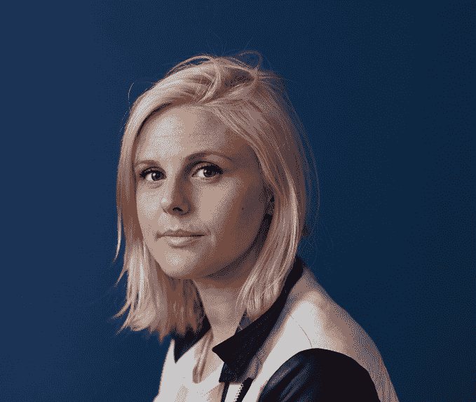

# 认识 Disrupt NY 2016 的演讲者和评委

> 原文：<https://web.archive.org/web/https://techcrunch.com/2016/05/03/meet-the-disrupt-ny-2016-speakers-and-judges/>

[Disrupt NY](https://web.archive.org/web/20230312232539/https://techcrunch.com/event-info/disrupt-ny-2016/) 就在眼前。活动将于 5 月 9 日开始，我们很高兴公布日程。阵容是一流的，我们将第一次在布鲁克林的红钩[布鲁克林邮轮码头](https://web.archive.org/web/20230312232539/https://www.google.com/maps/place/Brooklyn+Cruise+Terminal/@40.6825847,-74.0134548,15z/data=!4m2!3m1!1s0x0:0x3d0fc7b4341f3ece?sa=X&sqi=2&ved=0ahUKEwiDlaC034nMAhVN52MKHZWKCLoQ_BIIgwEwCw)举办 [Disrupt NY](https://web.archive.org/web/20230312232539/https://techcrunch.com/event-info/disrupt-ny-2016/) 。我们每年都这么说，但这是我们迄今为止最好的一次颠覆。

大会于 5 月 9 日开幕，为期三天，内容丰富，包括鼓舞人心的企业家、精明的投资者和 TechCrunch 全球知名的[创业战场竞赛](https://web.archive.org/web/20230312232539/https://techcrunch.com/startup-battlefield/)。最终，一家初创公司将获得 5 万美元和梦寐以求的 Disrupt Cup。

[Adi Sideman](https://web.archive.org/web/20230312232539/https://www.crunchbase.com/person/adi-sideman#/entity) 是 YouNow 的创始人兼首席执行官。他是参与式媒体的先驱，拥有 20 多年在用户生成内容领域创建应用和公司的经验。他将在 5 月 10 日星期二下午 1 点 40 分发表演讲。

[Ajay Agarwal](https://web.archive.org/web/20230312232539/https://www.crunchbase.com/person/ajay-agarwal#/entity) 领导贝恩资本风险投资公司的湾区办公室，在那里他专注于早期应用软件和 SaaS 投资。在 2003 年加入贝恩资本风险投资公司之前，Ajay 是 Trilogy 的销售和营销主管，在那里他的年收入增长到了 3 亿美元。他将担任《创业战场》的评委。

[艾伦·帕特里科夫](https://web.archive.org/web/20230312232539/https://www.crunchbase.com/person/alan-patricof#/entity)是格雷克罗夫特有限责任公司的创始人兼董事总经理。作为风险投资的长期创新者和倡导者，艾伦在该行业形成之初就进入了该行业，创建了 Patricof & Co. Ventures Inc .，它是当今 Apax Partners 的前身，是世界领先的私募股权公司之一，管理着 350 亿美元的资产。他将担任《创业战场》的评委。

亚历克斯·钟是流行的 Giphy 分享网站的联合创始人兼首席执行官。他最近的创业包括当代艺术的电子商务目的地 Artspace 和被谷歌收购的私人社交网络冰箱。他将于 5 月 9 日星期一上午 9:05 发表演讲。

[Alfred Lin](https://web.archive.org/web/20230312232539/https://www.crunchbase.com/person/alfred-lin#/entity) 是红杉资本(Sequoia Capital)的风险投资家，从事消费互联网、企业和移动公司的工作。阿尔弗雷德目前是精英会、Airbnb、Houzz、Humble Bundle、Kiwi、Romotive 和 Stella & Dot 的董事会成员。他将担任《创业战场》的评委。

[安朵斯·福加斯](https://web.archive.org/web/20230312232539/https://www.crunchbase.com/person/andras-forgacs#/entity)是 Modern Meadow 的首席执行官和联合创始人，这家总部位于布鲁克林的初创公司正在利用设计、生物学和工程学生产世界上第一种可持续的生物制造皮革。安朵斯之前联合创立了 Organovo(纽约证券交易所代码:ONVO)，该公司将 3D 生物打印商业化，以创建用于制药研究和医疗应用的人体组织。他将在 5 月 11 日星期三下午 1:00 发表讲话。

安迪·韦斯曼是联合广场投资公司的合伙人。安迪在 90 年代中期开始了他的互联网生涯。在加入 USV 之前，他于 2007 年共同创立了 betaworks，该公司创建并投资于社交、实时应用和服务。他将于 5 月 9 日星期一上午 10:05 发表演讲。

[Benjamin Joseph Manaly“b . j .”Novak](https://web.archive.org/web/20230312232539/https://www.crunchbase.com/person/b-j-novak#/entity)是一名美国演员、单口喜剧演员、编剧、作家和导演。他也是 List 应用程序的联合创始人。他最广为人知的身份是《办公室》的编剧和执行制片人，在该片中他还扮演了瑞安·霍华德。他将在 5 月 9 日星期一下午 2:00 发表演讲。

[凯勒·默克尔](https://web.archive.org/web/20230312232539/https://www.crunchbase.com/person/caleb-merkl#/entity+)是枫叶公司的联合创始人兼首席执行官。他拥有在运营要求苛刻的环境中领导团队的经验，也曾在消费增长股票投资方面花过时间。最近，Caleb 是 Primary Venture Partners 的常驻企业家。他将于 5 月 10 日星期二上午 10:05 发表演讲。

[假虎刺属·罗梅罗博士](https://web.archive.org/web/20230312232539/https://www.crunchbase.com/person/carissa-romero#/entity)是 Paradigm 的合伙人，Paradigm 是一家战略公司，采用数据驱动的方法来帮助公司建立更强大、更多样化和更具包容性的组织。罗梅罗拥有斯坦福大学的心理学博士学位，是“学习心态”方面的专家，这种心态是指引导人们投入工作并在挑战中坚持下来的信念。她将在 5 月 9 日星期一上午 11 点 50 分发表演讲。

纽约尼克斯队的卡梅隆·基亚姆·安东尼九次入选 NBA 全明星，六次入选 NBA 最佳阵容。他三次入选美国奥林匹克男子国家队。他是 Melo7 Tech Partners 的联合创始人和合伙人，melo 7 Tech Partners 主要投资于早期数字媒体、消费互联网和科技企业，并在这些领域开发机会。他将于 5 月 11 日星期三上午 11:15 发表演讲。

凯西·奈斯塔特是 YouTube 上的红人，拥有 250 万订户和超过 4 亿的浏览量。Neistat 还是视频编辑社交应用 Beme 的联合创始人。他将在 5 月 10 日星期二上午 11 点 10 分发表演讲。

[Charles Hudson](https://web.archive.org/web/20230312232539/https://www.crunchbase.com/person/charles-hudson#/entity) 是 Precursor Ventures 的管理合伙人，Precursor Ventures 是一家早期风险投资公司，专注于投资企业对企业和企业对消费者软件市场的强大团队。在创办 Precursor 之前，Charles 是 SoftTech VC 的合伙人，soft tech VC 是互联网和移动创业公司中最活跃的种子阶段投资者之一。他将担任《创业战场》的评委。

[查理·安东内尔](https://web.archive.org/web/20230312232539/https://www.crunchbase.com/person/charlie-odonnell#/entity)是布鲁克林大桥投资公司的唯一合伙人和创始人。该基金进行种子和种子前投资，是位于布鲁克林的第一家风险公司，布鲁克林是他出生和长大的地方。他将担任《创业战场》的评委。

克里斯·多沃斯是风险投资协会的常务董事和普通合伙人。他是公司投资委员会的成员，负责管理与基金经理及其有限合伙人的关系，并为公司确定和发展新的关系。他将于 5 月 9 日星期一上午 10:05 发表演讲。

[克里斯·米尔克](https://web.archive.org/web/20230312232539/https://www.crunchbase.com/person/chris-milk#/entity)是虚拟现实技术公司 Vrse 的创始人兼首席执行官，也是虚拟现实制作公司 Vrse.works 的创始人兼创意总监。作为一名卓有成就的视觉艺术家，米尔克的职业生涯始于为坎耶·韦斯特、街机之火、贝克、杰克·怀特、U2、约翰尼·卡什、奈尔斯·巴克利等创作音乐视频。他将在 5 月 10 日星期二下午 2:20 发表演讲。

克里斯·索恩是诚实公司的 CMO。Chris 负责公司的营销活动，包括品牌、创意、媒体、
电子商务、分析、公关和社交营销。在 2015 年加入
Honest Company 之前，Chris 是领先的全球视频游戏公司艺电(EA)的全球营销、媒体&移动副总裁。在他的五年任期中，克里斯监督了 EA 游戏机和移动游戏产品的营销和媒体，包括 EA SPORTS Madden，The Sims，战地&植物大战僵尸。他将于 5 月 11 日星期三上午 10:05 发表讲话。

[达格·基特劳斯](https://web.archive.org/web/20230312232539/https://www.crunchbase.com/person/dag-kittlaus#/entity)是 Viv 的首席执行官和联合创始人。此前，在 2007 年将这项技术从斯坦福研究所剥离出来后，他是 Siri 的联合创始人兼首席执行官。他将于 5 月 9 日星期一上午 11:30 发表演讲。

[丹妮尔·布朗](https://web.archive.org/web/20230312232539/https://www.crunchbase.com/person/danielle-brown#/entity)担任英特尔首席执行官布莱恩·科兹安尼克的幕僚长兼技术助理。Brown 负责为 Brian 和英特尔管理委员会成员提供战略和运营支持。布朗是英特尔的首席多元化&包容官，领导全球多元化&包容团队。她将于 5 月 9 日星期一上午 11 点 50 分发表演讲。

[丹妮尔·魏斯伯格](https://web.archive.org/web/20230312232539/https://www.crunchbase.com/person/danielle-weisberg#/entity)(左图)曾在 DC 华盛顿州的 NBC 新闻工作，她为《晚间新闻》和《今日秀》报道政治。2010 年，韦斯伯格搬到纽约，为 MSNBC 的《与劳伦斯·奥唐奈的最后一句话》制作节目 2012 年，韦斯伯格和联合创始人卡莉·扎金(Carly Zakin)在客厅的沙发上推出了 theSkimm。他们将在 5 月 9 日星期一上午 9:45 发表演讲。

[丹·威德迈尔](https://web.archive.org/web/20230312232539/https://www.crunchbase.com/person/dan-widmaier#/entity)是 Bolt Threads 的首席执行官和创始人，之前被称为 Refactored Materials，Inc .他领导该公司走过了四年的技术开发、成长和融资之路。他将在 5 月 11 日星期三下午 1:00 发表讲话。

[大卫·科尔](https://web.archive.org/web/20230312232539/https://www.crunchbase.com/person/david-cole-6#/entity)是 NextVR 的联合创始人。科尔与人合著了 26 项与虚拟现实和立体技术相关的专利，以及 3 项自适应计算机学习技术专利。在 NextVR 之前，科尔是教育科技公司 LearningSoft 的首席执行官。在他职业生涯的早期，他创建了 Studiotronics，一家生产彩色扫描软件的数字成像公司。他将在 5 月 9 日星期一下午 5:05 发表演讲。

大卫·帕克曼是纽约文洛克律师事务所的合伙人。David 专注于互联网和数字媒体公司的早期风险投资。他的积极投资包括 Dstillery(前身为 Media6Degrees)、Smartling、Dollar Shave Club、YouNow、Amino 和 Burner。他将担任《创业战场》的评委。

大卫·普劳夫被广泛认为是奥巴马总统两次总统竞选胜利的“设计师”。在 2008 年总统选举中担任竞选经理后，他在白宫担任总统高级顾问。他现在是优步的首席顾问。普劳夫目前在巴拉克·欧巴马基金会董事会任职，也是优步董事会成员。他将于 5 月 10 日星期二下午 2:40 发表演讲。

[大卫·蒂施](https://web.archive.org/web/20230312232539/https://www.crunchbase.com/person/david-tisch#/entity)是纽约市种子期天使投资公司 BoxGroup 的管理合伙人。他还是移动购物市场 Shop Spring 和风险基金 TechStars 的联合创始人和董事长，该基金旨在投资合适的初创公司。他将担任《创业战场》的评委。

[道恩·康](https://web.archive.org/web/20230312232539/https://www.crunchbase.com/person/dawoon-kang#/entity)是咖啡遇上百吉饼的联合创始人和首席运营官。康的工作范围从战略&业务发展到市场营销、研究和投资/金融。她在雅芳产品公司开始了她的职业生涯，在纽约担任美国战略&业务发展分析师。她将于 5 月 11 日星期三上午 10 点 50 分发表演讲。

[戴娜·格雷森](https://web.archive.org/web/20230312232539/https://www.crunchbase.com/person/dayna-grayson#/entity)于 2012 年加入 NEA，专注于早期消费互联网和企业公司。在加入 NEA 之前，戴娜是波士顿北桥风险投资公司的投资人，她专注于种子期和早期阶段的消费互联网和 SaaS 投资。她将担任《创业战场》的评委。

戴夫·弗莱厄蒂(Dev Flaherty)是 List 应用的联合创始人。Dev 是 List 应用程序的首席执行官和联合创始人。Dev 来自布鲁克林，在投身科技创业公司之前，他获得了斯坦福大学的土木工程学士学位。在去年与 B·J·诺瓦克一起创建 List 应用程序之前，Dev 是 Fab.com 公司用户体验部的 SVP，在此之前是总部位于波士顿的公司 WHERE 的一部分，该公司于 2011 年被易贝/PayPal 以 1.35 亿美元收购。他将在 5 月 10 日星期一下午 2:00 发表演讲。

[埃莉·惠勒](https://web.archive.org/web/20230312232539/https://www.crunchbase.com/person/ellie-wheeler#/entityhttps://www.crunchbase.com/person/ellie-wheeler#/entity)是格雷克罗夫特合伙公司的合伙人，常驻纽约办事处。在加入 Greycroft 之前，Ellie 在 Lowercase Capital 从事类似的评估投资机会的工作。Ellie 还在思科公司的企业发展部工作，负责统一通信、企业软件、移动和视频部门的收购、投资和战略。她将担任《创业战场》的评委。

[艾丽卡·贝克](https://web.archive.org/web/20230312232539/https://www.crunchbase.com/person/erica-joy-baker#/entity)是 Slack Technologies 的高级工程师，倡导科技领域的多样性和包容性，并扩大科技教育的覆盖面。她于 2015 年加入 Slack，专注于构建和发布工程。她将于 5 月 9 日星期一上午 11 点 50 分发表演讲。

[Fidji Simo](https://web.archive.org/web/20230312232539/https://www.crunchbase.com/person/fidji-simo#/entity) 是脸书的产品总监，领导产品团队，负责媒体(视频、新闻、影响者)和新闻订阅中的广告。最近，她推出了实时视频、自动播放的视频和视频广告，以及即时文章。她还负责将脸书的广告产品套件从 27 种广告格式简化为 7 种。Fidji 从易贝加入脸书。她将于 5 月 10 日星期三下午 1 点 25 分发表讲话。

弗雷德·威尔森自 1987 年以来一直是一名风险投资家。他目前是 Union Square Ventures 的管理合伙人，还创建了 Flatiron Partners。他将在 5 月 10 日星期二上午 9:05 和下午 2:00 发表演讲。

[吉尔·彭奇纳](https://web.archive.org/web/20230312232539/https://www.crunchbase.com/person/gil-penchina#/entity)是一位连续创业家和多产的天使投资人。他目前通过 AngelList 运营着一只每笔交易 400 万美元的种子基金，该基金从 500 多名有影响力的硅谷天使那里众筹而来，并正在招募合伙人加入他的行列。他将担任《创业战场》的评委。

[希瑟·哈特尼特](https://web.archive.org/web/20230312232539/https://www.crunchbase.com/person/heather-hartnett#/entity)是 Human Ventures 的首席执行官和联合创始人，Human Ventures 是纽约的一家初创工作室，共同创立创新科技公司，让生活更轻松、更充实。Heather 领导着 Human 的核心团队，在构建的早期阶段支持每个项目组合的创建者。她将于 5 月 10 日星期二上午 11:30 发表演讲。

杰瑞米·莱文领导了对 Yelp、Pinterest 和 LinkedIn 的早期投资，并因在别人错过他们的时候发现初出茅庐的明星而闻名。他的成功使他成为福布斯科技投资者“迈达斯名单”中的一员。他将担任《创业战场》的评委。

[杰西卡·阿尔芭](https://web.archive.org/web/20230312232539/https://www.crunchbase.com/person/jessica-alba#/entity)是一名演员、活动家、母亲、妻子和企业家。这位两个女儿的母亲以她的演艺生涯闻名于世，她于 2012 年 1 月创办了“诚实公司”。在一个有毒有害产品充斥的行业中，诚实的公司响应家庭、儿童和婴儿对安全、有效和价格合理的产品的需求。她将于 5 月 10 日星期三上午 10:05 发表讲话。

[吉尔·艾森哈德](https://web.archive.org/web/20230312232539/https://www.crunchbase.com/person/jill-eisenhard#/entity)是布鲁克林红钩镇红钩倡议(RHI)的创始人兼执行董事。在她的领导下，RHI 开发了一个社会变革和青年发展的模式，使社区成员能够成为他们自己生活和社区的变革推动者。她将在 5 月 10 日星期二下午 5 点 40 分发表演讲。

[乔安妮·威尔逊](https://web.archive.org/web/20230312232539/https://www.crunchbase.com/person/joanne-wilson#/entity)从零售业起家，最终进军批发业。然后，她转到了科技世界的媒体领域，然后再次将自己重塑为一名投资者。她目前是一名活跃的天使投资人，投资了 90 多家公司，如 Food52、Catchafire、Vengo、Nestio、Captureproof、Makers Row、Le Tote 和 Union Station。她将担任《创业战场》的评委。

[约翰·博思威克](https://web.archive.org/web/20230312232539/https://www.crunchbase.com/person/john-borthwick#/entity)是 betaworks 的首席执行官和联合创始人。Betaworks 是一家互联网工作室，在社交、数据驱动的媒体互联网上建立和投资公司。betaworks 建立的公司包括 Giphy、Dots、bitly 和 Chartbeat，betaworks 收购并重新推出了 Digg 和 Instapaper。他将于 5 月 10 日周二上午 11:30 发表演讲，并将担任初创公司战地评委。

Jon Stein 是 Betterment 的首席执行官和创始人。他热衷于让生活变得更美好，凭借自己在风险和产品方面为银行和经纪商提供咨询的经验，于 2008 年创立了 Betterment。他将于 5 月 10 日星期二上午 11:55 发表演讲。

[黄邦贤·特里斯特](https://web.archive.org/web/20230312232539/https://www.crunchbase.com/person/jonathon-triest#/entity)是勒德洛风险投资公司的创始人和管理合伙人，他已经投资了 50 多家科技公司。他将担任《创业战场》的评委。

[乔希·科佩尔曼](https://web.archive.org/web/20230312232539/https://www.crunchbase.com/person/josh-kopelman#/entity)自从互联网行业商业化以来，他一直是一名活跃的企业家和投资者。2004 年，乔希与他人共同创立了首轮资本公司(First Round Capital ),旨在重塑种子期投资。从那时起，该公司已经投资了 300 多家新兴技术创业公司，成为美国最活跃的风险投资公司之一。他将于 5 月 9 日星期一上午 10:05 发表演讲。

[坎伊·马克贝拉](https://web.archive.org/web/20230312232539/https://www.crunchbase.com/person/kanyi-maqubela#/entity)是总部位于纽约的早期风险投资公司 Collaborative Fund 的合伙人。Collaborative Fund 已经支持了 Lyft、Hopscotch、AltSchool、Blue Bottle、Earnest、Sweetgreen 和 Skillshare 等公司。他将担任《创业战场》的评委。

Karen Kerr 领导的团队专注于在通用电气的先进制造生态系统中进行投资和发展合作关系。Karen 带着 20 年发展技术型企业和风险投资的经验来到通用电气。她将担任《创业战场》的评委。

[马丁·米科斯](https://web.archive.org/web/20230312232539/https://www.crunchbase.com/person/marten-mickos#/entity)是领先的漏洞协调和漏洞奖励平台 HackerOne 公司的首席执行官。此前，Marten 是 Eucalyptus Systems 的首席执行官，该公司被惠普收购，他在惠普担任云业务主管。他将于 5 月 9 日星期一上午 9:25 发表演讲。

梅根·奎恩是星火资本增长基金的普通合伙人。她专门与改变世界的企业家合作，设计、构建和扩大变革性消费产品和公司。她将担任《创业战场》的评委。

[迈克尔·海登](https://web.archive.org/web/20230312232539/https://www.crunchbase.com/person/general-michael-v-hayden#/entity)是退休的美国空军四星上将，曾任国家安全局局长、国家情报局首席副局长和中央情报局局长。他目前是切尔托夫集团的负责人，这是一家由前国土安全部部长迈克尔·切尔托夫创立的安全咨询公司。他将在 5 月 11 日星期三下午 2:05 发表演讲。

[迈克·乔治](https://web.archive.org/web/20230312232539/https://www.crunchbase.com/person/mike-george#/entity)在亚马逊管理 Echo、Alexa 和 Appstore 团队，监督产品战略技术开发、业务开发和业务运营。乔治于 1997 年加入亚马逊，担任亚马逊子公司 Junglee 的业务发展副总裁。从那时起，他担任了多个职位，包括 Appstore、游戏、云驱动和 Mechanical Turk 的副总裁、全球支付服务副总裁、数字副总裁、AmazonLocal 副总裁和人力资源副总裁。他将于 5 月 10 日星期二上午 9:25 发表演讲。

[密涅瓦·坦托科](https://web.archive.org/web/20230312232539/https://www.crunchbase.com/person/minerva-tantoco#/entity)是纽约市长办公室的首席技术官。Tantoco 引领了新兴技术计划，包括人工智能、电子商务、虚拟化、在线营销和移动应用。Tantoco 拥有四项智能工作流美国专利，是移动、安全、大数据和创新方面的演讲者和作者。她将担任《创业战场》的评委

内特·卡多佐是电子前沿基金会数字公民自由团队的高级律师。除了关注言论自由和隐私诉讼，Nate 还参与了 EFF 的《谁支持你？报告和编码者权利项目。他将于 5 月 9 日星期一上午 9:25 发表演讲。

[Nicolas Jammet](https://web.archive.org/web/20230312232539/https://www.crunchbase.com/person/nicolas-jammet#/entity) 是 sweetgreen 的联合创始人&兼首席执行官，sweet green 是一家简单、时令、健康食品的目的地。该品牌强烈的食品精神、对激情和目标的热爱以及对当地社区的投资，使 sweetgreen 成长为一个全国性品牌，在东海岸和加利福尼亚州拥有超过 39 家分店。他将于 5 月 10 日星期二上午 10:05 发表演讲。

[雷切尔·豪特](https://web.archive.org/web/20230312232539/https://www.crunchbase.com/person/rachel-haot#/entity)是 1776 公司的董事总经理，该公司是一家全球孵化器和种子基金，专注于影响人类基本需求的行业。在 1776 年之前，她在 2014 年至 2015 年担任州长安德鲁·m·科莫领导下的纽约州首席数字官和技术副部长，并在 2011 年至 2013 年担任市长迈克尔·r·彭博领导下的纽约市首席数字官。她将担任《创业战场》的评委。

Randall Rothenberg 是美国互动营销行业协会互动广告局的主席兼首席执行官。IAB 代表了 600 多家领先的媒体、营销和技术公司。它的成员包括谷歌、雅虎、微软、美国在线、纽约时报、华特·迪士尼公司、NBC 环球、哥伦比亚广播公司、Cars.com，以及许多其他广告支持的数字公司，这些公司负责销售美国 86%以上的在线广告。他将于 5 月 9 日星期一上午 10 点 50 分发表演讲。

罗宾·埃克斯顿是最大的同性恋、双性恋和酷儿女性应用程序 Her 的创始人。她的博客反映了女性在现实生活中见面和交谈的方式，提供了一个社交空间来进行群体对话、分享内容，以及一种与他人就你最关心的事情进行联系的简单方式。她将于 5 月 11 日星期三上午 10 点 50 分发表演讲。

莎莉·克劳切克的职业使命是帮助女性实现她们的财务和职业目标。她是即将推出的女性数字投资平台 Ellevest 的首席执行官和联合创始人。她是 Ellevate 网络的主席，这是一个拥有数千人的全球职业女性网络。她还是 Pax Ellevate 全球女性指数基金的主席，该基金投资于在提高女性地位方面排名靠前的公司。她将于 5 月 11 日星期三上午 9:05 发表演讲。

Shanna Tellerman 是 Modsy 的创始人兼首席执行官，Modsy 是一款家居设计应用程序，可以让你在自己的家中可视化设计创意。此前，Shanna 是谷歌风险投资公司投资团队的合伙人。她的职业生涯专注于设计和技术的交叉，尤其是在 3D 技术平台领域。她将在 5 月 9 日星期一下午 5:05 发表演讲。

[索莱达·奥布莱恩](https://web.archive.org/web/20230312232539/https://www.crunchbase.com/person/soledad-o-brien#/entity)是一名获奖的记者、纪录片导演、新闻主播和制片人。在过去二十年里，奥布莱恩站在重大突发新闻报道的最前沿，是当今最受欢迎的记者之一。2013 年 6 月，奥布莱恩成立了海星媒体集团，这是一家多平台媒体制作和发行公司，致力于发现和制作赋权故事，通过个人叙事对种族、阶级、财富、贫困和机会等经常引起分歧的问题进行挑战性的审视。她将于 5 月 11 日星期三上午 9:25 发表演讲。

[斯潘塞·耶戈](https://web.archive.org/web/20230312232539/https://www.crunchbase.com/person/spencer-lazar#/entity)是一名企业家、技术评论员和爱好者，以及软件和互联网投资者。他目前是通用催化剂公司的合伙人。他之前曾与 Accel Partners 和 Insight Venture Partners 合作。他将担任《创业战场》的评委。

斯里达尔·拉马斯瓦米负责谷歌所有的广告和商务产品，包括搜索、展示和视频广告、分析、购物、支付和旅游。自 2003 年作为工程师加入谷歌以来，他一直是 AdWords 和谷歌广告业务增长不可或缺的一部分。他将在 5 月 10 日星期二下午 12:20 发表演讲。

[斯坦·丘德诺夫斯基](https://web.archive.org/web/20230312232539/https://www.crunchbase.com/person/stan-chudnovsky#/entity)是脸书信息产品的负责人。在加入脸书之前，斯坦是 PayPal 增长和全球战略副总裁，他联合创立的公司 IronPearl 于 2013 年被收购。斯坦还共同创立了其他几家成功的公司，包括 Jiff、NFX、Ooga Labs 和 Wonderhill。他将于 5 月 10 日星期二上午 10:30 发表演讲。

[Stuart U. Goldfarb](https://web.archive.org/web/20230312232539/https://www.crunchbase.com/person/stuart-goldfarb#/entity) 是 Melo7 Tech Partners，LLC 的联合创始人和合伙人，该公司由 Carmelo Anthony 和 Stuart Goldfarb 创立，主要投资于早期数字媒体、消费互联网和科技企业并开发机会。斯图尔特和卡梅罗还合作了其他项目，包括屡获殊荣的 Vice Sports Clubhouse。他将于 5 月 11 日星期三上午 11:15 发表演讲。

苏珊·莱恩是 BBG 风险投资公司的创始人兼总裁，这是一家为女性领导的科技初创企业设立的早期投资基金。她将担任《创业战场》的评委。

[塔尔蒙·马尔科](https://web.archive.org/web/20230312232539/https://www.crunchbase.com/person/talmon-marco#/entity)是 Viber Media Inc .的联合创始人&首席执行官。目前，马尔科已经启动了一项新的拼车服务 Juno。他将于 5 月 10 日星期二上午 9:25 发表演讲。

Ted Livingston 是 Kik 的创始人兼首席执行官，Kik 是一个拥有超过 2 . 4 亿注册用户和 40%美国青少年的聊天网络。Kik 成立于 2009 年，总部位于安大略省滑铁卢，已从包括腾讯和 Union Square Ventures 在内的投资者那里筹集了 1.205 亿美元。他将在 5 月 11 日星期三上午 11:35 发表演讲。

[Till Faida](https://web.archive.org/web/20230312232539/https://www.crunchbase.com/person/till-faida#/entity) 与 Wladimir Palant 在科隆成立了 Eyeo GmbH 2011，帮助运行世界上最受欢迎的浏览器扩展 Adblock Plus，并开发额外的软件，为用户提供对其冲浪体验的更多控制。他将于 5 月 9 日星期一上午 10:30 发表演讲。

[蒂姆·阿姆斯特朗](https://web.archive.org/web/20230312232539/https://www.crunchbase.com/person/tim-armstrong#/entity)是美国在线公司的首席执行官，美国在线是一家领先的全球媒体技术公司，总部设在纽约市，业务遍及全球 20 多个国家。他将于 5 月 10 日星期二下午 2 点发表演讲。

[许宏涛](https://web.archive.org/web/20230312232539/https://www.crunchbase.com/person/tony-xu#/entity)是按需送货公司 DoorDash 的首席执行官和联合创始人，该公司可以将货物送到以前不可能到达的地方。从餐馆开始，DoorDash 正在建设基础设施和物流平台，让任何当地商家都能送货上门。他将于 5 月 11 日星期三上午 9:45 发表演讲。

弗拉德·特涅夫(Vlad Tenev)是 Robinhood 的联合创始人兼联合首席执行官。作为来自保加利亚的第一代移民，Tenev 在斯坦福大学获得了数学学士学位，然后在纽约市创办了两家金融公司，向对冲基金销售交易软件。2013 年，Tenev 创建了 Robinhood，这是一家移动第一的零佣金股票经纪公司。该公司已经从 NEA、Index Ventures 和 Ribbit Capital 等公司筹集了 6600 万美元。

谢文于 2006 年加入凯鹏华盈。他专注于硬件相关的投资——“硬技术”，如企业 IT 基础设施(数据存储、网络、计算)、颠覆性数字设备(可穿戴设备、移动设备、消费电子产品)、物联网解决方案、无人机、3D 打印、半导体和可持续技术投资。他将担任《创业战场》的评委。

[惠特尼·沃尔夫](https://web.archive.org/web/20230312232539/https://www.crunchbase.com/person/whitney-wolfe#/entity)是约会应用 Bumble 的首席执行官和联合创始人。在 Bumble 之前，她联合创立了 Tinder，并担任了两年的营销副总裁。在她离开后，她看到了在线责任中缺失的一环。她希望创造一个平台来表达善意。她将于 5 月 11 日星期三上午 10 点 50 分发表演讲。