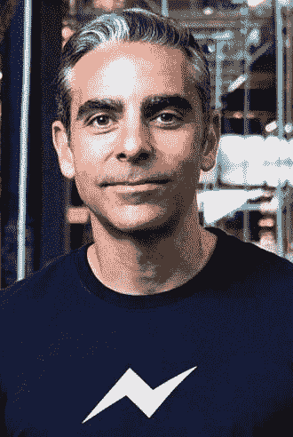

# 认识 Disrupt SF 2016 演讲人和评委 

> 原文：<https://web.archive.org/web/https://techcrunch.com/2016/09/09/meet-the-disrupt-sf-2016-speakers-and-judges/>

颠覆科幻就在眼前。该活动将于 9 月 12 日开始，我们很高兴公布活动日程。阵容很强大，我们很高兴回到旧金山 48 号码头举办迄今为止最好的 Disrupt。

大会于 9 月 12 日开幕，为期三天，内容丰富，包括鼓舞人心的企业家、精明的投资者和 TechCrunch 全球知名的[创业战场竞赛](https://web.archive.org/web/20230128194853/https://techcrunch.com/startup-battlefield/)。最终，一家初创公司将获得 5 万美元和梦寐以求的 Disrupt Cup。

[大卫·马库斯](https://web.archive.org/web/20230128194853/https://www.crunchbase.com/person/david-marcus) 是脸书公司信息产品副总裁。他领导的 Messenger 每天被全世界数亿人使用。大卫于 2014 年从 PayPal 加入脸书，此前两年他担任公司总裁，此前担任移动副总裁，领导其移动产品和业务。他将在 9 月 12 日周一上午 9:05 发表讲话。

杰森·罗宾斯是 DraftKings 的首席执行官，该公司是每日幻想运动(DFS)行业的领导者，处于其天文数字增长的最前沿。罗宾斯在 2012 年共同创立了 DraftKings，负责监督公司的所有战略和运营，同时也推动资金和合作伙伴关系。他将在 9 月 12 日周一上午 9:25 发表讲话。

[贾格尔·麦康奈尔](https://web.archive.org/web/20230128194853/https://www.crunchbase.com/person/jager-mcconnell#/entity)是 CrunchBase 的首席执行官，这是一个领先的平台，数百万企业家和投资者使用它来发现创新公司及其背后的人。贾格尔在 CrunchBase 从美国在线(AOL)分离出来后加入了该公司，此举是在去年的 TechCrunch Disrupt 上宣布的。在加入 CrunchBase 之前，Jager 在 Salesforce 工作了 11 年，担任过销售、市场营销和产品开发等多个职位。他将在 9 月 12 日周一上午 9:45 发表讲话。

[梅根·史密斯](https://web.archive.org/web/20230128194853/https://www.crunchbase.com/person/megan-smith)是美国科技政策办公室的首席技术官。在这个职位上，她是总统的助理。作为美国首席技术官，Smith 专注于技术政策、数据和创新如何推进我们国家的未来。她 是一位屡获殊荣的企业家、工程师和技术传播者。她将于 9 月 12 日周一上午 10:05 发表演讲。

[Alexander Macgillivray](https://web.archive.org/web/20230128194853/http://Fireside%20Chat:%20<a%20href=%22https://www.crunchbase.com/person/megan-smith%22%20target=%22_blank%22>%20Megan%20Smith%20</a>%20and%20<a%20href=%22https://www.crunchbase.com/person/alexander-macgillivray#/entity%22%20target=%22_blank%22>%20Alexander%20Macgillivray%20</a>%20(United%20States%20of%20America)) ，又名“amac”，是美国副首席技术官。在加入联邦政府之前，Macgillivray 先生在 Twitter 担任过各种职务，包括总法律顾问、公共政策主管、企业发展、通信和信托安全。他将于 9 月 12 日周一上午 10:05 发表讲话。

[摩根·德邦](https://web.archive.org/web/20230128194853/https://www.crunchbase.com/person/morgan-debaun#/entity) 在硅谷开始了她的职业生涯，是 Blavity 的 CEO。她是一位连续创业者，热衷于在创意和文化的交汇处构建技术。自创办 Blavity 以来，摩根一直被福布斯、NPR、TechCrunch 和赫芬顿邮报等全国性媒体援引为她这一代人的声音。她将于 9 月 12 日周一上午 10:30 发表演讲。  

[Jeff Lawson](https://web.archive.org/web/20230128194853/https://www.crunchbase.com/person/jeff-lawson) 是一位连续发明家，拥有超过 15 年的创业和产品经验。在联合创办 Twilio 之前，Jeff 是 NineStar 的创始人和首席技术官，Stubhub.com 的创始人和首席技术官，以及 Versity 的创始人、首席执行官和首席技术官。他也是亚马逊网络服务最初的产品经理之一。他将于 9 月 12 日周一上午 10:50 发表演讲。

莱斯利·麦莉 是 Slack 公司的工程总监。他曾在 Twitter、苹果和谷歌担任工程领导职务。他是几个由女性和少数族裔创办的创业公司的顾问，也是一个致力于 POC、LGBT 和女性企业家的基金的投资者。他将于 9 月 12 日周一上午 11:30 发表演讲。

[陈民亮](https://web.archive.org/web/20230128194853/https://techcrunch.com/startup-battlefield/) 是 Razer 的联合创始人兼首席执行官，Razer 是为游戏玩家提供联网设备和软件的全球领导者。他被 Juniper Research 评为“十大最具影响力的科技领袖”之一，与塞特亚·纳德拉、乔尼·伊夫、埃隆·马斯克和马云等人比肩。谭先生在 Business Insider 评选的“25 位最具创造力的科技界人士”中脱颖而出，并被 Kotaku 评为该出版物的“40 大影响力人物”之一。他将于 9 月 10 日周一上午 11:50 发表演讲。

[迈克·詹郅](https://web.archive.org/web/20230128194853/https://www.crunchbase.com/person/mike-judge#/entity)是艾美奖和金球奖提名喜剧系列《硅谷》的联合创作人、执行制片人、编剧和导演，该系列于 4 月份推出第三季，目前正在筹备第四季。他将在 9 月 10 日星期一下午 12:10 发表演讲。

[蒂姆·阿姆斯特朗](https://web.archive.org/web/20230128194853/https://www.crunchbase.com/person/tim-armstrong#/entity)是美国在线公司的首席执行官，该公司是一家领先的全球媒体技术公司，总部位于纽约市，在全球 20 多个国家开展业务。在加入 AOL 之前，Tim 在谷歌工作了近十年，担任谷歌美洲业务总裁和谷歌公司高级副总裁，并在该公司的全球运营委员会任职。他将在 9 月 12 日周一下午 1:40 发表讲话。

[Marni Walden](https://web.archive.org/web/20230128194853/https://www.crunchbase.com/person/marni-walden#/entity) 是威瑞森无线公司的执行副总裁兼首席运营官，该公司是美国最大的无线公司，负责公司在全国范围内的运营，并为消费者和企业客户提供行业领先的性能。她将于 9 月 12 日周一下午 1:40 发表演讲。

[马克·贝尼奥夫](https://web.archive.org/web/20230128194853/https://www.crunchbase.com/person/marc-benioff#/entity) 是 Salesforce 的董事长兼首席执行官。作为云计算的先驱，贝尼奥夫于 1999 年创建了该公司，其愿景是创建一种新型的企业软件公司，采用基于云的新技术模式、新的现收现付业务模式和新的综合企业慈善模式。在他的领导下，Salesforce 从一个开创性的想法发展成为一家财富 500 强公司，全球发展最快的前 10 大软件公司和最大的 CRM 公司。他将于 9 月 13 日周二 9:05 发表讲话。

[巴斯蒂安·特龙](https://web.archive.org/web/20230128194853/https://www.crunchbase.com/person/sebastian-thrun)是科学家、教育家、发明家和企业家。 他是 Udacity 的创始人、董事长兼总裁，其使命是教育民主化。Udacity 专注于负担得起的终身学习，为人们提供获得新工作或推进职业发展所需的技能。 Thrun 也是 X(之前的 Google X)的创始人，在那里他领导了自动驾驶汽车、谷歌眼镜等项目的开发。他将于 9 月 13 日星期二上午 9:25 发表演讲。

[雷德·霍夫曼](https://web.archive.org/web/20230128194853/https://www.crunchbase.com/person/reid-hoffman) 于 2009 年加入格雷洛克合伙公司成为投资合伙人。他专注于打造能够接触到数亿参与者的产品和具有网络效应的企业。 作为一名成功的企业家和高管，里德在建立当今许多领先的消费技术企业方面发挥了不可或缺的作用，包括 LinkedIn 和 PayPal。他将在 9 月 13 日星期二上午 9:45 发表讲话。

乔希·埃尔曼 是格雷洛克合伙公司的投资合伙人。他投资于建立社交网络和平台、移动应用、新媒体和互联设备的企业家。 他于 2011 年加入该团队，投资创业者打造新的消费产品和服务。Josh 专注于设计、制造和扩展消费产品，曾是多家公司的成员，这些公司的用户已经超过 1 亿。他将于 9 月 13 日星期二上午 9:45 发表演讲。

我是 Fetch Robotics 公司的首席执行官，该公司为物流行业提供先进的机器人。该公司在 2015 年 5 月推出了他们的机器人系统，包括取货和货运。在加入 Fetch 之前，Melonee 是无界机器人公司的首席执行官和联合创始人。在那之前，Melonee 是 Willow Garage 的机器人开发经理，她领导着一个工程师团队开发下一代机器人硬件，包括 PR2 和 TurtleBot。她将于 9 月 13 日星期二上午 10:10 发表演讲。

[阿什卡特](https://web.archive.org/web/20230128194853/https://www.crunchbase.com/person/ash-carter#/entity) 是第 25 任国防部长。卡特部长花了 30 多年的时间，利用他在科学技术、全球战略和政策方面的知识，以及他对国防部男女工作人员的深切奉献，使我们的国家和世界变得更加安全。他在民主党和共和党政府的 11 位国防部长的直接和间接服务中都是这样做的。他将于 9 月 13 日星期二上午 10:30 发表演讲。

马克·安德森是风险投资公司安德森·霍洛维茨的联合创始人和普通合伙人。他是一个创新者和创造者，是为数不多的开创了一个被超过 10 亿人使用的软件类别的人之一，也是为数不多的建立了数十亿美元公司的人之一。马克参与创建了极具影响力的 Mosaic 互联网浏览器，并与人合作创办了网景公司，后来以 42 亿美元的价格卖给了美国在线。他还联合创立了 LoudCloud，作为 Opsware 以 16 亿美元的价格卖给了惠普。他将于 9 月 13 日星期二上午 11 点 10 分发表演讲。

[Rana el Kaliouby](https://web.archive.org/web/20230128194853/https://www.crunchbase.com/person/rana-el-kaliouby#/entity) 是 Affectiva 的联合创始人兼首席执行官。作为麻省理工学院媒体实验室的研究科学家，拉纳率先提出了面部编码的应用。她的作品曾在《纽约客》、《连线》、《福布斯》、《快速公司》、《华尔街日报》、《纽约时报》、《美国有线电视新闻网》、《哥伦比亚广播公司》、《时代杂志》、《财富》和《红迪网》上发表。她被企业家认可为“2014 年值得关注的 7 位最有影响力的女性”之一，入选“工程女性”名人堂，获得 2012 年《技术评论》的“35 岁以下最佳创新者 35 人”奖，被列入广告时代的“40 岁以下的 40 人”，并获得史密森尼杂志的 2015 年美国技术独创性奖。她将于 9 月 13 日(星期二)上午 11:30 发言。

[Danny Lange](https://web.archive.org/web/20230128194853/https://www.linkedin.com/in/dannylange) 是优步大学机器学习的负责人，在那里他领导着一项努力，旨在建立世界上最通用的机器学习平台，以支持优步的快速增长。在人工智能这一分支的帮助下，包括深度学习，优步可以为客户提供更好的服务。此前，丹尼是亚马逊机器学习(Amazon Machine Learning)的总经理，这是一款提供机器学习即服务的 AWS 产品。他将于 9 月 13 日星期二上午 11:30 发表演讲。

[Janica Alvarez](https://web.archive.org/web/20230128194853/https://www.crunchbase.com/person/janica-alvarez#/entity) 是 Naya Health 的联合创始人兼首席执行官，负责公司领导、产品愿景和战略以及运营和卓越制造。从重新发明吸奶器和奶瓶开始，Janica 对 Naya Health 的使命是通过一系列早期婴儿营养品和服务为妈妈们创造更好的体验。她将于 9 月 13 日星期二上午 11 点 55 分发表演讲。

[黛博拉·安德森-比亚利斯](https://web.archive.org/web/20230128194853/https://www.crunchbase.com/person/deborah-anderson-bialis#/entity) 是 FertilityIQ 的联合创始人兼首席执行官。FertilityIQ 是一个供消费者查找生育医生和程序信息的平台。三分之一的试管婴儿患者现在使用该网站来查找他们的医生和研究费用以及药物方案。她将于 9 月 13 日星期二上午 11 点 55 分发表演讲。

[艾达·丁](https://web.archive.org/web/20230128194853/https://www.crunchbase.com/person/ida-tin#/entity) 是世界上发展最快的女性健康应用 Clue 的联合创始人兼首席执行官。她深信技术将深刻改变计划生育的未来。她将于 9 月 13 日星期二上午 11 点 55 分发表演讲。

尼尔·斯蒂芬森是一位未来学家和作家。在他令人印象深刻的 30 年写作生涯中，他不仅拥有当代小说中最大胆的想象力，还拥有独特的能力，通过各种主题阐释科学、技术和社会学的重要交叉。在用《冰雪奇缘》巩固了自己作为备受喜爱的推理小说作家的地位后，他在《密码经济学》中探讨了密码破译和世界大战，在《巴洛克周期》中探讨了历史小说和科学的起源，在《阿纳瑟姆》中探讨了哲学和数学，在《雷姆德》中探讨了高风险、充满动作的全球冒险。在《七夕》中，斯蒂芬森向月球射击——字面上的意思——并把粉丝带到外太空。他将在 9 月 13 日星期二下午 12:20 发表演讲。

[克里斯蒂娜·萨斯](https://web.archive.org/web/20230128194853/https://www.crunchbase.com/person/christina-sass#/entity) 是安德拉公司的联合创始人和首席运营官，该公司招聘非洲大陆最有才华的软件工程师，并将他们与全球科技公司配对，成为全职的分布式团队成员。Andela 成立的前提是，人才是平均分布的，但机会不是，它建立了世界上最挑剔的工程学院之一，总部设在拉各斯、内罗毕和纽约市。她将于 9 月 13 日周二下午 1:40 发表演讲。

George "Geohot" Hotz 因第一个从 AT & T 网络解锁 iPhone(原版)并允许该设备在其他手机运营商上工作而闻名，当时他 17 岁。他 21 岁的时候黑了 PlayStation 3。25 岁时，特斯拉找到他，要他花数百万美元为他们建造一个汽车视觉系统，他拒绝了。如今，26 岁的他计划在 2016 年底之前，以不到 1000 美元的价格为消费者带来一辆无人驾驶汽车。他将于 9 月 13 日周二下午 2:00 发表演讲。

大卫·萨克斯 是 Zenefits 的首席执行官。他是一名互联网企业家，是 Yammer 的创始首席执行官和最初的首席运营官以及 PayPal 的产品负责人。他还制作了获奖的独立电影《谢谢你抽烟》。他是脸书、优步、Airbnb、Houzz、SpaceZ 和 Palantir 等科技公司的天使投资人。他将于 9 月 13 日星期二下午 2:20 发表演讲。

[黛安·格林](https://web.archive.org/web/20230128194853/https://www.crunchbase.com/person/diane-greene#/entity) 是谷歌云业务的领导者:谷歌云、谷歌技术基础设施和谷歌应用程序。她还在 Alphabet、Intuit、Khan Academy 和 MIT 的董事会任职。Diane 是 VMware 的联合创始人，并在 1998 年至 2008 年期间担任首席执行官，使该公司上市并达到 20 亿美元的运营率。她将于 9 月 13 日周二下午 2:40 发表演讲。

斯蒂芬·库里因其在戴维森学院令人印象深刻的表演而获得了全国的关注。他在 2009 年被金州勇士队选中，最终凭借出色的投篮技术成为职业篮球的顶级球员之一。在获得最有价值球员荣誉并帮助勇士队在 2015 年赢得 NBA 总冠军后，库里带领球队在接下来的赛季中创下了 73 胜的联盟纪录。2016 年 5 月，库里成为 NBA 历史上第一个被全票评为最有价值球员的人，也是连续两年获得 MVP 奖的仅有的 11 名球员之一。他将在 9 月 13 日星期二下午 5:40 发表讲话。

[凯尔·沃格特](https://web.archive.org/web/20230128194853/https://www.crunchbase.com/person/kyle-vogt#/entity) 是 Cruise Automation 的首席执行官和创始人，该公司开发自动驾驶汽车技术，最近被通用汽车收购。此前，凯尔是 Justin.tv、Socialcam(被 Autodesk 收购)和 Twitch(被亚马逊收购)的联合创始人。凯尔在麻省理工学院学习计算机科学和电子工程。他将在 9 月 14 日星期三上午 9:05 发表讲话。

[Emmett Shear](https://web.archive.org/web/20230128194853/https://www.crunchbase.com/person/emmett-shear#/entity) 是 Twitch([www . Twitch . TV](https://web.archive.org/web/20230128194853/http://www.twitch.tv/))、全球领先的社交视频平台 和游戏玩家社区的创始人兼 CEO。希尔还是风险投资公司 Y Combinator 的兼职合伙人，在那里他为羽翼未丰的初创公司提供产品和战略方面的建议。在 2011 年推出 Twitch 之前，他在 2007 年共同创立了它的前身 Justin.tv。他将在 9 月 14 日星期三上午 9:25 发表演讲。

Adam Mosseri 我是脸书公司的产品管理副总裁，领导负责新闻订阅的产品团队。新闻订阅团队负责通过手机、平板电脑和网络向超过 17 亿人提供相关内容。在此之前，7 Adam 是移动产品组的设计总监，负责脸书所有移动应用的设计。他将在 9 月 14 日星期三上午 9:45 发表讲话。

Hemant Taneja 是风险投资公司 General Catalyst 的董事总经理，该公司管理着约 37.5 亿美元的资产。他在 2011 年创办了帕洛阿尔托公司。他关注那些肩负改变整个行业使命的创业者。Taneja 目前的投资组合涉及能源、教育、媒体、医药和金融等领域，包括 Stripe、Snapchat、Gusto、Livongo Health、TuneIn、ClassDojo、Fundbox、Digit、Fractyl、Gridco Systems 和 Highfive 等公司。他将于 9 月 14 日星期三上午 10:05 发表演讲。

[Bradley Tusk](https://web.archive.org/web/20230128194853/https://www.crunchbase.com/person/bradley-tusk#/entity) 是 Tusk Holdings 的创始人兼首席执行官，该公司是 Tusk Strategies、Tusk Ventures、克罗诺斯档案馆、象牙博彩集团和 Tusk Montgomery 家族基金会的母公司。在 2010 年创建图斯克战略之前，布拉德利曾担任迈克彭博的竞选经理，指导彭博市长第三次连任。2016 年，他为彭博可能的总统竞选提供建议。他将于 9 月 14 日星期三上午 10:05 发表演讲。

Ted Ullyot 是 Andreessen Horowitz 的合伙人，负责政策和监管事务。他也是经济创新集团的联合创始人，该集团汇集了各政治领域的领先企业家、投资者、经济学家和政策制定者，以应对美国的经济挑战。从 2008 年到 2013 年，Ted 担任脸书的总法律顾问，在那里他建立并管理公司的法律和安全团队，从私营、早期到 IPO。  他将在 9 月 14 日星期三上午 10:05 发表演讲。

Apoorva Mehta 是 Instacart 的创始人兼首席执行官，insta cart 是一家快速发展的零售配送服务公司，其员工从受信任的当地商店挑选并配送商品。Instacart 最初在旧金山推出，后来扩展到许多其他城市，它从根本上改变了传统的杂货配送速度，将顾客与购物者和司机联系起来，他们在短短一小时内购买并配送杂货和其他物品。他将在 9 月 14 日星期三上午 10:30 发表演讲。

Marc Raibert 是波士顿动力公司(BDI)的联合创始人兼总裁，该公司位于剑桥的麻省理工学院附近。Raibert 的研究致力于研究动态移动的系统，包括物理机器人和动画生物。Raibert 在麻省理工学院的实验室 Leg Lab 因其在动态移动系统方面的工作而闻名，包括腿式机器人、模拟机械装置和动画人物。他将于 9 月 14 日周三下午 3:15 发表讲话。

[戴安娜·威廉姆斯](https://web.archive.org/web/20230128194853/https://www.crunchbase.com/person/diana-williams#/entity)是卢卡斯电影公司故事组的成员，该团队负责开发《星球大战》宇宙中叙事的凝聚力和连通性。她还是 ILMxLAB 的创意开发主管，ILMxLAB 是一个沉浸式增强和虚拟娱乐的实验室。她将于 9 月 14 日周三下午 3:35 发表讲话。

Michael Koperwas 为 ILMxLAB 的众多内部项目和演示提供创意指导和监督。在 2016 年 6 月 xLAB 首次成立时，迈克尔领导了最初的原型团队，致力于魔兽争霸(艾泽拉斯上空)、Jakku Spy 和 Jakku Sundance xDECK 演示的概念，并领导团队进行 xLAB 的 Magic Leap 初始调查和合作。他将在 9 月 14 日周三下午 3:35 发表讲话。

[桂·卡瓦尔康蒂](https://web.archive.org/web/20230128194853/https://www.crunchbase.com/person/gui-cavalcanti#/entity)是 MegaBots 的首席执行官和联合创始人。他将于 9 月 14 日周三下午 4 点发表讲话。

[马特·奥莱因](https://web.archive.org/web/20230128194853/https://www.linkedin.com/in/mattoehrlein) 是首席运营官和 MegaBots 的联合创始人，通过在体育场大小的战斗中让数吨重的无人驾驶机器人相互对抗，创造了体育和现场娱乐的未来。他的 背景从高科技液压和军事研究到制作数百万观看量的病毒视频。他拥有明尼苏达大学控制理论&机器人学硕士学位。他将在 9 月 14 日星期三下午 4 点发表演讲。

Shervin Pishevar 是 Sherpa Capital 的董事总经理，这是一家总部位于旧金山的风险投资公司，他于 2013 年 3 月与斯科特·斯坦福共同创立。夏尔巴资本是优步、Airbnb、Munchery、ipsy、Shyp、Stance、Rent the Runway、Beepi、PillPack、Doctor on Demand 和 Cue Health 等公司的投资者。谢文是 Hyperloop One 的联合创始人兼执行董事长。他将于 9 月 14 日周三下午 5 点发表讲话。

**评委**

Stewart Alsop 是 Alsop Louie Partners 的联合创始人和合伙人，Alsop Louie Partners 是一家早期技术风险投资公司，成立于 2006 年，位于旧金山。该公司专注于颠覆性和创新性技术，并在网络安全、预测分析、教育和娱乐领域进行了投资。该公司牵头投资的一些公司包括 Twitch(已被亚马逊收购)、Netwitness、Keyssa、Cleversafe、Wickr 和 Lookingglass 网络安全公司。

[安茹拉·阿查里亚-巴斯](https://web.archive.org/web/20230128194853/https://www.crunchbase.com/person/anjula-acharia-bath#/entity)是 DesiHits 的 CEO！她将自己的职业生涯建立在弥合宝莱坞和好莱坞之间的流行文化鸿沟上。在最初担任搜索公司 Merchant McKenzie 的联合创始人后，这位在英国长大的企业家搬到了美国，与丈夫兰吉·巴斯(Ranj Bath)一起创办了 DesiHits.com 网站。这个在线目的地已经成长为一个多媒体平台，Acharia-Bath 已经从投资者那里筹集了资金，包括 Interscope Geffen A & M 董事长吉米·艾奥文。

[斯科特·贝尔斯基](https://web.archive.org/web/20230128194853/https://www.crunchbase.com/person/scott-belsky#/entity)是 Benchmark 的普通合伙人。此前，斯科特于 2006 年联合创立了 Behance，并担任首席执行官，直到 2012 年 Adobe 收购 Behance。数百万人使用 Behance 来展示他们的作品，以及追踪和寻找创意产业的顶尖人才。三年来，Scott 担任 Adobe 的产品副总裁，重新启动 Adobe 的移动产品战略，并领导 Behance，这是一个领先的创意人员展示和发现创意作品的在线平台。

Aparna Chennapragada 是一名在 IIT(印度麻省理工学院)和麻省理工学院接受培训的计算机科学家，也是一名产品负责人，拥有多年构建和发展搜索和 YouTube 等谷歌产品的经验，Aparna 是 Google Now 的负责人。通过 Google Now，Aparna 正在引领谷歌的大赌注，让智能手机变得更智能，并改变我们在移动世界中获取信息和完成事情的方式。

Rafael Corrales 现在是 CRV 的普通合伙人，他带来了早期创业公司的运营和创始人兼首席执行官的经验。他领导了 CRV 对 Amino 的投资，以及目前两家隐形公司的投资。他还获得了 CRV 对 PillPack 和 Airtable 等公司的投资。

[Brian Dixon](https://web.archive.org/web/20230128194853/https://www.crunchbase.com/person/brian-dixon-2) 专注于识别和评估早期投资，同时帮助投资组合公司有效成长。在作为 MBA 实习生度过两个夏天后，Brian 加入了 Kapor Capital。他致力于确保各种背景的企业家都能获得建议和资金，以使他们的企业取得成功。

伊利亚·福什曼是 Index Ventures 的合伙人。作为一名拥有运营和风险投资背景的前学者，他对尖端技术的前沿充满热情，并帮助下一波创业公司和企业家建立全球业务。在加入 Index 之前，Ilya 是 Dropbox 的产品主管。

罗布·海斯于 2006 年作为合伙人加入第一轮，开设了该公司的旧金山办事处。在过去的八年里，他领导了对 Mint.com(被 Intuit 收购)、Gnip(被 Twitter 收购)、Square、优步和 Planet Labs 等公司的投资。

[温德·赫顿](https://web.archive.org/web/20230128194853/https://www.crunchbase.com/person/wende-hutton)是一名医疗保健投资者，他在识别、投资和建立改变医疗实践的公司方面拥有 23 年的经验。她帮助将十几种医疗设备和药物推向市场，目前是 Antiva Biosciences、Chrono Therapeutics、Glooko、OncoResponse、ReVision Optics 和 Theraclone Sciences 的董事会成员。

[Aileen Lee](https://web.archive.org/web/20230128194853/https://www.crunchbase.com/person/aileen-lee#/entity) 作为投资者和经营者，在帮助初创公司打造客户喜爱的产品和帮助公司扩大规模方面拥有多年的经验。她是 Cowboy Ventures 的创始人，这是一家专注于种子阶段的基金。Cowboy Ventures 寻求支持杰出的创始人，他们正在开发技术产品，在不断增长的大市场中重塑工作和个人生活。

Jenny Lefcourt 是旧金山 6000 万美元种子基金 Freestyle 的合伙人，该基金的合伙人都是连续创业者。珍妮投资于下一代商务、市场、房地产技术和 SaaS。Freestyle 已经牵头投资了 Intercom、Patreon、Apple Pie Capital 和 Digit 等公司。

[苏珊·莱恩](https://web.archive.org/web/20230128194853/https://www.crunchbase.com/person/susan-lyne)是 BBG 风险投资公司的创始人兼总裁，这是一家为女性领导的科技创业公司设立的早期投资基金。

[叶小乖·马格斯卡斯](https://web.archive.org/web/20230128194853/https://www.crunchbase.com/person/carine-magescas#/entity)是 AngelPad 的合伙人，angel pad 是一家种子风险投资基金和加速器，总部设在旧金山和纽约。AngelPad 在 2015 年被麻省理工学院/莱斯大学的 Seed 排名项目评为美国排名第一的加速器。

塞尔吉奥·蒙萨尔维是诺韦斯特风险投资公司的合伙人。他专注于电子商务、消费化 SaaS、消费金融和教育技术领域的早期和成长型投资。他目前的投资和董事会席位包括适应性规划、仿生熊猫游戏、Branchout、Gemvara、Motif 投资和 Rafter。

Stephanie Palmeri 投资于小额风险投资基金 SoftTech VC，在那里她领导下一代商务和市场、移动服务、SaaS、消费者健康和 edtech 初创公司的交易，包括 Poshmark True & Co .、Clever、Handshake、Grovo、Panorama Education、Lantern 和 ClassDojo。Stephanie 目前代表 SoftTech 担任 Chariot、Educents 和 Fatherly 的董事会成员以及众多投资的董事会观察员。

彼得·范(Peter Pham)是成立四年的科技工作室 Science 的联合创始人，该工作室帮助孵化公司，与首席执行官一起共同创建公司，最近成立的公司包括以 10 亿美元出售给联合利华的 Dollar Shave Club，以及 DogVacay 等领先市场。

[布莱恩·波科尔尼](https://web.archive.org/web/20230128194853/https://www.crunchbase.com/person/brian-pokorny)是 SV 天使的普通合伙人。在此之前，他在 Airbnb，通过收购 DailyBooth/Batch 加入。DailyBooth 是一家风险投资支持的社交媒体初创公司，布莱恩担任首席执行官领导了三年。

桑蒂·苏博托夫斯基是新兴资本公司的普通合伙人。在加入 Emergence 之前，桑蒂在拉丁美洲创办了 SaaS 电子学习公司 AXG·泰克农西奥。他将公司扩大到 150 多名员工，业务遍及拉丁美洲和美国

[Sarah Tavel](https://web.archive.org/web/20230128194853/https://www.crunchbase.com/person/sarah-tavel#/entity) 于 2015 年加入 Greylock Partners 成为投资合伙人。她关注的领域包括产品、平台、网络和市场，支持新形式的通信、媒体和商业。

[童士豪](https://web.archive.org/web/20230128194853/https://www.crunchbase.com/person/hans-tung)于 2013 年加入 GGV 资本，担任管理合伙人，专注于中国和美国的消费者移动互联网、跨境电子商务、物联网和移动社交通信投资

[Monique Woodward](https://web.archive.org/web/20230128194853/https://www.crunchbase.com/person/monique-woodard#/entity) 是 500 Startups 的风险合伙人，她投资于早期初创公司，并领导了一个 2500 万美元的小额基金，投资于黑人和拉丁裔创始人及市场。她认为，不断变化的人口结构，加上目前 2.5 万亿美元的黑人和拉美裔购买力，正在创造下一个巨大的新兴市场——就在美国。

Cyan Banister 是 Founders Fund 的合伙人，她投资于多个行业和阶段，尤其关注监管严格的行业、市场、SaaS 和帮助具备基本技能的人找到有意义工作的企业。在加入创始人基金之前，Cyan 是一名活跃的天使投资人，投资组合包括优步、图钉、SpaceX、EShares、Postmates 和 Affirm。

[马修·潘扎里诺](https://web.archive.org/web/20230128194853/https://www.crunchbase.com/person/matthew-panzarino#/entity)曾是一名零售骑师，创办了一家专业摄影公司，并拥有一个报道苹果生态系统的新闻博客。他曾担任 Next Web 的新闻编辑和执行编辑，现在是 TechCrunch 的主编。

[鲁洛夫博塔](https://web.archive.org/web/20230128194853/https://www.crunchbase.com/person/roelof-botha#/entity)专注于互联网、服务和软件投资。他是 Eventbrite、Evernote、Inside.com、MongoDB、Natera (NTRA)、Plain Vanilla、Square、Unity Technologies、Weebly 和 Whisper 的董事。他还参与了红杉资本投资组合公司，包括 AssureX 和 mapi pile。

[苏珊·沃西基](https://web.archive.org/web/20230128194853/https://www.crunchbase.com/person/susan-wojcicki#/entity)是 YouTube 的首席执行官。此前，她是谷歌广告和商务高级副总裁。她监管谷歌广告、商业和测量平台产品的设计、创新和工程，包括 AdWords、AdSense、DoubleClick、Offers 和谷歌分析。

[Padmasree Warrior](https://web.archive.org/web/20230128194853/https://www.crunchbase.com/person/padmasree-warrior#/entity) 是美国 NextEV 公司的首席执行官，她还担任 NextEV 公司的首席开发官，以及董事会成员。在这些职位上，她负责 NextEV 自动驾驶汽车、电动汽车和整体用户体验的大脑。