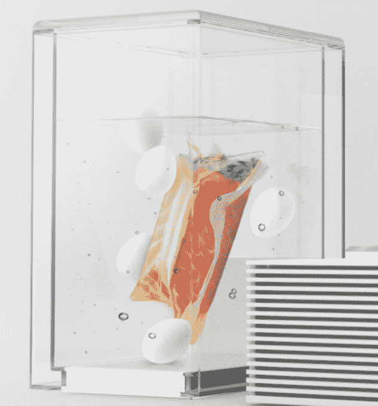

# Mellow 是忙碌的厨师 TechCrunch 的一款简单易用的机器

> 原文：<https://web.archive.org/web/https://techcrunch.com/2014/05/06/mellow-is-a-foolproof-sous-vide-machine-for-the-busy-chef/>

# 对于忙碌的厨师来说，Mellow 是一台万无一失的缝纫机

真空烹饪是一种烹饪方法,通过在温水浴中烹饪食物，你可以做出非常鲜嫩的蔬菜和肉类。在过去的几年里，它越来越受欢迎，像 [Anova](https://web.archive.org/web/20221007134443/https://beta.techcrunch.com/2013/09/09/hands-on-with-the-anova-automatic-sous-vide-system/) 这样的家用机器在过去的一年里降低了一台好机器的价格。现在有了 [Mellow](https://web.archive.org/web/20221007134443/http://cookmellow.com/) ，一种智能煮蛋器，你可以通过编程在精确的时间制作煮软的鸡蛋，并保持食物冷却直到需要烹饪。

它的工作原理是冷冻水和其中的物品，直到它准备好烹饪。然后，机器将水温升至 195 华氏度，并使水在真空密封的食材周围循环，直到它们可以食用。你不需要真空封口机，该套件包括可重复密封的塑料袋。内置秤称食物重量，并根据食物类型设置时间和温度。简而言之，你把食物放进去，按下手机上的一个按钮，然后回家吃一顿真正美味的牛排。

真正的智能在应用程序中，它可以计算出你在吃什么，提醒你食谱，并问你是否想尝试旧最爱的新变化。你也可以设置炊具在特定时间打开，当你的食物做好时通知你。

[机器的预购价格为 400 美元](https://web.archive.org/web/20221007134443/http://cookmellow.com/)，可能物有所值。鉴于它有点像一个可编程的咖啡机和一个非常好的烹饪设备，你在一个小包装里获得了很多价值，作为一个真空烹饪爱好者，让我告诉你，一个好的真空牛排或鸡胸肉是惊人的，从这些东西里出来的奇怪的脆而熟的蔬菜是很棒的。

Mellow 看起来也真好看。该团队由[卡塔琳娜·维奥兰特](https://web.archive.org/web/20221007134443/http://www.linkedin.com/in/catarinaviolante)和泽·平托·费雷拉创建，最初在葡萄牙，现在在英国设计厨房硬件。他们的愿景是为家庭厨师创造易于管理的工具，这样他们就可以“放松”，让食物自己烹饪。听起来很好吃。

【YouTube = https://www . YouTube . com/watch？feature = player _ embedded & v = ain MTI 51 gpw]