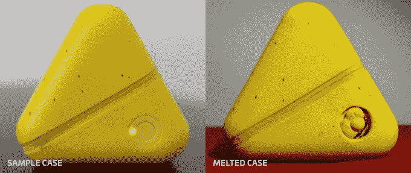
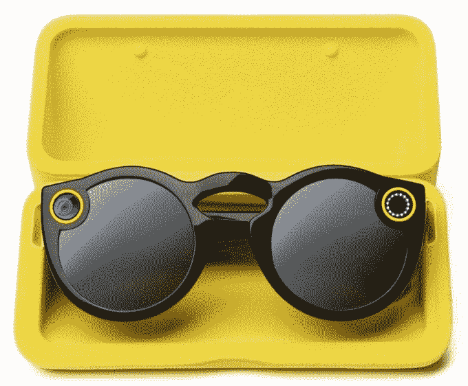

# 这个 Snapchat 眼镜盒在充电时融化了 

> 原文：<https://web.archive.org/web/https://techcrunch.com/2017/01/26/melted-spectacles-case/>

Galaxy Note 7napchat？Snap Inc .的 Spectacles 相机眼镜的一位所有者也有类似的经历。他们告诉 TechCrunch，在给眼镜盒充电半小时后，他们回来发现“内部熔化了”，并向我们提供了这张照片证据。不愿透露姓名的店主写道，你可以看到“大按钮和发光二极管……所有这些现在都是有线的。”

当 TechCrunch 向 Snap Inc 询问情况时，一位发言人回应道，“我们的团队正在与这位客户联系，我们正在与他合作调查这个问题。在我们了解更多信息之前，我们不能进一步评论，但想强调的是，对我们来说，没有什么比我们社区的安全更重要。”

TechCrunch 拍摄的一张状态良好的普通眼镜盒照片(左)，以及店主拍摄的一张熔化的眼镜盒照片(右)

我们的消息来源称，这些眼镜是在 12 月中旬从纽约市眼镜弹出式商店购买的。他们使用随附的特殊电缆连接到笔记本电脑、电池组或苹果 iPhone 充电器，多次为表壳和眼镜充电，没有出现任何问题。

但这一次，当他们将眼镜盒连接到同一个苹果 5W 墙壁充电砖时，店主写道“大约半小时后，我闻到了烧焦的味道。看了看箱子，里面的东西已经熔化了。我去摸的时候箱子很烫。”

这令人担忧，因为如果有足够的热量泄漏出来熔化外壳，它可能会引发火灾。主人写道“我拔掉了电源，让它冷却。幸运的是，眼镜不在盒子里，所以它们没有像 Note 7 一样走这条路。”

Snap Inc .在听说这个问题后迅速采取行动，主动提出给车主送一双新的，并把新的拿回去调查。老板说公司在处理支持方面做得很好。

现在的问题是 Snap Inc 即将进行的调查会有什么结果，以及美国消费品安全委员会是否会介入。在收到几十份过热报告后，美国消费品安全委员会要求召回三星 Galaxy Note 7。snap Inc .[有目的地限制眼镜](https://web.archive.org/web/20221006181229/https://beta.techcrunch.com/2016/11/15/spectascobles/)的销售，让他们觉得自己是独一无二的，这可能表明它没有卖出足够多的产品，一个故障设备可能是合理的预期。

这起不了了之的案件可能会让人对 Snap Inc .的硬件抱负产生怀疑，该公司正依靠这种抱负来说服投资者相信其预计在 3 月份进行的 IPO 的潜力。虽然这肯定是一次性的侥幸，但这个问题加上 Snapchat 缺乏硬件经验，可能会让买家对这家初创公司发明的眼镜或未来设备望而却步。