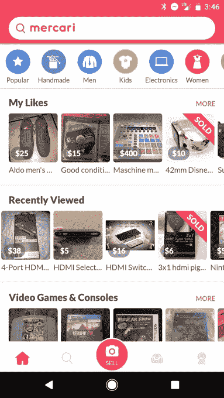

# Mercari 从脸书的管理团队聘请 John Lagerling 指导其美国战略 

> 原文：<https://web.archive.org/web/https://techcrunch.com/2017/06/21/mercari-hires-john-lagerling-from-facebooks-management-team-to-guide-its-u-s-strategy/>

当 [Mercari](https://web.archive.org/web/20221025222720/https://www.mercari.com/) 去年以 7500 万美元成为日本第一家创业独角兽时，[的资金被指定用于推动其成为美国顶级二手市场应用的目标](https://web.archive.org/web/20221025222720/https://beta.techcrunch.com/2016/03/01/mercari-unicorn/)。现在，Mercari 正加倍努力，在其他亚洲电子商务公司没有做到的地方取得成功。今天，它发布了其美国应用程序的更新版本，[宣布从脸书的管理团队聘请约翰·拉格林](https://web.archive.org/web/20221025222720/https://www.mercari.com/info/2017/06/21/john-is-joining-mercari/)担任其首席商务官。

尽管阿里巴巴和乐天一直难以在美国产生影响，但拉格林说，这并没有吓倒梅尔卡利。到目前为止，该应用程序已经被下载了 2500 万次，而一年前只有 1000 万次，目前它在全球范围内每月的交易量为 1 亿美元。但是，Mercari 必须用一系列二手市场应用程序(包括 [OfferUp](https://web.archive.org/web/20221025222720/https://offerup.com/) 、 [Letgo](https://web.archive.org/web/20221025222720/https://us.letgo.com/en) 、 [Poshmark、](https://web.archive.org/web/20221025222720/https://poshmark.com/)和 [Depop](https://web.archive.org/web/20221025222720/https://www.depop.com/) ，仅举几例)来争取美国消费者，当然，所有这些应用程序都面临着[易贝](https://web.archive.org/web/20221025222720/http://www.ebay.com/)和[亚马逊](https://web.archive.org/web/20221025222720/http://www.amazon.com/)的挑战，这两家公司已经用了 20 年时间来定义美国的电子商务格局。

拉格林曾是脸书负责业务发展、移动和产品合作伙伴关系的副总裁，此前曾在谷歌担任过几个领导职务，他告诉 TechCrunch，Mercari 将美国视为重中之重，而不是其次于其国内市场。

“如果作为一家公司，你在本土市场过于成熟，那么在其他地方投资资源总是成为第二优先事项，除非你能作为挑战者在新市场取得成功，否则你真的很难做到这一点，”他说。

Mercari 将美国业务视为在其他国家取得成功的重要垫脚石(该公司最近也在英国推出了这一业务)。

“如果 Mercari 能在美国成功，我相信我们也能在其他地方成功。它迫使公司迅速达到全球标准，我认为美国是全球最具竞争力的市场之一。这将基本上增强在其他地方的竞争力，”拉格林说。“这是一个大胆的举动，但我认为会有回报的。”

在旧金山，Lagerling 将负责一个快速发展的团队。Mercari 正在大举招聘，目前在美国有 100 名员工，而一年前只有 30 人(在日本有 400 人)。

除了新的外观，Mercari 的美国应用程序现在还有一个特定的代码库，这意味着新功能将更快地到达美国用户手中。日本的应用程序在美国人看来往往非常杂乱，所以美国的应用程序在视觉上更干净，而且它也让人们更容易在不同的类别中搜索他们想要的东西(拉格林说，日本用户往往通过浏览推荐的商品进行购买)。

Mercari 还将增加营销支出，在传统媒体和其他地方购买广告，以提高其品牌形象。

该公司希望通过创造一种非常简单的用户体验来区别于其竞争对手，这种用户体验已经成为默认的二手市场应用。这意味着不仅要让卖家上传商品无缝衔接，还要将商品运送给买家。

在日本，Mercari 还不得不与雅虎等老牌电子商务公司竞争。日本和乐天市场。它通过让物流变得没有痛苦而广受欢迎，它希望为美国用户复制这种体验。

在国内市场，Mercari 与日本最大的快递公司之一 Yamato Transport 整合，而在美国，它已经与美国邮政和联邦快递合作，提供自动计算运输标签等服务(它甚至会打印并邮寄给没有打印机的卖家)。Mercari 计划增加更多的航运公司，并与希望解决物流相关技术挑战的初创公司合作。

拉格林说:“我认为美国有创新的空间，像易贝这样的传统企业还没有真正去那里创新。”。

然而，美国的物流比日本更难管理，Mercari 还必须努力保持用户的兴趣，因为用户在销售商品时有越来越多的选择。但拉格林表示，愿意在脸书和 Instagram 上销售商品的人的数量，尽管这些交易经常涉及大量的信息和亲自提货，证明仍然有其竞争对手没有满足的需求，以及 Mercari 在其他亚洲电子商务公司没有满足的地方取得成功的空间。

拉格林在东京大学经济学研究生院进行了他的硕士论文研究，并在日本工作了几年，先是在 NTT 电信 DoCoMo，然后是谷歌。拉格林说，Mercari 的文化与美国公司相似，他认为这是它的一个优势。

“谷歌、脸书和其他公司的许多最佳实践已经被 Mercari 采用，这令人耳目一新。他说:“硅谷公司出人意料地受共识驱动，这并不适用于所有的企业文化，Mercari 与它们相似。“坦率地说，这是它将成为少数几家在海外获得成功的日本公司之一的原因之一。”