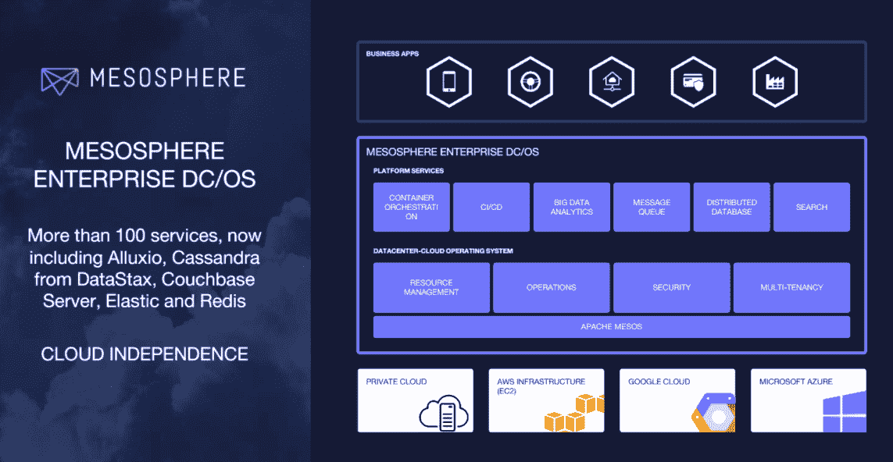

# Mesosphere 的 DC/操作系统增加了更多一键式集成，并为机器学习工作负载提供了更好的支持 

> 原文：<https://web.archive.org/web/https://techcrunch.com/2017/03/14/mesospheres-dcos-adds-more-one-click-integrations-and-better-support-for-machine-learning-workloads/>

# Mesosphere 的 DC/OS 增加了更多的一键式集成，并为机器学习工作负载提供了更好的支持

Mesosphere 正在发布其[DC/操作系统平台](https://web.archive.org/web/20221207135126/https://mesosphere.com/product/)的升级版本，用于在私有云和公共云中运行微服务和大数据应用。DC 操作系统的 1.9 版本比初看上去的版本号要大得多。

通过此次更新，DC/操作系统用户现在只需点击一下鼠标就可以部署 100 多种服务。该公司在此次发布中增加的一些新服务包括用于高速分布式存储访问的 Alluxio、NoSQL 数据库 Couchbase、分布式数据库服务 DataStax Enterprise、分析服务 Elastic Search 和 Redis 内存数据结构存储。所有这些新的集成都基于 DC/操作系统合作伙伴 SDK。正如该公司指出的，这意味着现在在几天内建立一个完整的数据服务基础设施相对容易(尽管仍然不是完全微不足道)。

此外，DC/OS 现在包括对基于 GPU 的调度的支持，允许运营商将 GPU 与其基础设施的其余部分相结合，并将其保留用于机器学习工作负载。这是 Nvidia 和 Mesosphere 在 2015 年宣布的[工作的延伸。](https://web.archive.org/web/20221207135126/https://mesosphere.com/blog/2015/11/10/mesos-nvidia-gpus/)

DC/操作系统现在包括新的数据收集和指标，允许用户跨容器监控他们的部署。这种简化的日志记录系统可以与其他监控工具集成，包括 Splunk 和 Datadog。

虽然看起来似乎 Mesosphere、Docker 和 Kubernetes 在争夺相同的客户，但 Mesosphere 已经在大数据世界中找到了自己的位置。通过这次更新，该公司正在建立其在这一领域的优势，但它也显然有兴趣支持更新的机器学习工作负载。毕竟，正是这种工作负载让企业存储在数据仓库中的大量数据重新变得有价值。

