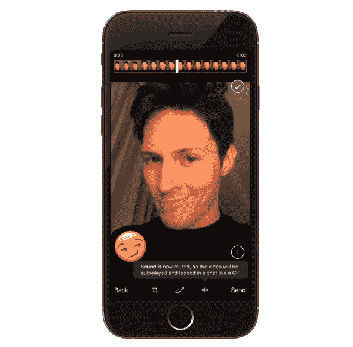

# 消息应用 Telegram 添加自拍面具、DIY GIFs 

> 原文：<https://web.archive.org/web/https://techcrunch.com/2016/09/24/messaging-app-telegram-adds-selfie-masks-diy-gifs/>

鉴于 Snapchat 爱好自拍的粉丝群，消息平台 Telegram 加强了其应用内的照片编辑器，称之为“[娱乐化更新](https://web.archive.org/web/20230302171803/https://telegram.org/blog/masks)”——包括一个选项，允许用户通过添加自动对准他们面部的卡通面具来定制自拍。Snapchat 当然有一个用于转换用户自拍的[镜头功能](https://web.archive.org/web/20230302171803/https://techcrunch.com/2016/01/06/snapchat-lenses/)。

电报功能远没有 Snapchat 的镜头复杂；更多的是“自拍增强”而不是全面的面部改造，因为它只适用于照片(而不是视频)。它实际上只是另一套贴纸，可以添加到您已经抓拍的照片上。但是[在信息平台](https://web.archive.org/web/20230302171803/https://techcrunch.com/2016/06/13/chat-app-line-makes-over-270-million-a-year-from-selling-stickers/)上的受欢迎程度不应该被低估。

可以通过 Telegram 的照片编辑器应用遮罩，只需轻按笔来编辑您选择发送的照片，然后轻按信封来调出遮罩集。

用户还可以使用/ *newmasks* 命令和 Telegram 的 [@stickers](https://web.archive.org/web/20230302171803/https://telegram.me/stickers) bot 创建自定义面具并上传到平台。(收到带有面具的照片的用户还可以看到面具来自哪个片场。)

目前，Telegram 有一系列卡通面具供用户选择，如动物脸、傻眼镜、喜剧胡子、帽子、假发等，以及其他卡通道具，如星星、心、更可爱的动物、泡泡字母字幕等。现有的电报贴纸也可以添加到照片中。

此外，在这个视觉主题的更新 Telegram 中，用户现在可以通过录制视频，然后点击一个新的静音按钮，将其转换为循环 GIF，来创建自定义 GIF，并在聊天中发送。gif 也可以用常用的表情符号、文本、彩色涂鸦等来扩充。

这家初创公司[展示了 DIY GIF 功能](https://web.archive.org/web/20230302171803/https://telegram.org/blog/masks),展示了创始人帕维尔·杜罗夫拍摄的自己露出类似傻笑的表情。

它指出，用户创建的任何 DIY GIFs 都被保存到该应用的 GIF 部分——“这样你就可以通过一套自己预先录制的 GIF 情绪对任何事情做出快速反应”。

本次更新中还增加了一个趋势标签标签——可能是帮助发现标签的一种方式。视觉可能比文字更容易理解，但是在无数的噘嘴、假笑和侧目中找到完美的贴纸就像搜索 *le mot juste* 一样耗时。

Telegram 在这一点上没有公布任何更新的用户指标，Durov 告诉 TechCrunch，它正在为这方面的重大年度披露做准备。

这家初创公司去年 2 月[在巴塞罗纳的 MWC 举办了一场炫目的派对，宣称每月有 1 亿活跃用户。当时它还表示，每天新增 35 万用户，每天产生约 150 亿条信息。(作为对比，Snapchat 在 3 月](https://web.archive.org/web/20230302171803/https://techcrunch.com/2016/02/23/encrypted-messaging-app-telegram-hits-100m-monthly-active-users-350k-new-users-each-day/)宣布每日活跃用户达到 1 亿*。)*