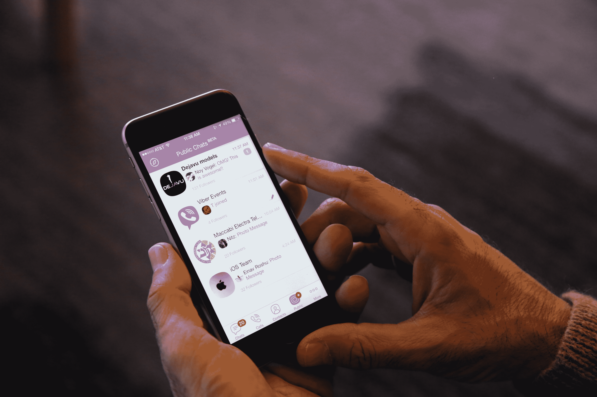

# 消息应用 Viber 通过新的公共聊天功能向社交网络迈进了一步

> 原文：<https://web.archive.org/web/https://techcrunch.com/2014/11/18/messaging-app-viber-takes-a-step-into-social-networking-with-new-public-chats-feature/>

许多消息应用程序一直在强调他们的服务是人们与朋友直接交流的一种很好的方式，这与脸书等社交网络的裸露性质相反。但今天，拥有 2.09 亿用户的即时通讯应用 Viber 采取了不同的方式:它推出了公共聊天，让用户可以使用其直接消息和语音服务应用向全世界广播。

公共聊天将引入实时对话流——来自名人，或者像首席执行官塔尔蒙·马尔科告诉我的那样，其他有趣的人“比如出租车司机！”—将对任何关注者开放，但不一定参与其中。如果有问题的帐户在他们的联系人中，用户将只能在公共聊天中跳转和交谈。

(然后，那些评论就会成为大众流的一部分。)

它给今年早些时候被日本乐天以 9 亿美元收购的 Viber 带来了一点社交媒体的旋转，同时有助于它与拥挤的消息应用包的其余部分区分开来，后者由脸书(Messenger: 5 亿用户；WhatsApp:600m)；但也包括许多其他非常受欢迎的应用，如微信(6 亿用户)；线；还有很多。

Public Chats 推出了一份“全球名人”名单，其中包括佩雷兹·希尔顿、YouTube 红人泰勒·奥克利、创作歌手皮克茜·洛特、国际 DJ 保罗·范·戴克、数字时尚创新者 Next Model Management、欧洲足球频道 COPA90。

在纽约参加 Viber 为宣布这一消息而组织的两场活动中的一场时，Marco 告诉我，它首先针对 Android 设备进行了优化，但也适用于 Viber 5.0 或更高版本的其他原生应用。您从主菜单中选择公共聊天栏，然后选择“指南针”图标以查找可关注的公共聊天列表，然后关注它们。

Marco 不愿直接评论是否有任何 Public Chats 的早期采用者通过使用该服务获得了报酬，但这一过程至少听起来像是他们中的一些人通过另一种方式注册，将他们的社交媒体覆盖范围扩大到那些选择使用 Viber 作为他们的交流平台的人。

“我们和一些人谈过，有些人表示愿意参与，”他说。“一般来说，我们在寻找那些能创造有趣聊天的人——不仅仅是名人，还有其他人，比如出租车司机或博客写手，我们觉得他们的对话会很有趣。”而且，据推测，可以接受将他们的对话或部分对话公之于众，让 2.09 亿人看到。

现在，每个人都没有选择让自己的信息流成为公共组合的一部分，但那些觉得自己的聊天值得公共聊天的人可以给 publicchats@viber.com 发电子邮件，“我们会考虑的，”他说。“我们的目的是在服务推出后进一步开放。作为测试版产品，我们希望一开始就有更大的控制权。”

对于 Viber 来说，这样做的动机是双重的。这是关于使用受欢迎的人来为 Viber 带来更多的参与，并为平台带来更多的新用户。但这也是为了让自己区别于其他大量的消息服务。

“这不是推特，”他说。这个想法是，如果你认识皮克茜·洛特，她可以将她添加到你的公共聊天中，全世界都可以看到“你对她说了什么，她对你说了什么”。

Marco 坚持认为，需要澄清的是，这与 Viber 寻找投放广告的方式无关。不像 Snapchat，它正在推进其广告服务，“我们不是，”他说。“这只是 Viber 上的附加内容。公共聊天中不会出现广告。”

有趣的是，这并不排除品牌可能直接与公众聊天者达成交易，类似于 Instagram 或 Twitter 上发生的情况，某些明星使用他们的订阅来推广某些产品。“当然，如果你想的话，你可以登广告，比如说，可口可乐。但这是你的内容，你的聊天，我们自己永远不会介绍这样的东西。”