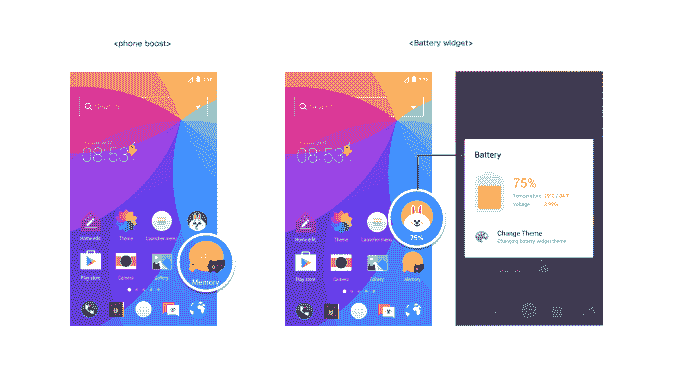

# 消息公司 Line 为 Android 设备推出了一款启动器应用程序

> 原文：<https://web.archive.org/web/https://techcrunch.com/2015/08/31/messaging-firm-line-introduces-a-launcher-app-for-android-devices/>

# 消息公司 Line 为 Android 设备推出了一款启动器应用

在发布了一款[安卓启动应用](https://web.archive.org/web/20230326023144/https://play.google.com/store/apps/details?id=com.campmobile.launcher)之后，日本消息公司 Line 继续其新应用和服务发布[的热潮。](https://web.archive.org/web/20230326023144/http://linecorp.com/en/pr/news/en/2015/1068)

启动器应用程序本质上是对 Android 设备的中央控制，允许用户定制其外观、感觉和用法。脸书是提供这种应用程序的公司之一，Line 的应用程序最初由 Camp Mobile 部门运营，但已更名为 Line 并更新了新功能，允许用户在壁纸上贴贴纸并编辑应用程序图标的外观，同时它还包括小工具快捷方式、实用应用程序和集成的搜索功能。

Line launcher 还向用户推荐下载应用，并加强了核心 Line 聊天应用的通知功能。目前，它似乎没有与后一种服务有太多的集成，但我们希望随着未来的更新，事情会变得更加优化。

据报道，继[最近](https://web.archive.org/web/20230326023144/https://techcrunch.com/2015/07/29/chat-app-lines-revenue-falls-for-first-time-amid-struggle-for-global-growth/)令人失望的财务结果之后，该公司[再次推迟了今年上市](https://web.archive.org/web/20230326023144/http://www.wsj.com/articles/line-scraps-ipo-plans-1440670068)的计划，在引入[一个位置共享应用](https://web.archive.org/web/20230326023144/https://techcrunch.com/2015/08/20/line-here-you-go/)、[键盘应用](https://web.archive.org/web/20230326023144/https://techcrunch.com/2015/06/17/you-wont-use-our-messaging-app-so-heres-a-funky-keyboard/)、[轻量级聊天应用](https://web.archive.org/web/20230326023144/https://techcrunch.com/2015/07/23/line-lite/)和[群组呼叫应用](https://web.archive.org/web/20230326023144/https://techcrunch.com/2015/06/04/line-moves-into-group-calling-with-popcorn-buzz-lets-you-talk-with-up-to-200-people-for-free/)以吸引新用户后，该公司一直在进行新的发布狂欢。

一个 Android launcher 应用程序绝对有意义，因为它不仅有可能帮助 Line 接触到不使用其消息应用程序的人——仅在日本、台湾和泰国这三个国家就占了其活跃用户群的一半——而且它可以帮助该服务的更活跃用户变得更加活跃。

Line 最初打算成为一款全球通讯应用，但在西方普及遇到困难后，该公司开始收紧对亚洲的重点关注。它还将自己推为一个生活方式平台，而不仅仅是一个信息工具。为此，[有一个基金投资于线上到线下服务](https://web.archive.org/web/20230326023144/https://techcrunch.com/2015/02/09/living-la-vida-line/)，以及[音乐](https://web.archive.org/web/20230326023144/https://techcrunch.com/2015/06/10/line-music-japan/)、[出租车](https://web.archive.org/web/20230326023144/https://techcrunch.com/2015/01/08/line-taxi-japan/)和[支付服务](https://web.archive.org/web/20230326023144/https://techcrunch.com/2014/12/16/line-pay-finally-rolling-out/)，这些都与在线聊天应用挂钩。