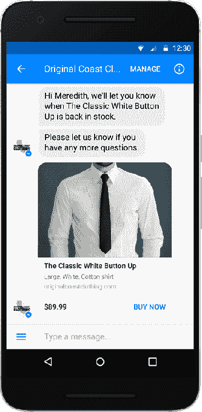

# Facebook Messenger 现在允许在其 3 万个聊天机器人中进行支付

> 原文：<https://web.archive.org/web/https://techcrunch.com/2016/09/12/messenger-bot-payments/>

脸书今天填补了聊天机器人平台的最大漏洞。脸书的信使负责人 David Marcus 今天在 TechCrunch Disrupt SF 2016 的舞台上宣布，信使机器人可以在本地接受支付，而无需将用户发送到外部网站。

最后，人们已经存储在脸书或 Messenger 中的信用卡信息可以用来立即在机器人中进行购买，这是开发者可以申请的新封闭测试版的一部分。马库斯还透露，在 4 月份的发布会上，34，000 名开发者加入了该平台，并构建了 30，000 个机器人，而 5 月份有超过 10，000 名开发者，7 月份有 11，000 名 T2 机器人。

为了支持 Messenger 中的支付，Marcus 说该公司正在与该行业的所有主要参与者合作，包括 Stripe、PayPal、Braintree、Visa、MasterCard 和 American Express——而不仅仅是脸书[开发者博客帖子](https://web.archive.org/web/20230323205543/https://developers.facebook.com/blog/post/2016/09/12/new-messenger-features-payments-ads-enhanced-mobile-websites/)提到的 Stripe 和 PayPal。

[gallery ids="1384187，1384186，1384185，1384184，1384183，1384182"]

在演讲中，Marcus 讨论了 Messenger 用户增加到 10 亿的原因，这要归功于脸书主要应用程序的强制迁移，他与 Mark Zuckerberg 的关系，以及聊天机器人早期的失误，聊天机器人已被 200 个国家的数百万人使用。

为了显示脸书对其机器人平台的承诺，Marcus 宣布所有类型的新闻提要广告都可以指向它们，用户可以与朋友分享他们喜欢的机器人。开发人员现在可以在对话中构建 web 视图，从他们的网站中引入界面，而不是强制所有的机器人交互都通过文本进行。这样你可以在聊天窗口中滚动航班列表，使用不同类型的媒体，甚至玩基本的游戏。

这是今天发布的[信使平台 v1.2](https://web.archive.org/web/20230323205543/http://newsroom.fb.com/news/2016/09/more-seamless-more-ways-to-share-more-ways-to-buy-more-context-introducing-messenger-platform-v1-2/) 的一部分。“在一个线程中，你拥有身份、事务能力、绘制 UI 的能力，以及绘制本机按钮和界面的能力，”Marcus 解释道。“我们将所有这些类型的体验融合在一起。”

他还指出，webview 可以预取得非常快，这是近几个月来该应用程序在引擎盖下的许多性能改进之一，以改善移动设备的启动时间和其他延迟问题。

所有这些变化将有助于 Facebook Messenger 机器人更好地实现该平台的承诺，马库斯承认，在发布时可能有点欠考虑。

“问题是它真的被夸大了，非常非常快，”他说。“我们当时提供的基本功能还不足以基本取代传统的应用程序界面和体验，”他说。

因为在平台上线之前，开发人员没有足够的时间或资源来构建他们的机器人，许多早期采用者认为机器人并不比他们的移动网络或移动应用程序好很多(有时甚至差很多)。

Marcus 被问及脸书在 bot 平台发布前多长时间向开发者提供了关于将提供哪些功能的最终细节。他回答说，“只有几个星期”。当被问及这段时间是否足够制造一个高质量的机器人时，他承认“可能不够”。

“这并不容易，”马库斯谈到推出 Messenger 的机器人这样的平台时说。“这需要时间。我们在 F8 想做的是让所有超过 34，000 名开发人员都能使用这个平台，不管他们是在为第三方开发功能还是实际体验，”他说。

虽然一些机器人——如专注于传递新闻的机器人——做得很好，但其他机器人需要做很多工作来提供令人信服的体验。

但随着 webview 和支付的加入，Hipmunk 即将推出的旅行机器人可以帮助旅行者找到并预订机票和酒店，以及在 Messenger 应用程序中显示行程。

Marcus 指出，随着新功能的增加，开发人员现在也将从脸书获得更多关于如何构建成功的 Messenger 体验的指导。