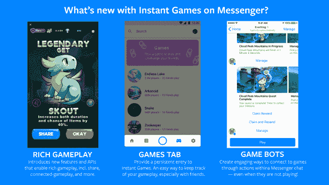
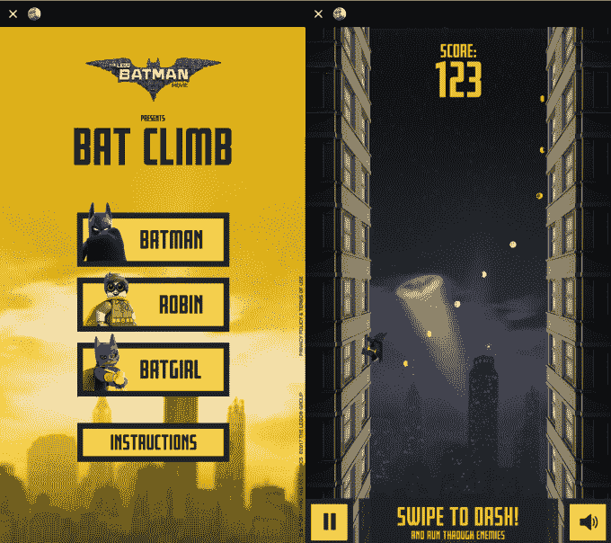

# Facebook Messenger 在全球推出即时游戏

> 原文：<https://web.archive.org/web/https://techcrunch.com/2017/05/02/messenger-games/>

脸书现在允许所有人在 Facebook Messenger 中玩免下载的 HTML5“即时游戏”，从而避开了应用商店。11 月在美国推出的即时游戏现在已经在全球[发售](https://web.archive.org/web/20230326023319/https://newsroom.fb.com/news/2017/05/game-on-games-on-messenger-go-global-with-new-features-and-games/)，有 50 个游戏，从吃豆人到 8 球池。

此外，脸书推出了两项新功能，这是 T4 在本月早些时候的 F8 会议上宣布的。开发者可以制作游戏机器人，与玩家交流新的等级或奖励，就像游戏 EverWing 现在所做的那样。

为了满足其最常见的功能要求，即时游戏现在支持逐回合游戏，而不仅仅是带有分数排行榜的单人游戏。第一批新的即时路线游戏之一是 Zynga 的 Words With Friends，它允许同时聊天，非常适合消息应用程序的来回性质。Messenger 中专门的游戏标签还在测试中，上面有精选的热门游戏。

本月在 F8 发布的特性。现在，丰富的逐回合游戏和游戏机器人正在推出

即时游戏给人们提供了一个对话的起点，让他们在等待朋友回复信息时有事情可做。由于传统应用商店充斥着垃圾，下载的摩擦阻碍了用户的实验，即时游戏可能会让 Messenger 变得更粘，同时让人们更深入地了解脸书的应用家族。脸书在 F8 说，在过去的 90 天里，即时游戏被玩了 15 亿次。

目前，没有广告或游戏内购买可用，所以脸书和开发者都没有在即时游戏平台上赚钱。像乐高蝙蝠侠电影《蝙蝠攀登》这样的品牌游戏可以为其他地产提供营销火力。但大约在 2009 年，脸书围绕其桌面游戏平台建立了一个庞大的商业和开发者生态系统。现在，随着其桌面支付收入下降，Messenger 用户超过 12 亿，它有机会培育一个新的游戏平台。

脸书还不允许在即时游戏中付费或打广告，但游戏本身可以是广告，就像乐高蝙蝠侠电影中的这个

我们回顾了推出游戏的全部名单，最喜欢迷幻平台游戏《无尽之湖》、《字谜游戏》和街机经典《太空入侵者》。从那以后，像篮球 FRVR，宾果和纸牌等一系列游戏被添加进来。

HTML5 是脸书最大战略错误的源头，因为该公司最初的移动应用程序反应迟钝，因为它们实际上只是围绕移动网络标准的原生 iOS 和 Android 包装程序。但 HTML5 已经有所改进，开发人员多年来已经越来越熟练地使用它，尽管不需要正式的应用程序下载，但仍允许快速的帧速率和爆炸性的图形。

经过多年的忽视，脸书最近已经为游戏开发了几个新的表面。除了 Messenger，脸书去年推出了名为 [Gameroom](https://web.archive.org/web/20230326023319/https://techcrunch.com/2016/11/01/facebook-gameroom/) 的桌面游戏平台，感觉像是 Steam 的一个更休闲的社交版本。新的[增强现实脸书相机效果平台](https://web.archive.org/web/20230326023319/https://techcrunch.com/2017/04/18/facebook-camera-effects-platform/)也可以支持与现实世界中的物体互动的 AR 游戏。

然而，正如它在桌面上学到的，最好的游戏平台是你已经花了所有时间的地方。2017 年，当聊天成为智能手机的中心时，这意味着 Messenger。