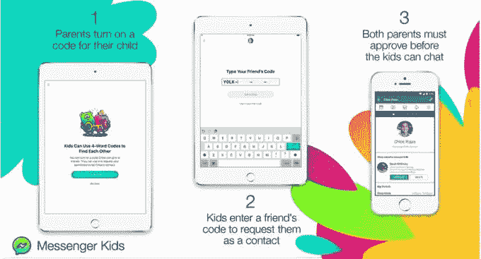

# Messenger Kids 推出了密码短语，因此孩子们可以自己发起好友请求

> 原文：<https://web.archive.org/web/https://techcrunch.com/2018/08/13/messenger-kids-rolls-out-passphrases-so-kids-can-initiate-friend-requests-themselves/>

脸书让孩子们更容易在 13 岁以下的聊天应用 Messenger Kids 上添加他们的朋友。从今天开始，该公司将推出一项新功能，允许孩子请求父母批准新的联系人。该公司表示，要使用该功能，父母需要打开一个设置，创建一个四个单词的密码，用于生成这些联系请求。

家长可以选择使用该功能，默认情况下该功能是不打开的。

一旦启用，脸书将随机生成一个四个单词的短语，专门分配给每个孩子。当孩子将来想要将朋友添加到他们应用程序的联系人列表中时，他们会向朋友显示此短语，以便在他们自己的应用程序中输入。

然后，父母双方都会收到孩子的联系请求——在孩子开始聊天之前，双方都必须批准该请求。换句话说，这并不代表父母批准规则的放松——所有联系请求仍然需要父母的明确关注和确认，就像以前一样。

然而，当他们的父母不是脸书的朋友时，这确实让孩子们更容易成为朋友。这是这个应用程序的一个问题，一段时间以来，脸书在 5 月份首次开始解决这个问题，当时它做出了一项改变[，最终不再要求父母成为朋友，](https://web.archive.org/web/20230313195359/https://techcrunch.com/2018/05/30/messenger-kids-no-longer-requires-the-kids-parents-to-be-friends-too/)也是。

虽然大多数父母至少想知道他们的孩子在和谁发短信，但很多时候父母会在更随意的基础上与某人友好相处——比如通过孩子的学校或课外活动。但是仅仅因为两个人是邻居或者同为足球妈妈和爸爸，并不一定意味着他们也是脸书的朋友。

5 月份引入的变化允许父母搜索孩子朋友的父母，然后邀请他们加入应用程序，这样孩子们就可以联系了。但是这仍然需要父母采取最初的步骤(当然是在孩子的催促下)。我们发现，当我们自己尝试时，有时也会感到困惑——例如，一些我们联系过的家长不知道审批流程是如何运作的。

话虽如此，这可能有助于大幅提升该应用的安装基础，以及其在美国以外的[扩张](https://web.archive.org/web/20230313195359/https://techcrunch.com/2018/06/22/messenger-kids-expands-outside-the-u-s-rolls-out-kindness-features/)根据 Sensor Tower 的数据，Messenger Kids 在 6 月初的安装量有了相当大的增长，刚刚在 iOS 和 Android 上超过了 140 万次下载。此外，其每日下载量是 5 月底的 3 倍左右。

密码短语解决方案将使父母的事情变得简单一些，因为联系请求将由孩子发起。家长只需点击一个大大的“批准”按钮来确认请求(或者拒绝，如果请求由于某种原因不合适的话)。)

只有孩子在 Messenger Kids 应用程序中可以看到四个单词的密码，家长在其家长门户中也可以看到。

值得注意的是，脸书选择了一个密码短语，而不是可扫描的二维码，这在包括 Facebook Messenger、Snapchat 和 Twitter 在内的其他通讯应用中很常见。脸书说，这样孩子们就可以在没有设备的情况下交换密码。

数据显示，Messenger Kids 是一款[有争议的](https://web.archive.org/web/20230313195359/https://techcrunch.com/2018/02/05/why-i-decided-to-install-messenger-kids/)应用，但它的接受度正在上升。家长们一直渴望有一款这样的应用——一款允许对话监控(你只需安装你自己的副本)和联系人批准的应用。这是否会真正灌输新一代的脸书或信使用户更值得怀疑。很可能当孩子们长大后不再使用 Messenger Kids 时，他们仍然会转而使用脸书的 Instagram 和 Snapchat。

密码短语功能从今天开始在 Messenger Kids 移动应用程序上推出。