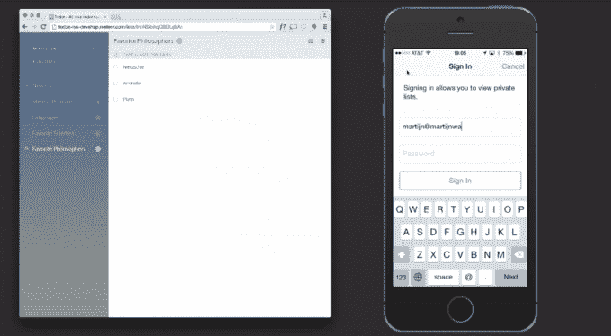

# Meteor 筹集了 2000 万美元来建立一个 JavaScript 栈来统治他们

> 原文：<https://web.archive.org/web/http://techcrunch.com/2015/05/19/meteor-raises-20m-to-build-the-one-javascript-stack-to-rule-them-all/>

# Meteor 筹集了 2000 万美元来建立一个 JavaScript 栈来统治所有这些

应用程序开发工具提供商的竞争格局变得越来越激烈，随着 [Meteor 开发集团](https://web.archive.org/web/20230326101916/https://www.meteor.com/)为其用 JavaScript 开发网络和移动应用程序的框架和工具筹集了 2000 万美元。

这一轮由 Matrix Partners 牵头，来自 Andreessen Horowitz 和 Trinity Ventures 的投资也将为 MDG 提供所需的资源，以提供补充其开源框架和工具的付费产品。

Meteor Development Group 首席执行官杰夫·施密特(Geoff Schmidt)昨天在与 TechCrunch 的电话中为该公司即将推出的产品制定了一个粗略的路线图。首先是[银河](https://web.archive.org/web/20230326101916/http://info.meteor.com/blog/meteor-and-a-galaxy-of-containers-with-kubernetes)，这是一个基于谷歌开源 Kubernetes 项目的运行流星应用的系统，它本身是一个管理作为容器中的服务运行的应用的资源的系统。

预计今年晚些时候全面发布，施密特说，Galaxy 将首先推出给一些已经使用 Meteor 生产应用程序的公司。这些公司将与 MDG 密切合作，就 MDG 如何融入他们的工作流程提供反馈，并深入了解 MDG 在现实世界中的表现。当它在早期接入期后向更多的客户开放时，Galaxy 将提供免费、按小时付费和企业级服务。

MDG 已经建立了 Galaxy，最初在亚马逊网络服务上运行，施密特引用了在亚马逊基础设施上工作的开发人员的需求。但在未来，Galaxy 将跨基础设施提供商工作，并支持微软 Azure 和谷歌的云平台。

但是银河只是一个更大的拼图的第一块。Schmidt 告诉我，构建和托管应用程序很重要，但像应用程序性能分析和测试这样的事情对正在进行的开发过程也同样重要，Meteor 正在开发软件来解决这些问题。

除了长期的努力，Meteor 还有更多直接的工作进入开源平台，使它对更多的开发者有用。虽然 Meteor 提供了一个可以处理 UI 的库，但是一些开发者可能更喜欢使用 T2 的 Angular 或者 T4 的 React。Meteor 的模块化性质意味着那些致力于其他 UI 框架的人已经能够让它们工作，但 Schmidt 说工作将更直接地支持它们。对于已经开发了一段时间的 [Windows 支持](https://web.archive.org/web/20230326101916/http://info.meteor.com/blog/meteor-11-microsoft-windows-mongodb-30)也可以这么说。