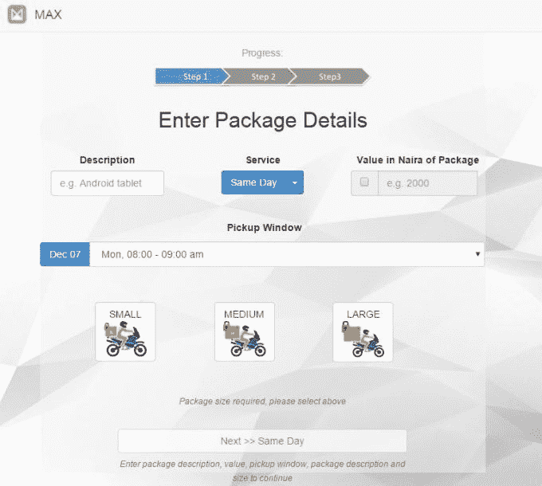

# Metro Africa Xpress 希望为非洲城市提供按需本地送货服务 

> 原文：<https://web.archive.org/web/https://techcrunch.com/2015/12/07/metro-africa-xpress-looks-to-bring-on-demand-local-delivery-to-urban-africa/>

Adetayo Bamiduro 必须说服他的联合创始人 Chinedu Azodoh，创办一个电子商务网站不一定是最好的主意——至少现在不是。相反，两人决定开始

[Metro Africa Xpress](https://web.archive.org/web/20230103224335/http://www.max.ng/)

(或简称 MAX)，总部位于尼日利亚拉各斯，为非洲城市提供最后一英里的送货服务。麦克斯今天将在 TechCrunch Disrupt 伦敦站上舞台。

这项服务让商家可以通过一个可以使用该公司开发的 API 的平台，以及短信和其他平台，在三个小时内将商品送到客户手中。商家通过平台召唤 MAX 快递员，MAX 根据距离而不是重量和物流公司经常使用的其他因素向商家收费。此外，传统物流公司目前无法提供这种速度，这在很大程度上是 MAX 的重点，Azodoh 说。

“我们讨厌今天做事的方式——你有公斤，测量，每个人都浪费时间，”他说。“通常，整个过程都没有很好地组织或思考，所以对我们来说，我们这样做是为了简化过程，使我们的平台易于使用。”

MAX 确实有众包快递员，但它也有一批用品牌摩托车递送包裹的基线员工。他们雇佣的全职快递员是有薪的，而众包快递员——如果有需求的话——是按递送量付费的。Azodoh 在台上说，大约 70%的司机是全职的。

这对搭档来自尼日利亚，他们通过了 TechStars(第一批来自尼日利亚的选手之一)。Azodoh 表示，他们在非洲建立了 MAX，以帮助鼓励非洲大陆的其他人创办公司。

“当你看风景时，没有多少成功的公司是非洲人所有的，这使得年轻人很难抬头，”Azodoh 说。“与全世界相比，非洲的一些城市拥有最高的城市化率。随着越来越多的东西进入这个系统，我们有一些你可以仰望的东西，并且说嘿，如果 MAX 做到了，我也能做到，这非常重要。”

他们在非洲建立公司的另一个原因是，他们希望通过向零售商提供实际交付商品的工具来促进他们的增长——你可能会认为这是增长的自然前兆。他说，在电子商务方面，它没有达到英国和美国的渗透率的原因之一是没有良好的交付基础设施。

“当你看可比市场时，电子商务的增长与强大的最后一英里交付的出现直接相关，”Azodoh 说。“我们的主要目标是增强全公司零售商和消费者的能力。最有效的方法是提供最后一英里的递送。这提供了一种真正的商业工作流程。”

当然，房间里有一头大象:优步。该公司可能最终会寻求与 MAX 相同的空间，因为它一直是一家积极进取、资金充足的公司，擅长处理从一个地方到另一个地方的旅行。阿佐多知道，优步有可能最终会对他们下手，但他说，他现在正全力以赴处理公司的事情。

“重要的是一直专注于执行，然后疯狂地执行，”他说。“我们希望尽快完成工作。我们不太关注竞争对手在做什么。我们爱他们，尊重他们；我们不会用它来衡量我们的表现。”