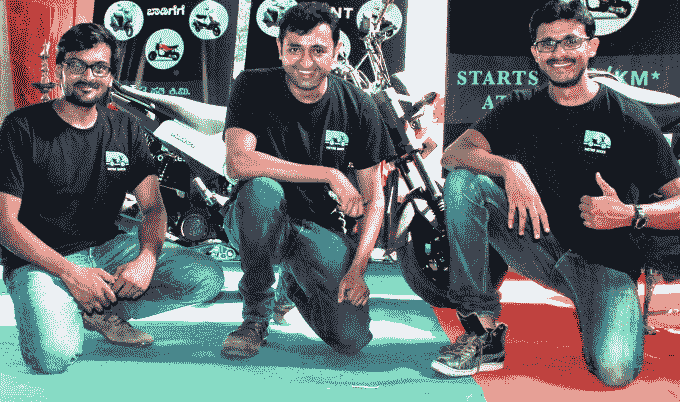

# Sequoia India 和 Accel 以 1220 万美元收购按需滑板车初创公司 

> 原文：<https://web.archive.org/web/https://techcrunch.com/2018/08/09/metro-bikes-bounce-sequoia-india-accel/>

在红杉印度(Sequoia India)和 Accel 对 Metro Bikes 进行了 1220 万美元的投资后，印度两家最著名的风投公司正在支持摩托车点播服务。红杉印度和 Accel 也加入了这轮投资，Raghunandan G 和其他投资者一起创立了 TaxiForSure，后来卖给了 Ola。

Metro Bikes 在 2014 年以豪华自行车租赁服务起家——最初是“邪恶的骑行”——它在 2016 年推出了滑板车(摩托车)和其他两轮租赁。现在，该公司正在更名为 Bounce，并重新将业务重点转向按需代步车([在美国的说法是摩托车](https://web.archive.org/web/20230127124449/https://motorcycles.honda.com.au/urban_scooter))租赁，用于第一英里和最后一英里的运输。这个想法是为了吸引通勤者，他们可以在最近的地方取自行车，然后把它放在终点区。费用基于距离和花费的时间。

Bounce 目前在班加罗尔有 2000 辆小型摩托车，在海德拉巴有大约 500 辆。首席执行官维威卡难达·哈勒凯尔在接受 TechCrunch 采访时表示，该公司计划增加这些数量，但该公司正在等待运营电动滑板车的许可，一旦获得许可，它将只部署电动滑板车。其目前的车辆组合还包括自行车、电动自行车和踏板车。

他补充说，这家初创公司目前将专注于班加罗尔和海德拉巴，6-10 个月内不会有新的扩张。展望未来，Bounce 的目标是到 2020 年覆盖全国，而 Hallekere 表示，他看到了未来在东南亚部署的潜力。

Bounce 声称，在其点播平台上，目前每辆车每天约有 4 次乘坐，该公司的目标是 7 至 12 次乘坐，它认为这将为其带来良好的收入水平。尽管 Hallekere 强调核心业务是以可持续发展为基础的。

这取决于车队的资金，首席执行官表示，车队的资金来自机构投资者，他们购买资产以换取收入的减少。这有助于支付很大一部分运营费用，而在其他情况下，Bounce 与以类似条款提供车辆的原始设备制造商合作。

Bounce 创始团队(从左至右):首席执行官维威卡难达·H·R；Varun Agni，CTO 首席运营官·阿尼尔·吉里·拉朱

Bounce 正在进入印度一个相当拥挤的市场，其他初创公司包括今年早些时候 TechCrunch 报道过的 wheel street——zihop 也在与类似的服务竞争。Bounce 首席执行官 Hallekere 表示，该公司在业务和技术方面的历史可以帮助它脱颖而出。

此外，Bounce 表示，它正在与当局密切合作，以帮助缓解最后一英里的拥堵。例如，该公司是与孟加拉国地铁有限公司(BMRCL)达成协议的公司之一，将在 36 个地铁站提供租赁自行车。它还与企业达成了一项协议，允许在整个城市停车。该公司表示，计划在扩张时与海德拉巴和其他城市的地铁运营商达成类似的安排。

“第一英里和最后一英里对印度的公共交通至关重要，”Hallekere 说。“对印度人来说，骑踏板车是很自然的事情，我们开始研发地铁自行车时就考虑到了这一点。我们希望产生影响，让人们弃车而去。”

Bounce 还希望推出一种拼车服务，让滑板车车主能够将他们的车辆加入公司的车队，并在使用时赚钱。