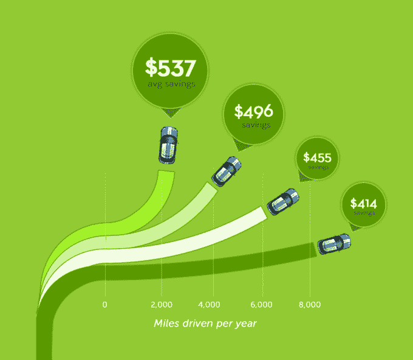
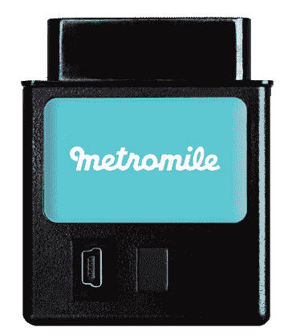

# Metromile 推出优步汽车保险，司机只需支付个人里程数

> 原文：<https://web.archive.org/web/https://techcrunch.com/2015/01/28/metromile-launches-uber-car-insurance-where-drivers-only-pay-for-personal-miles/>

# 地铁里程推出优步汽车保险，司机只需为个人里程付费

优步为在职司机提供了 100 万美元的保险，但即使他们下班后很少开车，也必须购买个人汽车保险。但是现在， [Metromile](https://web.archive.org/web/20230404091456/https://www.metromile.com/) 和优步已经为优步司机开发了一个[无缝个人/商业每英里汽车保险计划，该计划使用一个插入车辆诊断端口的蜂窝小工具。它与优步连接，以识别司机何时工作，并由优步的保险覆盖，因此它只对他们私人使用的里程收费。](https://web.archive.org/web/20230404091456/http://blog.metromile.com/blog/2015/1/15/uber-partnership)

Metromile 和优步的合作可以大大降低专业司机的汽车保险价格。最初，该保险将在加利福尼亚州、华盛顿州和伊利诺伊州推出，[的司机可以在这里注册。](https://web.archive.org/web/20230404091456/https://www.metromile.com/uber)

Metromile 最初在 2013 年推出了以消费者为中心的每英里汽车保险，以帮助低里程数的司机支付更合适的费率。它的设备插入汽车的 OBD-II 端口，允许它跟踪里程，汽车故障，位置等。Metromile 的配套应用程序可以帮助司机记住他们停车的位置，避免街道清洁罚单，优化他们的燃油效率，并知道何时通勤交通最轻松。

正常的汽车保险对不常开车的人收费过高，因为它不能告诉他们行驶了多少英里。他们付的钱太多，而那些每天开车数小时、通勤时间长的人，在道路地下支付时面临很多风险。

Metromile 的设备插在汽车的仪表板上，跟踪里程，以便为每英里汽车保险

Metromile 的设备可以让司机证明他们驾驶的里程比平均水平少，并让他们支付更少的费用，因为他们不太可能发生事故。它贴上了主要保险提供商的标签，提供与传统保险计划相同的可靠支持。

我怀疑优步和 Metromile 会合作，但我认为这是为了帮助那些有车但很少开车的乘客，因为在城市里乘坐优步更方便。这就是我的情况。优步可以推广 Metromile，作为让人们完全放弃拥有汽车的一种方式。

Metromile 可能不会为那些只载客的优步司机省下多少钱。但对于那些把优步作为主要工作，只是在不工作时需要保险的人来说，Metromile 可以降低保险成本，这样司机就可以保留更多优步支付的费用。