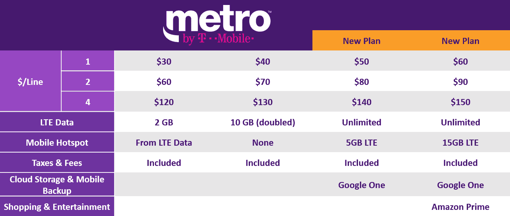

# T-Mobile TechCrunch 将 MetroPCS 更名为 Metro

> 原文：<https://web.archive.org/web/https://techcrunch.com/2018/09/24/metropcs-is-now-metro-by-t-mobile/>

# MetroPCS 现在是 T-Mobile 的 Metro

T-Mobile 收购 MetroPCS 已经有五年了，现在预付费服务终于有了新的一面。“个人电脑”这个词已经过时，而这个品牌的所有者正让你知道谁是 T-Mobile 新品牌的老板。

新名字包含了一些新计划，以及来自主要合作伙伴的一些额外津贴。除了标准层之外，还有两个新的(更贵的)层。新的无限制计划每月收费 50 美元和 60 美元，都包括通过 Google One 的存储空间。

这使得新更名的服务成为第一个提供谷歌新存储计划的服务。云协议还提供了与谷歌专家的联系，他们可以帮助你解决任何谷歌服务的问题。

与此同时，60 美元一个月的计划，额外增加了亚马逊 Prime。鉴于亚马逊 Prime 计划目前每年 119 美元，这本身并不是一个可靠的升级理由，但更高级的计划为其移动热点提供 15GB 的 LTE 数据，而不是 5GB。