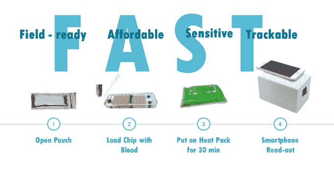

# mFluiDx 使用移动设备和云实现现场疾病诊断 

> 原文：<https://web.archive.org/web/https://techcrunch.com/2016/09/13/mfluidx-uses-mobile-and-the-cloud-to-enable-disease-diagnosis-in-the-field/>

寨卡疫情继续令世界担忧，然而诊断这种病毒以及任何其他病毒都需要复杂而昂贵的测试，更不用说进出该领域的难度了。 [mFluiDx](https://web.archive.org/web/20221208190755/http://mfluidx.com/) 是一家初创公司，它利用手机和互联网提供一种既便携又实惠的选择。

这家初创公司正在开发一种比香烟盒还小的疾病诊断工具，几乎不需要任何电力。这使得它比现有的解决方案便宜 1000 多倍，现有的解决方案除了体积大，还需要电力输入，这在最需要电力输入的新兴市场尤其具有挑战性。

mFluiDx 的套件分为多个部分。血液样本与一管化学物质(这将表明是否存在病毒)混合，然后将所得物质倒入由真空泵驱动的芯片中，在那里将其分离，以便可以分析病毒的存在。该公司提供了一个光盒，使用单个电池，一小时后将芯片插入其中，以分析结果。

到目前为止，远程诊断工具以这种方式运行，但 mFluiDx 更有趣的地方是接下来会发生什么。通过一个使用摄像头的智能手机应用程序，芯片的结果被分析，以确定是否存在病毒，如果存在，它的浓度有多高。将来，mFluiDx 可以在同一个芯片上运行不同的测试，但是现在它只能测试一种病毒。

[gallery ids="1385692，1385691，1385690"]

该应用程序记录结果、GPS 位置和其他信息，并同步到基于云的平台。然后，可以将这些数据与其他测试数据放在一起，也许是为了监视某个地区或特定位置的病毒爆发，或者由专家单独进行分析。

这种方法的美妙之处在于它消除了远程病毒测试的一个主要难点。一旦主机电话连接到互联网，就可以在线获取样品。这意味着它们可以被快速远程分析，绕过将测试样本拖回实验室的问题。

今年夏天，这家初创公司从 IndieBio 加速器项目毕业，迄今为止，它已经在巴西进行了实地测试，与该国首次发现寨卡病毒的医生合作。创始人查理·叶(CEO)和丹妮卡·赫尔布(CSO)都在加州大学伯克利分校获得了博士学位，他们估计，他们可能还需要一年时间才能拥有与合作伙伴一起进入该领域的技术。起初，他们认为非政府组织和疾病监测组织将是他们的销售目标

迄今为止，mFluiDx 一直自筹资金。Yeh 与人合著了三项专利，作为他在加州大学伯克利分校之前项目的一部分，该项目本身获得了盖茨基金会的资助，这些专利的许可为 mFluiDx 的开发提供了资金。Yeh 和 Helb 正在寻找生物技术和医药领域的投资者，以帮助他们推进业务发展。