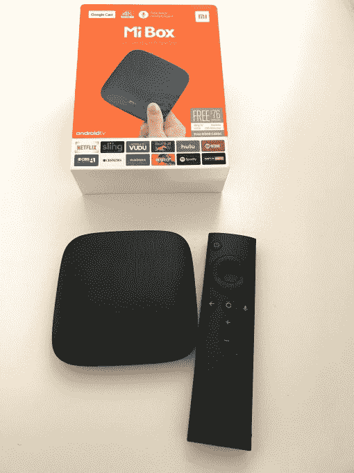
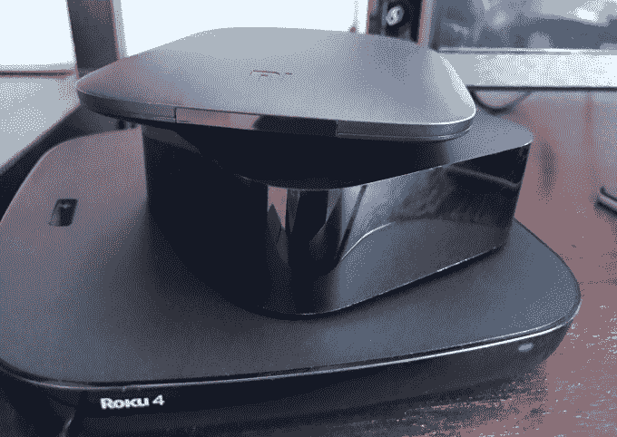
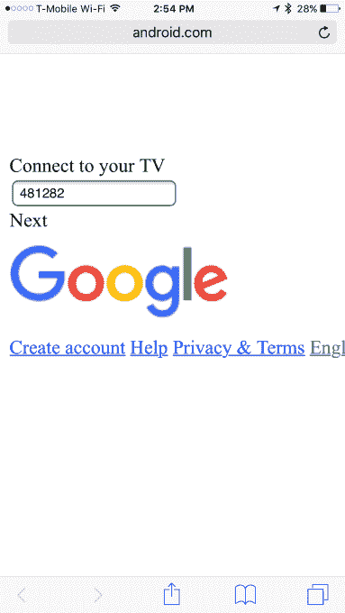
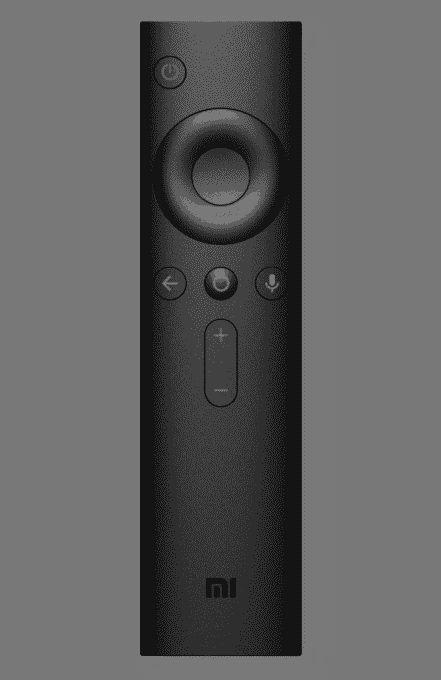
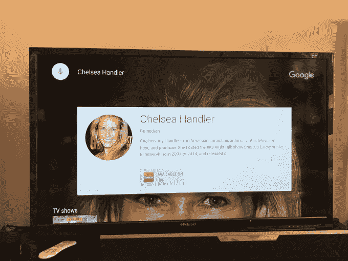
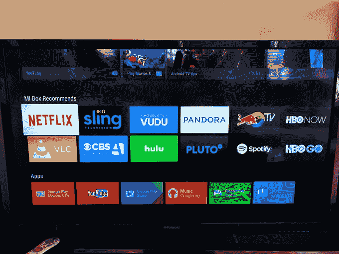
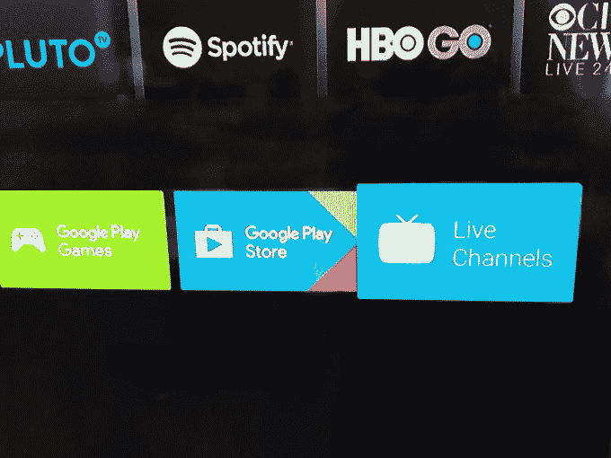

# Mi Box 是一款价格实惠的 4K HDR 流媒体工具，但受到 Android TV  的拖累

> 原文：<https://web.archive.org/web/https://techcrunch.com/2016/11/17/mi-box-is-an-affordable-4k-hdr-streamer-but-dragged-down-by-android-tv/>

小米盒子是中国智能手机公司小米在 T2 推出的应对 Roku、Apple TV、Android TV 和 Fire TV 等设备的游戏。这款支持 4K 和 HDR 的设备售价仅为 69 美元，具有集成的谷歌 Cast 和语音搜索等功能，似乎值得一看。但归根结底，小米盒子仍然是一款安卓电视播放器，并受到该平台的诸多限制。

## 一目了然:

*   四核 2GHz ARM 处理器
*   2 GB 内存和 8 GB 存储空间(可通过 USB 扩展)
*   带语音控制的蓝牙遥控器
*   每秒 60 帧的 4K 视频支持

Mi 盒相当薄。这个大约 4 x 4 英寸的粗糙塑料设备只有大约四分之一英寸厚。这比 Apple TV、Fire TV 和 Roku 的高端盒子都要小，尽管我不认为人们购买飘带主要是为了它们的便携性。(或者，当担心便携性时，他们可能会选择像亚马逊 Fire TV Stick 或 Chromecast 这样的棒或加密狗。)

在 Mi 盒子的背面是一个电源端口、USB(可以通过适配器支持添加存储或以太网)，以及一个 3.5 毫米耳机插孔，也可以用于连接外部扬声器。该设备包括电源线、HDMI 电缆和一个简单的蓝牙遥控器。

## 设置

开始使用 Mi Box 并不是最无缝的体验，但公平地说，设置往往是配置任何新设备的最令人沮丧的方面之一。

[gallery ids="1417166，1417165"]

屏幕上的动画会提示你按下遥控器上的一个按钮开始，但一些伴随的文字会有所帮助。(毕竟，他们为什么要移动*两个*大拇指来按一个按钮？他们的手指是放在圆形 home 键上还是音量调高了？该图可以更清楚)。

然后你一步步完成一系列相当标准的安卓电视配置问题，比如语言、Wi-Fi 网络、定位服务是否开启……哦，还有*你同意把你的个人数据交给谷歌，让它根据需要下载更新*？太好了。

有一个选项可以使用你的 Android 手机或平板电脑来简化设置，或者你可以在手机上访问一个 URL 并输入一个代码。(不过，这个网页在我的 iPhone 上无法运行。你可以输入密码，但不能点击进入。)

或者，你可以直接在屏幕上登录你的谷歌账户。对于任何使用双因素认证的人来说，还有一层额外的地狱，包括输入你的谷歌账户电子邮件和密码，然后在 Mi Box 意识到你需要通过不同的认证流程后，不得不再次输入*。耶。*

 *谢天谢地，这只是一次性的事情。

## 遥远的

Mi Box 遥控器没有杂乱的按钮，这基本上是一件好事。至于你是否喜欢选择使用方向键来控制播放器(播放/暂停、倒带、快进)可能取决于个人喜好。

但是内置的音量控制是很棒的。还有一个关机键，不一样。我倾向于让我的 Roku 一直开着，以获得可爱的背景图片，但你可能喜欢在不使用时让你的盒子休眠。只是要小心——我走神的时候，有一次出于习惯按了电源键，因为 Roku 的 home 键也在最上面。那很有趣。

## 用户体验

人们可能会被迫购买 Mi Box，因为它提供 4K/HDR 流媒体的价格低于竞争对手，如 Roku 的 4K Premiere(80 美元，4K)，Premiere+(100 美元，4K/HDR)和 Ultra(130 美元，4K/HDr)，或高端的 NVIDIA Shield(200 美元)。同时，Mi Box 将支持 4K 超高清和 HDR10 标准(后者从 Android N 及更高版本开始启用)。

但真正让人们喜欢他们的设备的是用户体验，建立在 Android TV 之上有优点也有缺点。

从好的方面来看，谷歌拥有强大的语音识别功能，只需按下遥控器上的一个按钮，就可以方便地启动语音搜索。你可以搜索内容，而不仅仅是简单地说出你想找的标题或演员。例如，你可以要求看“莱昂纳多迪卡普里奥的奥斯卡电影”，或者像谁在电影中扮演了某个角色这样的问题。

通过语音命令，您还可以启动应用程序、更换频道、搜索网络、直接观看一些电视节目和电影等等。你甚至会问一些与电视无关的问题，比如天气如何，或者(正如我的孩子喜欢做的那样)，一些基本的事实问题，比如“月亮有多远？”(这是她从 Alexa 那里学来的一招。)

然而，使用遥控器导航却很快。你可以在选择中快速移动，按住方向遥控器，你可以在屏幕上的项目间飞行。这(不幸的是)特别方便，因为你安装的应用程序在主屏幕上排成长长的水平行。应用程序加载速度也很快，游戏运行流畅。(请注意，Mi Box 支持外部游戏控制器，但这不包括在审查单元中。)

[gallery ids="1417147，1417156，1417150，1417155，1417151，1417153，1417154，1417148，1417146"]

不幸的是，安卓电视也有它的缺点。如果你不介意被锁定在谷歌生态系统中，你可能不会介意无法访问亚马逊的内容库或 Prime Video，或者顶部的“推荐”会推广谷歌的所有内容，如 YouTube 视频或 Google Play 电影和电视，以及一堆提示，如“如何铸造”

小米盒子还附带了一排烦人的“小米盒子推荐”应用链接。这包括一堆标准票价，像网飞，吊索电视，Vudu，潘多拉，HBO Go，Hulu，哥伦比亚广播公司所有访问，VLC 和其他。但你不能删除这一行，要从这一行删除应用程序，你必须先安装它，然后卸载它。

与此同时，虽然 Android TV 支持大多数主要的流媒体应用程序，但要安装它们，你必须从设备上访问 Google Play 商店。相比之下，Apple TV 将应用程序组织成类别，作为其更大的用户界面设计的一部分。

此外，还有在应用程序中导航的问题。例如，点击“返回”按钮可能会让你在点击几次后退出 YouTube，而对网飞做同样的事情会让你进入其设置屏幕。这也许是一个小问题，但是当你盲目地操作遥控器时，它会让你犹豫不决。

另一个理论上看起来很棒，但实际上失败的功能是 Android TV 的直播频道。这里的想法是给你一个简单的方法来收看通过应用程序提供的直播电视节目。

然而，目前只有少数几个应用程序支持这一点，如 Pluto.tv，但没有像 Sling TV 或 PlayStation Vue 这样的主要应用程序。当你打开直播频道，然后回到主屏幕，视频继续播放。对于我来说，除了进入，然后退出另一个应用程序，我不知道如何关闭视频。

## 为什么是米盒子？

Mi Box 的市场归根结底是为了迎合那些已经在寻找 4K 或 HDR 流光的技术爱好者，他们对较低的价格点很感兴趣。苹果电视还不支持 4K，Roku 的选项更贵。

但在后一方面，你会得到你所付出的。在 Mi Box 上，你可以在支持 4K 的应用程序中找到它的内容，如网飞、YouTube、Vudu、UltraFlix 和索尼的 Ultra streaming 服务。另一方面，Roku 的软件[会突出显示在哪里可以找到并观看 4K 的视频](https://web.archive.org/web/20230305173621/https://techcrunch.com/2015/10/06/roku-unveils-its-4k-streamer-the-roku-4-plus-new-software-discovery-features-and-upgraded-mobile-app/)。

还有一个事实是，归根结底，这是安卓电视。爱好者可能会认为这是相对于苹果更封闭的生态系统的一个优势。在 Mi Box 上，你可以下载应用程序，比如说 [Kodi](https://web.archive.org/web/20230305173621/https://www.youtube.com/watch?v=YpwMhcHvTwo) 。但是你也可以在亚马逊 Fire TV 上这样做，这款电视[支持](https://web.archive.org/web/20230305173621/https://techcrunch.com/2015/09/17/latest-amazon-fire-tv-features-4k-video-alexa-voice-assistant/) 4K，有 Alexa，[正在更新用户界面](https://web.archive.org/web/20230305173621/https://techcrunch.com/2016/10/20/amazons-new-fire-tv-stick-is-the-most-affordable-way-to-bring-alexa-home/)。

Android TV 在流媒体竞赛中基本上被遗忘了，这是有原因的。这是一种未完成的——而且太谷歌化了——的体验。如果你想锁定平台，很难选择安卓电视而不是苹果设计更好的苹果电视。或者对于那些想留在 Android 宇宙中的人来说，亚马逊 Fire TV 似乎是更好的选择。尽管如此，鉴于其在 4K 和 HDR 的价位，以及在沃尔玛商店和 Walmart.com 的可用性，Mi Box 可能会在未来几个月进入许多美国消费者的家庭。*