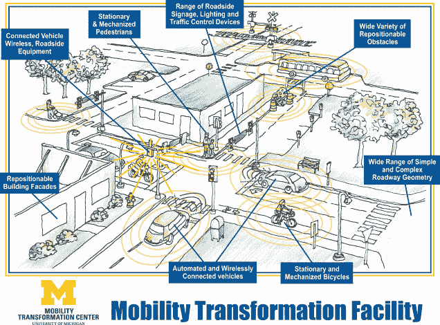

# 密歇根州正在建造一座假城市，将自动驾驶汽车投入真实世界 

> 原文：<https://web.archive.org/web/https://techcrunch.com/2014/06/05/michigan-is-building-a-fake-city-to-put-automated-vehicles-in-real-world-situations/>

# 密歇根州正在建造一座假城市，将自动驾驶汽车置于真实世界的环境中

尽管谷歌的无人驾驶汽车像[一样可爱](https://web.archive.org/web/20221210070453/https://beta.techcrunch.com/gallery/google-self-driving-car/)，但围绕它们的所有[讨论仍然存在问题。首先，这些自动车辆将如何处理意外的路况、交通信号或无视法律的行人？](https://web.archive.org/web/20221210070453/https://beta.techcrunch.com/2014/06/04/conan-shows-us-a-world-where-googles-self-driving-car-has-a-few-bugs/)

就像我们一样，密歇根大学的工程学院渴望得到答案，这就是为什么组织[计划](https://web.archive.org/web/20221210070453/http://www.engin.umich.edu/college/about/news/stories/2014/june/test-facility)在今年秋天建造一个自动车辆测试设施。

该设施将由位于密歇根州东南部的 U-M 移动转型中心运营。

但是这座专为测试新技术而建的城市会是什么样子呢？说实话，它和任何一个普通的城市都不会有太大的不同。毕竟，整个重点是测试无人驾驶汽车在野外会是什么样子。

将会有合并车道、红绿灯、环形交叉路口、十字路口、路标、铁路道口、建筑区、建筑立面，最终，工程学院将会包括一个需要注意的机械行人。

这个想法是为了确保无人驾驶汽车作为一个联网的群体工作，而不是仅仅基于自己的传感器单独操作。

“我们正在谈论的测试类型——在今天的大学基础设施中是不可能做到的，”船舶建筑和海洋工程副教授 Ryan Eustice 说。“每次有车辆绕过环路，都会撞上一些不寻常的东西。这将有助于我们让这些车辆变得成熟、坚固和安全。”

不仅仅是新的无人驾驶汽车可以在测试设施中转弯。即使是使用自动刹车等自动驾驶功能的新型汽车，也可以从花一些时间在课程上受益。

[via [theVerge](https://web.archive.org/web/20221210070453/http://www.theverge.com/2014/6/5/5781924/automated-cars-mobility-transformation-facility) ]