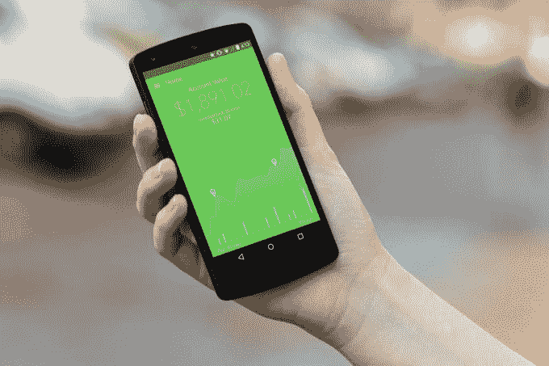

# 小额投资应用 Acorns 融资 2300 万美元，由 Greycroft，e.Ventures 领投 

> 原文：<https://web.archive.org/web/https://techcrunch.com/2015/04/15/micro-investment-app-acorns-raises-23-million-led-by-greycroft-e-ventures/>

# 小额投资应用 Acorns 筹集了 2300 万美元，由 Greycroft，e.Ventures 领投

通过收集你的零钱为你建立投资组合的小额投资应用 Acorns 今天宣布完成 2300 万美元的 C 轮融资，由 Greycroft Ventures 和 e.Ventures 领投，Sound Ventures、Garland Capital 和 MATH Venture Partners 参与。

这使得橡子的总募集金额达到 3200 万美元。

这家名为[的公司将用户每笔交易的金额四舍五入，并将其投资到一个可定制的投资组合](https://web.archive.org/web/20230129104234/https://techcrunch.com/2014/08/26/acorns-is-a-micro-investment-app-that-does-all-the-thinking-for-you/)，该公司表示，其会员已增至 65 万人，其中约一半在该平台上开设了投资账户。Acorns 还表示，它已经处理了超过 2800 万笔交易，并将超过 100 万张借记卡和信用卡链接到该平台。

Acorns 声称是世界上第一个移动投资平台，让用户附上他们的信用卡，借记卡等。并且可以随意存取款。但是橡子的特殊之处在于它用黏糊糊的手抓住你的零钱。在附带的信用卡或借记卡上进行的每一笔交易中，Acorns 会自动四舍五入到最接近的美元，并将多余的零钱放入您的投资组合。显然，用户可以选择退出，或者建立一个系统，每天进入并选择哪些交易应该被四舍五入。

用户还可以控制他们选择的投资组合类型，有从保守到激进的五种选择。

“我们正在创造新的投资者，随着他们的成长，我们最大的挑战之一将是真正改善教育，”联合创始人杰夫·克鲁登登说。“人们对 Acorns 应该如何为他们服务有疑问，我们希望投资，以确保我们创造的投资者受到全程教育。”

[Acorns](https://web.archive.org/web/20230129104234/https://www.acorns.com/) 现在可以在 iPhone 和 [Android](https://web.archive.org/web/20230129104234/https://techcrunch.com/2014/10/08/micro-investment-platform-acorns-lands-on-android/) 上使用。