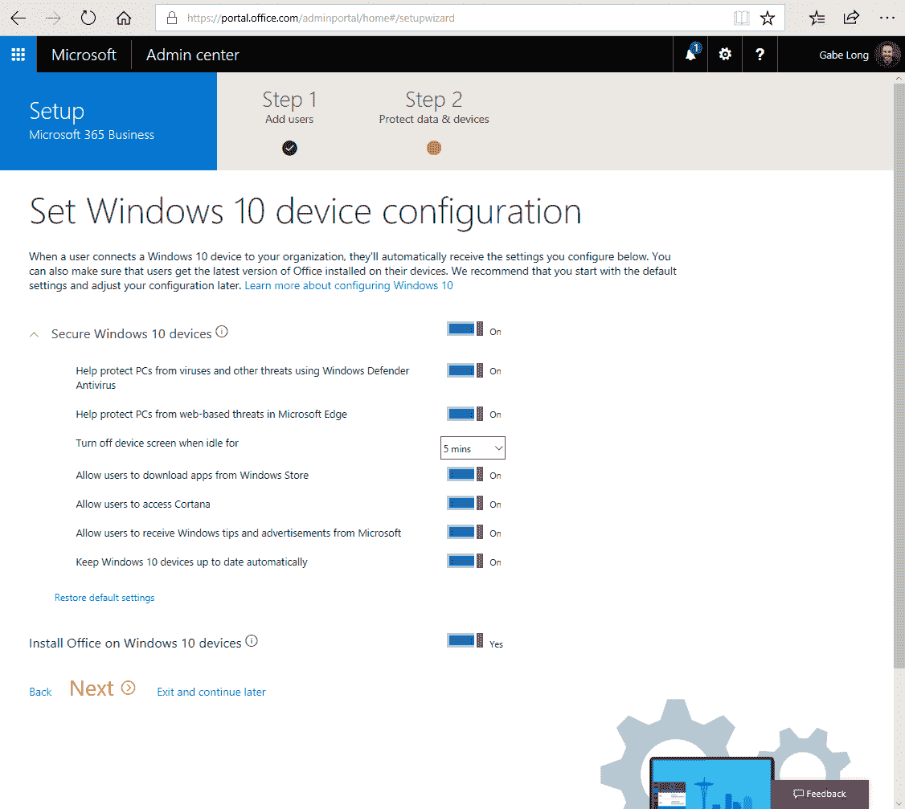
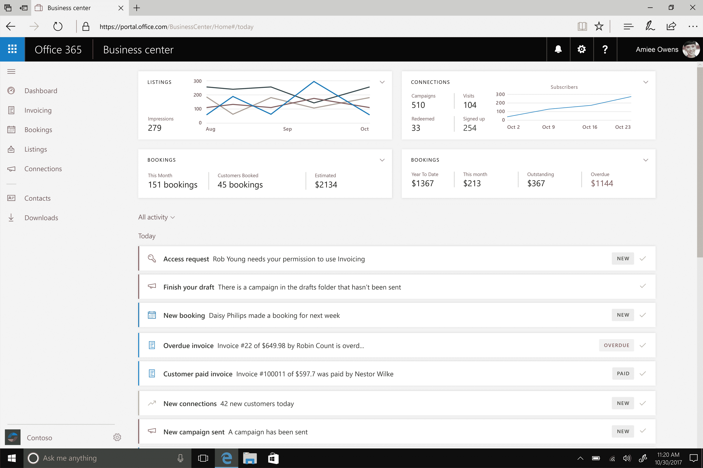

# 面向中小型企业的 Microsoft 365 现已正式上市 

> 原文：<https://web.archive.org/web/https://techcrunch.com/2017/10/31/microsoft-365-for-small-and-medium-businesses-is-now-generally-available/>

微软 365 允许企业订阅 Office 365、Windows 10 和该公司移动设备管理工具的捆绑包。该计划的早期重点是企业，但几个月前，该公司还推出了面向中小型企业的微软 365 预览版。今天，[微软 365 业务](https://web.archive.org/web/20230204161754/https://www.microsoft.com/microsoft-365/business)正走出测试版，现已面向客户全面发售。

该公司用于管理电子邮件营销活动(Microsoft Connections)、创建发票(Microsoft Invoicing)以及跟踪企业在搜索引擎、社交媒体和 Yelp (Microsoft Listings)上的在线表现的工具也在测试中。像 Microsoft 365 Business 一样，这些工具专门关注中小型企业(SMB)的需求，它们现在是 Microsoft 365 和 Office 365 Business Premium 订阅包的一部分。

微软喜欢谈论“数字化转型”，但它主要是在大型企业组织的背景下这样做的。正如微软的 Office SMB 主管 Caroline Goles 告诉我的那样，该公司最近也在研究如何将其经验应用于 SMB。考虑到这些公司中的大多数甚至没有专门的 IT 人员(或者只有很少的一部分)，他们面临的挑战往往非常不同，但他们也必须处理与大型企业相同的竞争压力和安全问题(只是即使很小的违规也可能很容易使他们破产)。

为了应对这一市场，该团队将 Windows 10 和 Office 365 与一个简化的设备管理服务相结合，该服务在一个更易于使用的界面后面提供了其企业级对手的许多功能，该界面提供了合理的默认选择。所有这些都位于所谓的微软管理控制台后面，用户可以轻松地提供新设备，允许某些用户访问文件(或删除文件)，并管理其他安全设置。

其中一些更智能的功能包括通过额外的 PIN 码或指纹扫描来保护公司数据的能力，以及在一段时间没有使用设备时自动删除设备数据的能力。例如，该控制台还允许管理员确保在每台新机器上安装 Office 365，并强制公司发放的每台笔记本电脑上都运行 Windows Defender。

这里的总体想法是通过为这些企业提供单一服务来管理他们的所有技术需求，从而简化他们的 IT 管理。

Goles 指出，增加像[连接](https://web.archive.org/web/20230204161754/https://products.office.com/business/microsoft-connections/email-marketing-software)、[开票](https://web.archive.org/web/20230204161754/https://products.office.com/business/microsoft-invoicing/invoicing-software)和[列表](https://web.archive.org/web/20230204161754/https://products.office.com/business/microsoft-listings/online-web-presence-management-tool)这样的工具是该公司为中小企业市场提供更多服务的目标的一部分。这三个工具加入了微软 Bookings、MileIQ 和 Outlook Customer Manager 的公司类似工具阵容。

就目前而言，微软没有任何具体的计划在这些商业应用之上推出额外的服务(或者至少 Goles 没有与我们分享)，所以就目前而言，计划是确保现有的服务满足微软客户的需求。

