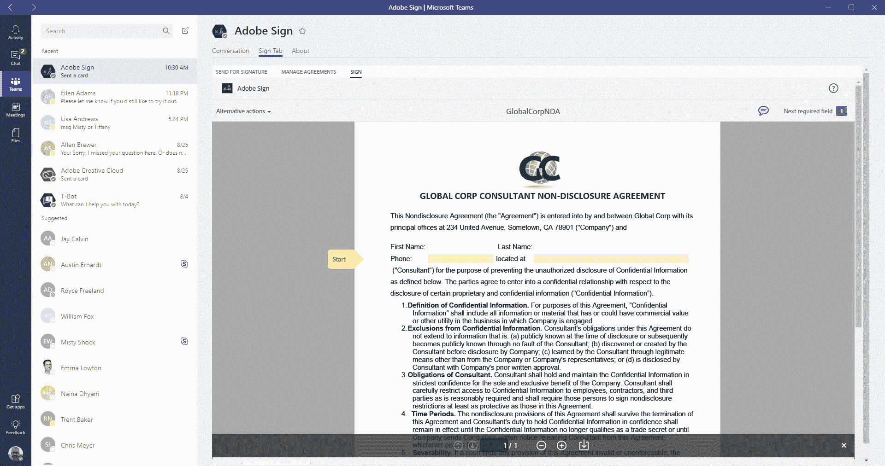
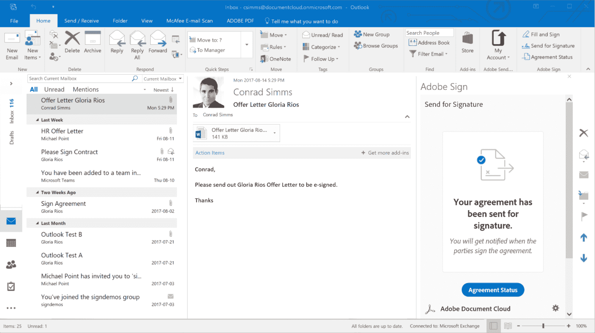

# 微软和 Adobe 宣布围绕 Adobe Sign 和微软团队扩大合作伙伴关系 

> 原文：<https://web.archive.org/web/https://techcrunch.com/2017/09/07/microsoft-and-adobe-announce-an-expanded-partnership-around-adobe-sign-and-microsoft-teams/>

差不多一年前，微软和 Adobe 宣布围绕微软的 Azure 云和 Adobe 的营销云建立战略合作伙伴关系。然而，这只是两家公司迈出的第一步。今天，他们宣布了这种合作关系的重大扩展，看到他们在电子签名和团队通信方面的合作。

具体来说，这一扩大的交易意味着 Adobe Sign 将成为微软的首选电子签名解决方案，集成到 Office 365 和 Dynamics 365 中，而微软团队——该公司的 Slack 竞争对手——将成为 Adobe Creative Cloud、Document Cloud 和 Experience Cloud 的首选协作服务。

微软还将把 Adobe Sign 集成到像其工作流自动化服务 [Flow](https://web.archive.org/web/20221006114159/https://flow.microsoft.com/en-us/) 这样的服务中，并且[微软机器人框架](https://web.archive.org/web/20221006114159/https://dev.botframework.com/)也将能够与 Sign 对话，例如检查批准过程的状态。当用户将新模板放入特定的 Creative Cloud 文件夹时，Flow 也将能够看到这一点，并自动通过审批流程传递文档。

同样，Adobe 也将把微软 Azure 作为其首选的 Adobe sign 云。这意味着，举例来说，Adobe 的 Creative Cloud tools 将与微软团队深度整合。

Adobe Sign 与 Teams、Flow、Word、PowerPoint 和 Outlook 的集成将在未来几周内上线。与微软团队的 Creative Cloud 集成也将很快推出，随后将集成到 Adobe Experience Cloud。

Adobe 的文档云产品开发副总裁乔恩·佩雷拉(Jon Perera)告诉我，他预计这笔交易也将使 Adobe 的其他产品，包括 Stock stock imagery marketplace 等更容易被发现，从而吸引更多用户使用它。两家公司还希望开展大量的联合企业客户活动。

微软和 Adobe 显然已经共享了大量的客户，而他们的产品组合只在少数领域重叠。这使得合作变得容易，尽管微软不想建立自己的电子签名解决方案有点令人惊讶。我就此询问了微软负责 Office 365 的公司副总裁。“作为一家公司，我们一直想要一个非常强大的合作伙伴生态系统。他告诉我说:“我们不可能什么都做。“对我们公司最有利的是拥有强大的合作伙伴生态系统。我们各尽所能。”

