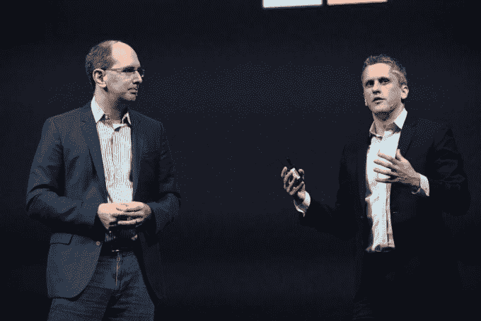

# 微软和 AWS 可能是迄今为止最奇怪的云伙伴 

> 原文：<https://web.archive.org/web/https://techcrunch.com/2017/10/12/microsoft-and-aws-could-be-the-strangest-cloud-bedfellows-yet/>

# 微软和 AWS 可能是迄今为止最奇怪的云伙伴

今天地狱并没有结冰，但是一些不寻常的事情发生了:微软和 AWS 宣布他们正在合作一个项目。

[Project Gluon](https://web.archive.org/web/20221207144141/https://mxnet.incubator.apache.org/gluon/) 是一个开源的深度学习项目，用于构建、部署和管理机器学习模型。值得注意的是，AWS 和微软在云市场竞争激烈。事实上，他们每个人都有试图卖给客户的人工智能工具包，然而，在这种情况下，他们认为合作而不是竞争符合他们的共同最佳利益。

我的朋友们是云的力量在起作用。它迫使那些曾经把自己封闭在专有堆栈后面的公司不由自主地一起工作。当然，他们不愿意和敌人同床共枕，但是当敌友关系符合双方的最大利益时，显然他们愿意这样做。

我们以前在云中见过一些奇怪的联盟。还记得微软和 Salesforce 在起诉对方几年后联手吗？毫无疑问，这是一对奇怪的组合。[自从](https://web.archive.org/web/20221207144141/https://beta.techcrunch.com/2016/07/06/microsoft-gives-frenemy-salesforce-a-shove-with-new-dynamics-365-integrated-cloud-platform/)[塞特亚·纳德拉在 2015 年 Salesforce 的 Dreamforce 大会上出现在舞台上](https://web.archive.org/web/20221207144141/https://www.salesforce.com/video/183633/)以来，这种关系可能有所降温，但两家公司在对客户有意义的时候会继续合作。

马克·贝尼奥夫和塞特亚·纳德拉。照片:马克·贝尼奥夫

在云中，一切都是为了客户。就在昨天，在 Box 的年度客户大会 BoxWorks 上，Aaron Levie 和微软云计算和企业集团执行副总裁 Scott Guthrie 一起站在舞台上，他们开着玩笑，友好地宣布这两个产品集的配合是多么好。

Box 首席执行官 Aaron Levie 与微软云计算和企业集团执行副总裁 Scott Guthrie。图片:彭博/盖蒂图片社

人们很容易忘记 Box 在 2009 年成名，当时加州 101 号公路上的广告牌宣称 Box 比微软 SharePoint 好得多。李维尽可能地扼杀微软。然而，今天我们在这里，两家公司一起站在舞台上，两家公司现在合作得非常紧密。

照片:盒子

云以一种有趣的方式推动公司走到一起，因为这一切都是关于云中的客户。订阅模式迫使供应商将客户放在第一位——他们要求工具具有互操作性。

去一家公司买一堆软件的日子已经一去不复返了。公司可能会将 Salesforce 用于 CRM，将 Microsoft Office 365 用于其办公套件，将 Box 用于内容管理，将 AWS 用于云基础架构，并且他们希望所有这些都协同工作，而没有太多的麻烦和费用。

这可能是 AWS 和微软今天在机器学习框架上合作的原因。仅仅因为这对他们的客户有意义…如果对客户有意义，他们就会去做——不管他们内心深处是否真的想做。