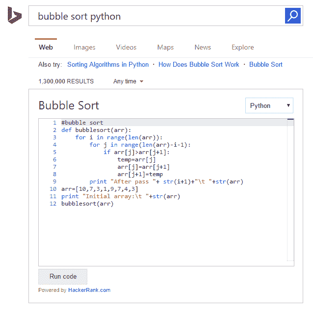

# 微软和 HackerRank 将可执行代码片段引入必应的搜索结果页面 

> 原文：<https://web.archive.org/web/https://techcrunch.com/2016/04/07/microsoft-and-hackerrank-bring-executable-code-snippets-to-bings-search-results-pages/>

# 微软和 HackerRank 给必应的搜索结果页面带来了可执行代码片段

迟早，每个程序员都会去寻找代码片段和算法。然而，大多数搜索引擎并不专门从事代码搜索，所以你最终会得到几个链接(其中一个最有可能是 StackOverflow)。现在，微软已经与 [HackerRank](https://web.archive.org/web/20221205120708/https://www.hackerrank.com/) 合作，将代码片段直接放入其 [Bing](https://web.archive.org/web/20221205120708/http://bing.com/) 搜索结果页面——作为一个额外的改变，你也可以在这些页面上编辑和执行这些代码。

 要触发这个，你所要做的就是搜索类似“ [string concat C#](https://web.archive.org/web/20221205120708/http://www.bing.com/search?q=string%20concat%20c%23) ”或[类似问题](https://web.archive.org/web/20221205120708/http://www.bing.com/search?q=bubble%20sort%20python)，必应就会为你弹出编辑器。使用这个小工具，你也可以切换到其他语言。根据您正在寻找的算法，这里的选项包括 C、C++、C#、Python、PHP 和 Java。

HackerRank 的联合创始人 Vivek Ravisankar 告诉我，该项目目前有 80 多个代码片段，集中在最常搜索的术语上。

微软将其定位为生产力和学习工具。

Bing 的 UX 功能和共享工具团队工程经理 Marcelo De Barros 说:“除了学习如何用给定的语言编写特定的算法/代码之外，用户还可以检查相同的解决方案在一系列其他编程语言中是如何构建的——为编程语言提供了一个 Rosetta-stone 模型。”。

如果你是 Visual Studio 用户，也值得看看微软的[开发者助手](https://web.archive.org/web/20221205120708/https://visualstudiogallery.msdn.microsoft.com/a1166718-a2d9-4a48-a5fd-504ff4ad1b65)插件(之前被称为 [Bing 代码搜索插件](https://web.archive.org/web/20221205120708/https://beta.techcrunch.com/2014/02/17/microsoft-launches-smart-visual-studio-add-on-for-code-snippet-search/))，它允许你在 IDE 中找到并重用超过 2100 万个代码片段和样本。