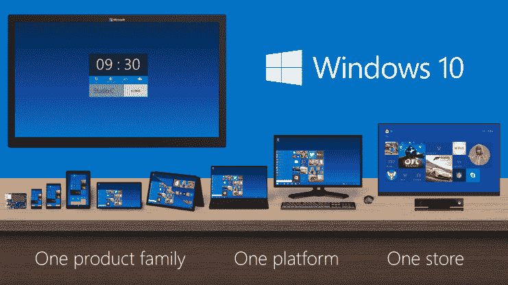
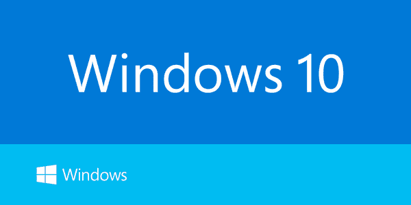
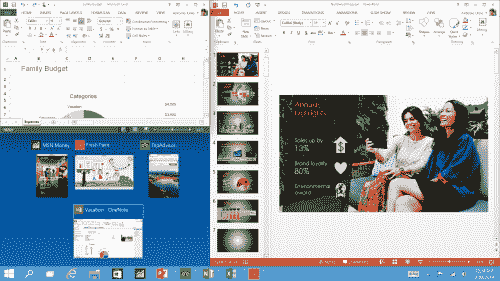
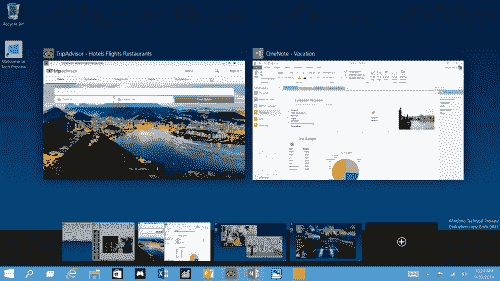
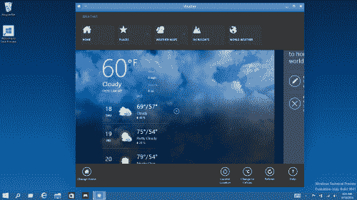
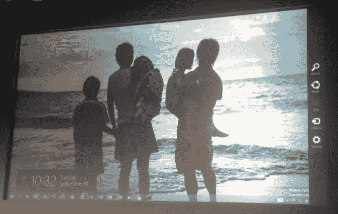

# 微软发布 Windows 10 

> 原文：<https://web.archive.org/web/https://techcrunch.com/2014/09/30/microsoft-announces-windows-10/>

今天早上在三藩市的一次活动中，微软[宣布](https://web.archive.org/web/20230401173249/http://blogs.windows.com/bloggingwindows/2014/09/30/announcing-windows-10/)其 Windows 操作系统的下一个版本:Windows 10。

这个名字肯定不符合预期，但也是在传言它可能会获得另一个头衔之后。令人高兴的是，负责操作系统的最后 943 人把名字搞错了。我也在其中。

https://www.youtube.com/watch?v=84NI5fjTfpQ

从明天开始，微软将推出一个 [Windows Insider 计划](https://web.archive.org/web/20230401173249/http://preview.windows.com/)，让那些习惯运行早期测试版软件的用户可以使用 Windows 10。这第一个预览将适用于笔记本电脑和台式机。稍后将推出服务器版本。微软表示，它正在开放这一测试过程，以尽早从更多用户那里获得更多反馈，但也指出，这将是公司的一次学习经历，用户在新版本中获得的一些实验可能不会进入最终版本。

该公司继续详细介绍了其新操作系统将在不同屏幕尺寸之间提供量身定制的用户体验——也就是说，如果你在较小的设备上，你将看到不同类型的用户界面。该代码将适用于所有设备类别:“一个产品系列。一个平台。一店。”

微软目前正在重复以下内容:企业价值、设备管理、根据您使用的设备定制商店的能力，以及保护数据的方法。或者更确切地说，企业将能够管理他们的设备，并“定制”他们的应用程序商店，等等。

更直白的说，公司是冲着企业皇冠去的。

正如预期的那样，该公司也将恢复 Windows 7 的一些功能，包括重新设计的开始菜单，该菜单将基本的 Windows 7 菜单与 Windows 8 开始屏幕的(可调整大小的)磁贴结合在一起。Windows 8 Metro 应用程序现在也可以在桌面上以窗口模式打开，所以默认情况下你不会进入全屏模式，你可以将“现代”的 Windows 8 与标准的 Windows 桌面应用程序一起使用。

Windows 10 还将允许用户使用多个桌面。由于微软新的“Snap Assist”用户界面，该公司正在让这些需要多个桌面的高级用户更容易从多个桌面获取应用程序并四处移动。

是的，如果你真的喜欢你的键盘，你也可以回到命令行，这也已经有了很大的改进。

虽然微软主要专注于与操作系统交互的常规鼠标和键盘组合，但该公司强调，它不会放弃触摸。举例来说，Windows 10 仍然会有一个类似 Windows 8 的开始屏幕，供支持触摸功能的机器上的用户使用。

在 Windows 10 中，一些手势会有一些变化(例如，现在从左侧滑动可以获得任务视图)，但整体功能集似乎与 Windows 8 非常相似，甚至 Windows 8 的 Charms 栏仍然可用。

微软没有展示的一件事(至少到目前为止)是 Windows 10 中的任何其他消费者功能。然而，该公司确实谈到了一点，即用于手机的 Windows 10 的外观和工作方式几乎完全类似于 Windows 10 上略微精简的现代用户界面。微软从 Windows 8 的经历中清楚地认识到，如果它想为每种设备构建单一的操作系统和用户界面，它不能只针对边缘情况进行优化。例如，微软的 Joe Belfiore 指出，虽然将平板电脑和手机的界面结合起来是一个显而易见的选择，但“真正的困难出现在中间。”他说，这一次，他对“我们将获得的结果非常乐观。”

*随着时间的推移，TechCrunch 正在更新这篇文章。*