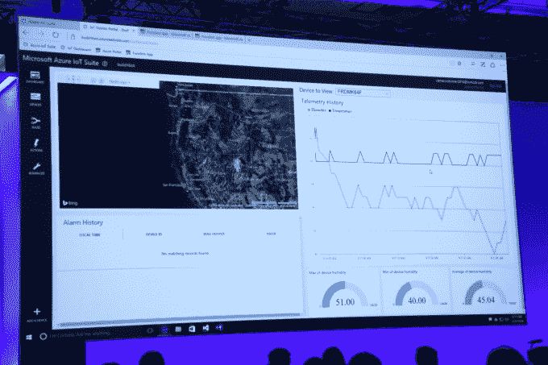

# 微软用 Azure 功能回答 AWS Lambda 的事件触发无服务器应用

> 原文：<https://web.archive.org/web/https://techcrunch.com/2016/03/31/microsoft-answers-aws-lambdas-event-triggered-serverless-apps-with-azure-functions/>

# 微软用 Azure 功能回答 AWS Lambda 的事件触发无服务器应用

微软今天在年度 [Build Developer conference](https://web.archive.org/web/20230306001118/https://build.microsoft.com/) 上宣布预览一项新服务，该服务允许程序员创建事件驱动的触发器，而无需部署任何底层基础设施。

如果这听起来很熟悉，那是因为 [AWS 去年在 re:Invent 上推出了一项名为 Lambda](https://web.archive.org/web/20230306001118/https://techcrunch.com/2014/11/13/amazon-launches-lambda-an-event-driven-compute-service/) 的类似服务，在公共云计算针锋相对的世界中，微软不得不做出回应。今天它做到了，提供了自己的服务版本 Azure Functions。

从微软的角度来看，它扩展了他们的平台即服务，允许开发人员用熟悉的语言——Java、Python、C#和 PHP——创建事件触发器。它几乎可以在你喜欢的任何类型的云中工作，包括 Azure、第三方、私有和混合云。

微软将其定位于物联网，这样当一个设备或传感器发出一些信息时，它可以触发一个事件，使一些事情自动发生。

值得注意的是 [Google 最近用一个类似的工具](https://web.archive.org/web/20230306001118/https://cloud.google.com/functions/docs)(名字类似)进入 Alpha，叫做 Google Cloud Functions。

从我听到这个术语的那一刻起，[无服务器应用](https://web.archive.org/web/20230306001118/https://techcrunch.com/2015/11/24/aws-lamda-makes-serverless-applications-a-reality/)的想法就深深吸引了我。考虑这样一种想法，您可以创建一个事件触发器(甚至一系列触发器，每个触发器都独立存在)，并让云服务处理所需的任何计算、内存和存储资源。该事件实际上可以持续几毫秒，然后消失。

它将部署这些小型自包含应用程序的权力交给了程序员，消除了开发人员将应用程序越过墙壁传递给运营部门进行部署的需要。它为开发人员提供了一种部署自己的方式，因为实际上，微软(或另一家云提供商)正在充当运营团队，部署适量的资源来处理触发事件。

当然，这可能涉及多个事件同时发生，或者由多米诺骨牌效应中的触发器触发。最终结果可能是触发活动的持续流动，每个触发活动都导致小的可收费事件，这些事件可以为微软积累大笔资金。