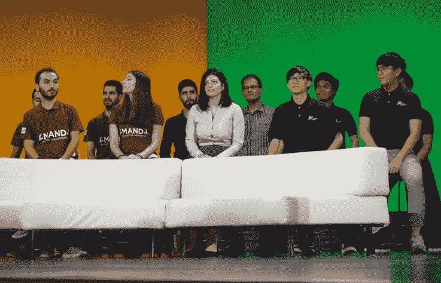
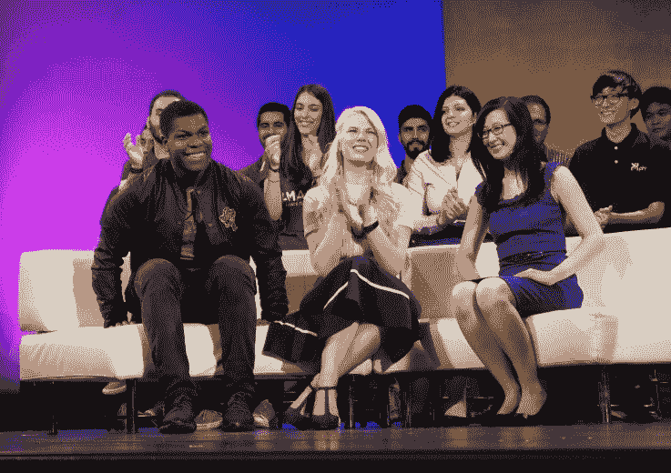
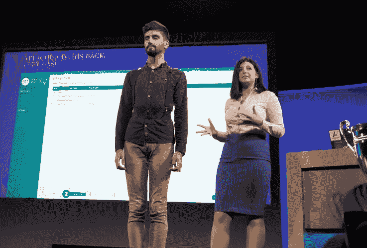
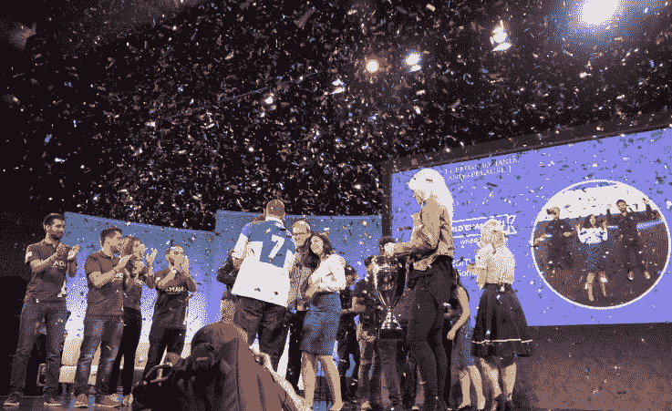

# 微软在 2016 年创新杯上为硬件创业公司 ENTy 颁奖

> 原文：<https://web.archive.org/web/https://techcrunch.com/2016/07/29/microsoft-awards-hardware-startup-enty-the-2016-imagine-cup/>

微软创意杯的庆祝活动已经结束，这是一项学生和年轻人创造新软件和设备的全球竞赛。[今年的获胜者](https://web.archive.org/web/20230325002940/https://blogs.microsoft.com/blog/2016/07/29/announcing-microsofts-imagine-cup-2016-world-champion/)是 [ENTy](https://web.archive.org/web/20230325002940/http://www.entymed.com/) ，这是一款精致且高度实用的硬件解决方案，用于跟踪姿势，帮助诊断并可能治疗影响平衡的疾病。

决赛中有 35 个团队，平均分为三类:游戏、创新和全球公民。所有这些作品都在周三提交给了一个评委小组，之后每个类别都选出了一个获胜者。这三人每人获得了 5 万美元，但大奖——声望和与塞特亚·纳德拉的私人辅导——是为今天的最后仪式而设的。

它发生在我自己的加菲尔德高中(加油牛头犬队！)并填满了我们新装修的昆西·琼斯礼堂。一位精力充沛的 beatboxer 打开了局面，但由于时间不到上午 9 点，而且里面不允许喝咖啡，我渴望事情能真正开始。

各队等待判决。

最终，决赛选手和三位评委一起出场了:詹妮弗·唐博士，前获奖者和 Eyenaemia 的创始人；微软学习的计算机科学教育专家 Kasey Champion 还有约翰·博耶加，你可能还记得 2011 年的《进攻街区》和一些关于星球大战的电影。

不在照片上:大约有 20 个人打扮成 501 部队的星战角色，在我右边 15 英尺处。

在游戏类别中是 [PH21 的](https://web.archive.org/web/20230325002940/http://www.imaginecup.com/Team/Index/105016)智能手机游戏，Timelie，它结合了战术隐身和对时间的控制。在全球公民行动中，Amanda 团队旨在通过测量用户对欺凌相关媒体的反应的虚拟现实体验来防止欺凌。在创新方面充满活力。

[ENTy](https://web.archive.org/web/20230325002940/http://www.entymed.com/)(ENT 代表耳朵、鼻子和喉咙——而不是有知觉的树)是一款实时监控平衡和姿势的设备和应用程序，旨在帮助医生诊断和检查内耳问题，如眩晕。

患者将一个大小如一包香烟的设备绑在背部，一组传感器将数据发送到相关的应用程序。有一个位置的实时读数，你可以随着时间的推移看到，例如，一个测试要求病人闭着眼睛站直 20 秒。

现场演示效果非常好，当然也为团队的胜利做出了贡献。

这个团队只有三个人，来自罗马尼亚理工大学:负责硬件的于连-拉兹万·mateșică，负责应用程序的克里斯蒂安·亚历山大斯库，以及负责业务开发的弗拉维亚·奥普雷亚。她带头展示技术并回答问题——我可以说她做得非常好；事实上，我看到的所有演讲都是经过高度加工的，尤其是对那些英语不是他们的第一语言，甚至不是第二语言的学生来说。

ENTy 的下一步，大概是在得到微软首席执行官的一些真正的谈话后，将使设备更像样一点。他们已经在几名医生和数百名患者身上进行了测试，反应非常积极，但正如他们所说，该设备本身还没有准备好进行特写。

“医生说他们不想让它再小了，”奥普雷亚在周四的问答中说。“但我们有一个 B2C 的计划，让它变得更小——它必须是，你怎么说，一个性感的可穿戴设备，适合所有人。”

为此，他们正在与布加勒斯特的一家公司合作，在医生办公室外设计和推广这种设备，尽管严格的医学方面也在进行中——但这似乎主要是书面工作。为机器学习收集数据也摆在桌面上，但与此相关的繁文缛节甚至更多。

仪式结束后，奥普雷亚还非常乐观地谈到了年轻女性在科技领域的前景，至少在布加勒斯特是这样。

“感兴趣的女孩越来越多，”她说。“我们告诉他们不要害怕，不要听诸如‘电脑是男孩子的东西’之类的负面建议。”"

作为最后的款待，微软邀请加菲尔德的校长泰德·霍华德(Ted Howard)上台接受捐赠:“价值 10 万美元”的 Surface Books，我认为这是其中的 85 或 90 本。这所学校看起来比我在 90 年代末去那里的时候好多了，但是你最好相信 GHS 感谢这份礼物——不知何故我怀疑他们在笔记本电脑里游泳。

这里期待明年的杯赛和随之而来的新鲜想法。

[gallery ids="1361441，1361440，1361439，1361438，1361437，1361436，1361435，1361434，1361433"]