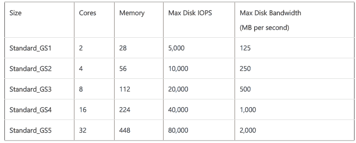

# 微软 Azure 降低部分虚拟机价格，为 G 系列虚拟机带来高端存储选项 

> 原文：<https://web.archive.org/web/https://techcrunch.com/2015/09/02/microsoft-azure-gs-series/>

# 微软 Azure 降低了一些虚拟机价格，为 G 系列虚拟机带来了高级存储选项

微软[今天宣布](https://web.archive.org/web/20221210001450/http://azure.microsoft.com/en-us/blog/azure-has-the-most-powerful-vms-in-the-public-cloud/)其 Azure 云计算服务的几项更新，其中包括推出其性能优化的 G 型虚拟机(VM)的新版本，以及其以计算为中心的 D 型虚拟机的降价。

Azure 的 G 级虚拟机是微软在 Azure 云中最高端的机器——因此也是[最贵的](https://web.archive.org/web/20221210001450/http://azure.microsoft.com/en-us/pricing/details/virtual-machines/)。运行 Windows 操作系统的虚拟机最高价格为[7180 美元/月](https://web.archive.org/web/20221210001450/http://azure.microsoft.com/en-us/pricing/details/virtual-machines/#Windows)。现在，微软正在推出这些机器的一个变种，增加了高级存储作为一个选项。GS 系列虚拟机可提供高达 64TB 的存储，每秒可提供高达 80，000 次存储 I/o，存储吞吐量高达 2，000 MB/s。

标准 G 系列和新 GS 系列虚拟机现在也将支持 20 Gbps 的网络带宽。据微软称，这是其竞争对手提供的任何其他虚拟机吞吐量的两倍。

正如微软项目管理总监科里·桑德斯(Corey Sanders)告诉我的那样，由于客户的需求，公司决定增加这种高级存储选项。Azure 用户希望使用 G 系列机器来运行大型数据库工作负载。

“随着这些工作负载的增长，增加存储吞吐量的需求也在不断增加，”他告诉我。在他看来，GS 系列虚拟机非常适合运行 MySQL 和微软自己的 SQL Server 等数据库，以及 MongoDB 等 noSQL 数据库。

桑德斯还指出，Azure 的一些客户正在寻找这些机器来支持他们的数据仓库和企业应用程序，如 Exchange 和 Dynamics。

通过此次更新，微软还将 D 系列虚拟机的价格降低了 27%，这些虚拟机通常用于支持 web 应用前端和基本数据层工作负载。桑德斯告诉我，降价背后的想法是让更多用户转向 D 系列，因为他们将生产负载转移到 Azure。价格变动将于 10 月 1 日生效。

Azure 现在还推出了其[服务总线消息服务](https://web.archive.org/web/20221210001450/http://azure.microsoft.com/en-us/services/service-bus/)的高级层，为开发人员提供了更高的保证正常运行时间和更可预测的性能，以及针对虚拟机的新诊断功能。