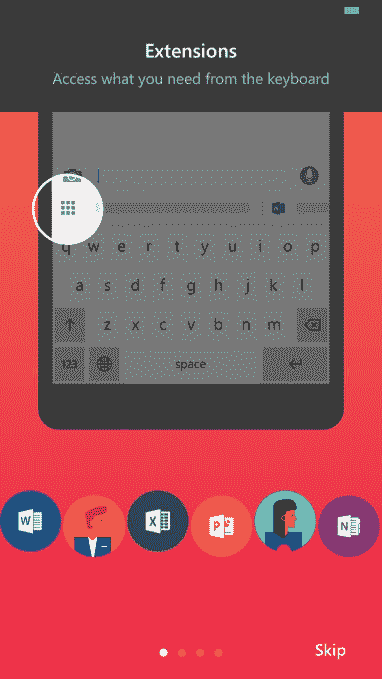

# 微软将其 Hub 键盘应用程序引入 iPhone 

> 原文：<https://web.archive.org/web/https://techcrunch.com/2016/04/07/microsoft-brings-its-hub-keyboard-app-to-iphone/>

微软今天发布了第一款面向 iOS 用户的独立键盘应用。不，这不是传闻中的 Windows Phone 键盘的[版本，而是今年 2 月登陆 Android](https://web.archive.org/web/20221007065618/http://www.theverge.com/2016/1/25/10829594/microsoft-iphone-keyboard-word-flow-features) 的微软 Hub 键盘、[的 iOS 版本](https://web.archive.org/web/20221007065618/https://play.google.com/store/apps/details?id=com.microsoft.hub_keyboard)[。像以前的版本一样，iOS Hub 键盘可以让你快速共享 Office 文档和存储在云中的文档，共享联系人，并访问你的剪贴板。](https://web.archive.org/web/20221007065618/https://itunes.apple.com/us/app/hub-keyboard/id1096760900)

没错，是一个*非常*的微软键盘。当然，这才是重点。

该项目是微软内部孵化器[微软车库](https://web.archive.org/web/20221007065618/http://blogs.microsoft.com/firehose/2016/02/23/hub-keyboard-app-from-microsoft-garage-makes-it-easy-to-multitask-from-one-mobile-screen/)涌现出的众多应用之一，面向那些基本上生活在微软宇宙中的人。然而，这在 iPhone 上可能更有意义，因为 iOS 在企业中的地位比 Android 更高。这对有 iPhone 的学生也很有用。

然而，iOS 版本的 Hub 键盘没有与 Android 相同的功能集，可能是由于平台限制。例如，iOS 键盘只显示你最近拷贝的文本，而不是提供你之前拷贝的所有文本项的列表。然后，您可以按一个按钮将其粘贴到您的文档、电子邮件或聊天中。

此外，它还允许您获取和共享保存在 OneDrive 和 SharePoint 中的 Office 365 文档的 URL，并允许您共享保存在 Office 365 中或存储在手机上的联系人信息。然而，翻译功能——将你写的东西翻译成另一种语言——似乎在发布时就没有了。

这些功能要求您使用 Office 365 帐户信息登录，以便访问存储在云中的信息。您可以从设置部分进行设置，在这里您还可以调整其他首选项，如启用或禁用自动完成或声音。

[gallery ids="1304009，1304008，1304007，1304006，1304005"]

键盘本身是办公室团队的高级设计师[发明的，](https://web.archive.org/web/20221007065618/http://blogs.microsoft.com/firehose/2016/02/23/hub-keyboard-app-from-microsoft-garage-makes-it-easy-to-multitask-from-one-mobile-screen/#sm.00009uxrhq9m6ewfvbf2gcguw8ze0)史蒂夫·温(Steve Won)，他对不得不在智能手机上的应用程序之间切换以执行某些任务感到沮丧。这个想法是利用一些常见的功能，比如获取联系信息或正在讨论的文件的链接，并使这些功能可以直接从键盘上访问。

该项目的工作在 2015 年微软内部//为期一周的黑客马拉松上正式开始。后来，它变成了一个七人团队，并获得了进一步开发的资金。

然而，当它在 Android 上发布时，没有提到将应用程序移植到其他平台。

[微软 Hub 键盘可以在 iTunes 上免费下载](https://web.archive.org/web/20221007065618/https://itunes.apple.com/us/app/hub-keyboard/id1096760900)。