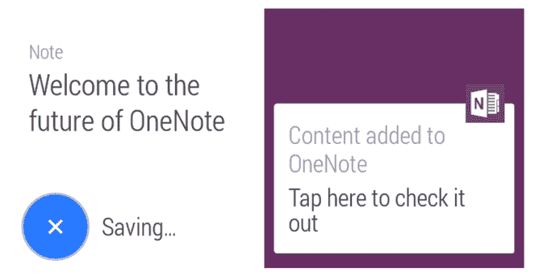

# 微软将 OneNote 引入 Android 可穿戴设备 

> 原文：<https://web.archive.org/web/http://techcrunch.com/2014/09/16/microsoft-brings-onenote-to-android-wearables/>

# 微软将 OneNote 引入 Android 可穿戴设备

我认为可穿戴设备是跨平台工具和服务的新领域。今天微软[为 Android Wear 设备](https://web.archive.org/web/20230129063617/https://play.google.com/store/apps/details?id=com.microsoft.office.onenote.wear)带来了 OneNote。您现在可以从手表上使用 OneNote。如果你想的话。

使用时看起来是这样的:

所以现在，如果你想在公共场合对着你的手表大喊大叫，你可以。你看起来会很酷。用你的智能手表。有时能听懂你的声音。除非外面很吵。那么你很可能不会取得那么大的进步。

图片由 FLICKR 用户 [KENNETH LU](https://web.archive.org/web/20230129063617/https://www.flickr.com/photos/toasty/3538820892/in/photolist-krpxQ9-6oHoaj-cwr9kY-krnjNx-8UAoSq-krpyU3-krniRH-9sf2jJ-73x68A-8mEiE3-aeEoST-7Ssuuh-6kzXBW-73t74n-69RwYC-cSvND3-cSvK8Y-8MNJoU-cSvMfW-cSvMLm-8mEiBE-q4bLj-8RvAdL-7GLybs-6CUUk4-cSvLCq-6BzjhP-95AuRU-9UKjCS-e4kt9p-kvUQpF-9UGszr-dbAeC3-cSSZks-9UKkEh-9UGroa-7SsAGW-9CZzGa-ap6A4c-cqPd3J-8jBNJa-7QFBoz-9LtfGc-byyS3N-9UGsGX-bN4sC4-9UGsMF-9RxcKv-mFcVyH-9QWZxJ) 根据  [CC BY-SA 2.0](https://web.archive.org/web/20230129063617/https://creativecommons.org/licenses/by-sa/2.0/) 授权(图片已修改)