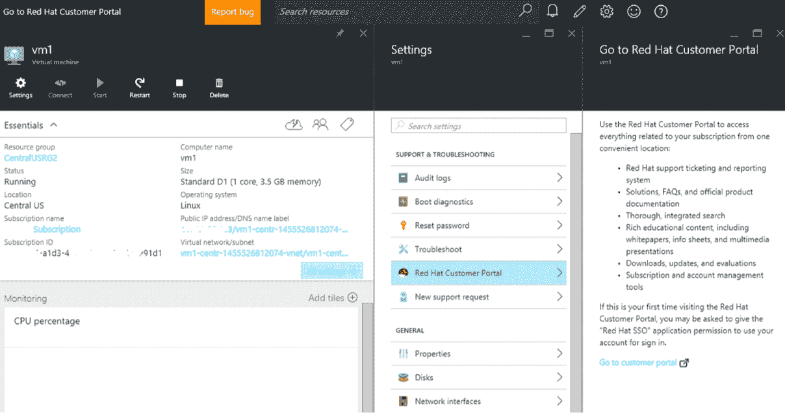

# 微软将 Red Hat Enterprise Linux 引入 Azure 

> 原文：<https://web.archive.org/web/https://techcrunch.com/2016/02/17/microsoft-brings-red-hat-enterprise-linux-to-azure/>

微软现在正在[出售](https://web.archive.org/web/20221202223318/https://azure.microsoft.com/pricing/details/virtual-machines/#red-hat) [红帽企业版 Linux](https://web.archive.org/web/20221202223318/https://www.redhat.com/en/technologies/linux-platforms/enterprise-linux) 许可证。从今天开始，你将能够从 Azure Marketplace 部署[Red Hat Linux Enterprise](https://web.archive.org/web/20221202223318/https://www.redhat.com/en/technologies/linux-platforms/enterprise-linux)(RHLE)[，并从微软和 Red Hat 获得对你的部署的支持。](https://web.archive.org/web/20221202223318/https://azure.microsoft.com/en-us/campaigns/redhat/)

此外，微软今天宣布，它现在在 Azure Marketplace 中提供经过认证的 Bitnami 图像，并且它现在支持[沃尔玛](https://web.archive.org/web/20221202223318/http://oneops.com/)(是的，就是[沃尔玛](https://web.archive.org/web/20221202223318/http://www.walmart.com/))的开源 [OneOps 应用生命周期管理平台](https://web.archive.org/web/20221202223318/https://beta.techcrunch.com/2016/01/26/walmart-launches-oneops-an-open-source-cloud-and-application-lifecycle-management-platform/)。直到今天，OneOps 只为亚马逊的 AWS 平台提供了一个机器映像。

在一个句子中同时出现“微软”和“Linux”这两个词可能会让一些人感到震惊，但微软表示，Azure Marketplace 中超过 60%的图片都是基于 Linux 的。

Red Hat 和微软之前也宣布了导致今天发布的合作关系，所以你现在可以在 Azure 上运行 RHEL 虚拟机的事实不应该完全令人惊讶。

还值得注意的是，RHEL 用户已经能够将他们现有的许可证移植到 Azure，但现在任何人都可以在 Azure 上运行 RHEL 机器(在基本虚拟机的标准成本基础上支付额外费用)，并获得微软和红帽的全面支持。

【T2

正如 Red Hat 的业务架构高级主管 Mike Ferris 和微软的 Azure 项目管理主管 Corey Sanders 本周早些时候告诉我的那样，两家公司还在密切合作，为选择在 Azure 上走 RHEL 路线的客户提供支持。Red Hat 和微软的支持专家实际上坐在一起回答客户的问题，这对两家公司来说都是第一次。

正如 Ferris 和 Sanders 所强调的，他们的两个企业客户群之间已经有了几乎 100%的重叠。鉴于微软对混合云部署的关注，让这些客户能够在其内部和云中运行相同的操作系统是一个显而易见的举措。

“自从我们在 11 月宣布我们的合作伙伴关系以来，我们已经看到我们的客户对将他们的红帽投资带到 Azure 的强烈兴趣和势头，”桑德斯在今天的声明中说。“Azure 提供了公共云的最佳企业级支持，通过提供完全集成的支持体验，位于同一地点的 Red Hat 和 Microsoft 支持工程师可以在您需要时并肩帮助您！”

RHEL 6.7 和 7.2 图像现在可以在所有 Azure 地区使用，除了中国和 Azure 的[美国政府](https://web.archive.org/web/20221202223318/https://azure.microsoft.com/en-us/features/gov/)平台。

虽然与 Red Hat 加深的合作伙伴关系显然是今天发布的亮点，但认证第一组 Bitnami 图像也给了 Azure 客户更多的灵活性。微软表示，将在未来几个月内向 Azure Marketplace 添加更多此类产品。