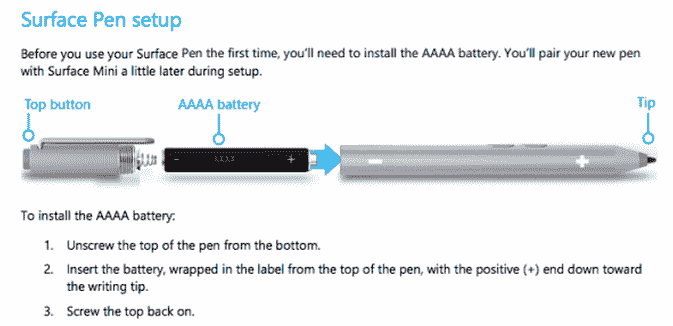

# 微软无意中证实 Surface Mini 是真的，帮了我们一个大忙 

> 原文：<https://web.archive.org/web/https://techcrunch.com/2014/06/20/microsoft-does-us-a-solid-by-accidentally-confirming-that-the-surface-mini-is-real/>

# 微软意外确认 Surface Mini 是真的，这帮了我们一个大忙

微软拒绝置评。今天早些时候，一本帮助用户深入了解他们的新 Surface Pro 3 设备的手册[多次提到了目前超级秘密的 Surface Mini](https://web.archive.org/web/20221006202857/http://www.slashgear.com/microsoft-needs-to-clean-the-surface-mini-from-its-pro-3-manual-20334576/)。哎呀。

惊讶吗？不要这样。微软原本计划与 Surface Pro 3 一起推出 Surface Mini。我从知情人士那里听说，这个决定是在[接近风口浪尖](https://web.archive.org/web/20221006202857/https://beta.techcrunch.com/2014/05/19/microsoft-likely-to-break-out-a-bigger-not-smaller-surface-tomorrow-morning/)的时候做出的，如果不是特别令人惊讶的话，这让这个错误变得很滑稽。

请记住，微软也犯了一个错误——也许这次事故不算是*的一次事故——并且在官方宣布之前[泄露了即将推出的 Surface Pro 3](https://web.archive.org/web/20221006202857/http://www.theverge.com/2014/5/14/5716282/surface-pro-3-microsoft-support-site) 。*

当然，今天标志着 Pro 3 正式上市的第一天。因此有了用户指南。这是否意味着 Surface Mini 会在未来上市销售？不。但是它确实强调了在它撞到杂草上之前它走了多远。

较小的表面是个好主意吗？一些公司在销售更小的基于 Windows 的平板设备方面取得了成功，比如戴尔 Venue Pro 8。然而，鉴于 Surface 系列专注于键盘和文档，以及除了消费内容之外还能做更多事情的能力，较小的外形有点难以解析。

只是为了好玩:

