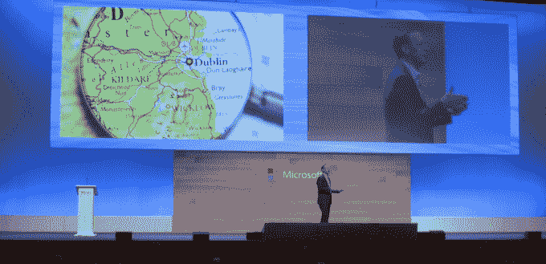

# 微软将 Azure 数据中心扩展到法国，发起信任攻势对抗 AWS，谷歌

> 原文：<https://web.archive.org/web/https://techcrunch.com/2016/10/03/microsoft-expands-azure-datacenters-to-france-looks-to-beat-aws-on-image-of-trust/>

像微软、亚马逊和谷歌这样的公司继续在云服务领域为消费者、开发者和企业激烈竞争。今天，微软做出了最新的努力，试图在竞争中领先，同时也启动了一项新的任务，将自己定位为你可以信任的云提供商。

微软宣布今年将在法国建立首个 Azure 数据中心，作为其在欧洲投资 30 亿美元建立云服务的一部分。与此同时，该公司还发布了一份新的出版物,*全球公益云*，在数据保护和可访问性等 15 个领域提出了不少于 78 条公共政策建议。

微软首席执行官塞特亚·纳德拉在爱尔兰都柏林的一次活动上发表讲话时透露了新的扩张、投资和“信任”计划。他表示，这一扩张将意味着微软“覆盖的地区比任何其他云提供商都多……在过去一年里，容量增加了一倍多。”

作为衡量微软和亚马逊目前在服务可用性上的意向的一个指标，法国数据中心的消息来自 T4，一个月前亚马逊宣布也将在法国建设一个数据中心。

当然，Nadella 没有提到 AWS 的名字，但这对于微软来说是个大问题。纳德拉今天表示，微软的数据中心覆盖全球 30 个地区，“比任何其他云提供商都多”，欧洲足迹包括爱尔兰、荷兰、英国和德国。

在德国，其数据中心由德国电信代表微软按照[受托人模式](https://web.archive.org/web/20230326051810/https://techcrunch.com/2015/11/11/microsoft-trustee-model-for-cloud-mistrust/)运营，纳德拉说，此举既是为了“数字主权和合规性”，也是为了“现实世界对客户需求的理解”

在过去几年里，受依赖基于云的架构运行应用的智能手机和平板电脑崛起的推动，基于云的存储和服务的受欢迎程度呈指数级增长；以及其他消费者和企业服务的兴起，这些服务也采用远程存储和处理方法来更有效地交付软件。

虽然微软在构建被大众市场广泛使用的移动平台或手机方面可能输给了谷歌/安卓和苹果等公司，但它希望自己在云服务方面的存在将在未来的计算领域占据一席之地。

纳德拉今天表示:“我们对移动优先和云优先的定义有一个非常独特的观点，这是关于你在生活中所有设备上的体验的移动性，以及实现这种移动性的方式……这些体验……只有通过云才是可能的。”

作为一项业务，它为亚马逊和微软等公司提供了非常稳定的经常性收入，因此是它们各自财务业绩的强大引擎。在云中为开发人员提供类似实例的基本服务，也为向客户追加销售许多其他功能奠定了基础，从其他软件和产品到更多改进应用程序的技术，如机器学习和人工智能技术。(纳德拉描述了他的愿景，例如，“每个应用程序中都有机器人”。)

云的业务方面不是今天演讲的重点。更重要的是，微软为自己设定了一个新的有趣的定位，用纳德拉的话说，就是“更值得信赖、更负责任、更包容”的云提供商，这大概是与亚马逊和谷歌等其他公司形成对比。

谈到在爱尔兰制造新闻，微软有一个有趣的背景故事。在一定程度上由于其税收结构，爱尔兰已经成为许多主要科技公司的总部所在地，不仅是微软，还有脸书、谷歌、苹果和许多其他公司，它们都在建立国际总部，覆盖美国以外的全球业务，这意味着在爱尔兰出现的关于数据保护或纳税等问题的监管问题会产生更大的反响。

就微软而言，该公司长期卷入与美国政府的诉讼，因为它存储在爱尔兰服务器上的数据是美国政府想要获取的。(它[今年早些时候打赢了这场官司](https://web.archive.org/web/20230326051810/https://techcrunch.com/2016/07/14/microsoft-wins-second-circuit-warrant/)。)

微软首席法律顾问兼总裁布拉德·史密斯(Brad Smith)在今天的演示中表示:“我们一点也不知道这个数据中心会导致对我们自己政府的诉讼……我们一点也不知道，如果我们坚持不懈，我们实际上会赢得这场官司。”。“人们拥有权利，这些权利需要得到保护。我们需要构建一个负责任的云。”

