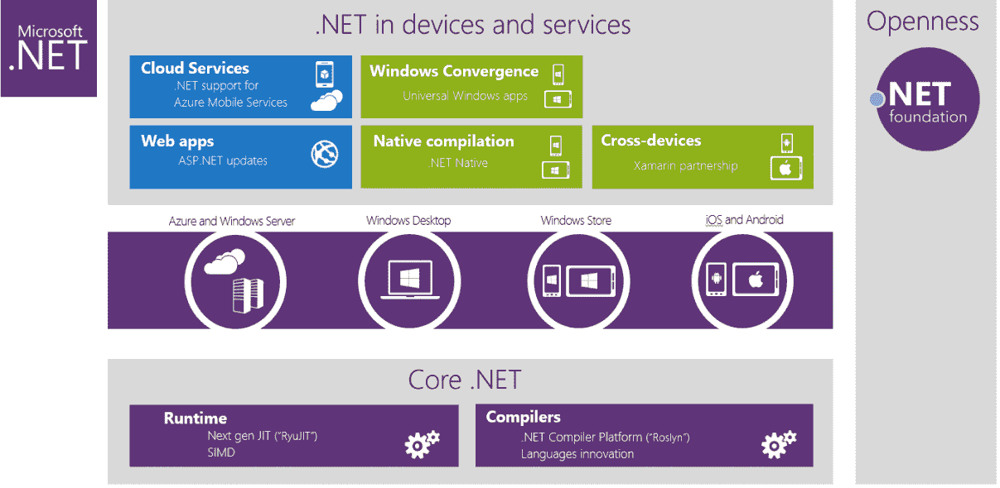

# 微软扩展其。具有新编译器平台和语言特性的. NET Framework With New

> 原文：<https://web.archive.org/web/https://techcrunch.com/2014/04/03/microsoft-extends-its-net-framework-with-new-compiler-platform-and-language-features/>

今天在旧金山举行的 [Build 开发者大会](https://web.archive.org/web/20230224041250/http://buildwindows.com/)上，微软宣布了它的一系列新功能。NET 平台。拥有超过 18 亿的安装量和 600 万专业开发人员。大约 12 年前推出的. NET 一直是微软开发者生态系统的基石之一。

除了启动。今天，微软还宣布了对。NET 平台。在这些新特性中，有一个新的编译器平台的预览版，更深层次的 Azure 集成。NET Mobile Services，一个改进的实时编译器和 C#和 Visual Basic 的新语言功能预览。

正如微软开发部门的公司副总裁索玛·索玛瑟加上周告诉我的那样，公司希望“向开发者展示这一点”。对于想要在这个现代世界中开发应用程序的开发者来说，NET 仍然是一个非常可行的平台。”

微软之前预演了“罗斯林”。NET 编译器平台(它现在已经搁置了“Roslyn”代码名称)，但今天它宣布这现在是一个开源项目，微软也将开始接受外部贡献。该项目包括微软的 C#和 Visual Basic 的下一个版本，但可能更有趣的是，它还包括一个“编译器即服务 API”，可以集成到其他 ide 中。例如，Xamarin 演示了如何使用？NET 编译器平台，在 MacBook 上运行的 Xamarin Studio 中提供改进的 C#开发体验。

C#和 Visual Basic 也在此次更新中获得了一些新功能。微软今天预览了这两种语言中的一些新的语言特性，包括主构造函数和自动属性初始化器。

正如微软昨天宣布的，它在这个版本中预览了一个. NET 原生编译器，但是今天，它也宣布了。NET 的标准实时编译器。在很大程度上，新的编译器加快了启动速度，并提高了许多性能。该版本提供了新的 API，可以利用现在大多数现代处理器中可用的单指令多数据(SIMD)支持。然而，这项功能仍处于预览阶段。

这个版本中更深层次的 Azure 集成并不令人惊讶。微软已经宣布了。NET 移动服务。这些为开发者提供了一个连接 Azure 的数据存储和其他功能的移动后端。

正如索马塞格在我与他交谈时指出的那样，微软仍在考虑。NET 作为其平台的核心部分。这些更新——以及的[发布。NET Foundation](https://web.archive.org/web/20230224041250/https://techcrunch.com/2014/04/03/microsoft-launches-net-foundation-to-foster-the-net-open-source-ecosystem/)——旨在加强该平台，他似乎特别兴奋的一件事是。NET Foundation 将有助于将该平台带入未来。

【T2