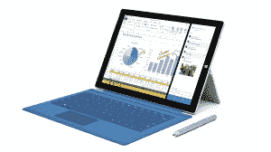

# 微软面临严峻的移动挑战 

> 原文：<https://web.archive.org/web/https://techcrunch.com/2015/01/26/microsoft-faces-stiff-mobile-challenge/>

微软上周过得很糟糕，不是吗？它实际上感觉像是用全息透镜找回了它的凹槽，它的全息虚拟现实眼镜，我不得不说看起来很酷。它还通过 Windows 10 移动战略引起了我们的注意，它展示了桌面版的 Cortana，这是 Siri 无法做到的。

我敢说，尽管这一周表现不错，但我不得不怀疑微软能否在移动领域取得进展。截至目前，其平板电脑和手机的市场份额简直糟糕透顶。微软在市场份额方面落后太多，它需要一个巨大的飞跃才能发挥作用。

这并不是说该公司没有移动战略。塞特亚·纳德拉因重新关注公司并创造了更加积极的形象而获得了当之无愧的赞誉。Windows 10 的移动和桌面统一屏幕可能对消费者和开发者都有吸引力，这两者都还没有对 Windows mobile 产生兴趣。但这足以让微软摆脱目前的市场份额低迷吗？

微软[去年收购了诺基亚](https://web.archive.org/web/20221005143404/https://beta.techcrunch.com/2014/04/25/microsofts-7-2bn-acquisition-of-nokias-devices-business-is-now-complete/)，试图控制 Windows mobile 平台，并最终创建了一个跨越移动和桌面的单一平台视图。就目前而言，这很好，但人们仍然没有购买 Windows 手机，甚至没有购买足够多的 Surface 平板电脑——除非这种情况发生逆转，否则将会非常困难。

## 让我们看看手机号码

该公司押注 Windows 10 将成为其手机的救星，并最终推动人们购买这些设备，但我们以前听到过这种说法，但这并没有发生。

事实上，该公司移动设备的全球市场份额正在下降。

考虑看看 [Kantar WordPanel 移动市场份额统计](https://web.archive.org/web/20221005143404/http://www.kantarworldpanel.com/global/smartphone-os-market-share/)。这是一个很好的资源，但它不会让微软或 Windows 粉丝高兴。截至 11 月，Windows phone 在美国的市场份额仅为区区 3%。这是在多年推动该平台，并在电影和电视节目中获得巨大的产品植入之后。此外，这个数字实际上比 2014 年初的 5%有所下降。

我能听到平台的粉丝们溅射:“但是欧洲呢？”那又怎么样？想想这些 11 月的 Kantar 数据:

*   英格兰的这一比例仅为 7%，低于 2013 年 8 月 12%的高点。
*   法国？这一比例为 9.8%，低于 2013 年 10 月 12.5%的高点。
*   就连微软的大本营意大利也从 2013 年 12 月 17.1%的高点下降到了 12.7%。

整个趋势都在下降，这对该公司的移动计划来说不是一个好兆头。我知道微软会说，一旦 Windows 10 上市，人们看到它在移动和桌面上的集成有多好，这一切都将改变，但很难看到这些数字有足够的转变来产生显著的变化。事实上，你可以说，在这一点上，市场已经硬化，微软将有一段艰难的时间来推动 iOS/Android 的霸主地位。

如果你对今天的季度收益报告感到好奇，微软报告销售了 1050 万部 Lumias。这比上个季度的 930 万有所上升，尽管上升总比下降好，但这充其量只是一个增量。

## Surface Pro 3 来救场？

撇开 Windows Phone 不谈，我们只剩下 Surface Pro 3，这是一款平板电脑和笔记本电脑的混合体，微软喜欢称之为一大胜利，毫无疑问，它做得很好。根据大多数报道，它可以而且应该对此感觉良好。然而，尽管 2014 年取得了令人印象深刻的 67%的增长，该公司的市场份额仍然微乎其微。

Surface [在今天的报告中创造了 11 亿美元的健康收入，高于上一季度的 9 . 08 亿美元，但它距离赶上 iPad 第二名还有很长的路要走，更不用说 Android 第一了。](https://web.archive.org/web/20221005143404/https://beta.techcrunch.com/2014/10/26/about-that-microsoft-quarterly-report/)

这就是为什么微软的 Windows 10 展示对该公司如此重要。这给了他们另一个获得持续关注的机会，而且没有浪费。事实上，微软实际上有点让我们惊叹，但不要被几分钟的 HoloLens 所迷惑。尽管它很酷，但它永远不会产生 iPhone 给苹果或 Android 给谷歌以及三星带来的那种提升。

别误会，我也被 HoloLens 弄得眼花缭乱。我明白这一点，但我也明白，要在下一个十年真正参与竞争，[需要的不仅仅是全息人脸计算机](https://web.archive.org/web/20221005143404/https://beta.techcrunch.com/2015/01/21/microsoft-just-fired-latest-volley-in-the-face-computer-battle/)。

## 严酷的移动现实

微软似乎已经做了它需要做的事情，也许是它早就应该做的事情。它创建了从手机到平板电脑再到桌面的单一视图。统一操作系统是重要的一步，但要让它发挥作用，还需要在移动市场份额上取得巨大的收益，尤其是手机市场。

现实是，如果它不能获得可观的市场份额，它就不能吸引开发者。如果开发人员不注意的话，跨桌面和移动开发是多么容易都没用。同样重要的是要记住，Windows 10 的故事对公司的吸引力将超过对消费者的吸引力，而今天的手机选择在很大程度上掌握在消费者手中。大多数公司不再购买员工手机，大多数消费者也不再关注 Windows 手机。

这意味着它将需要消费者的巨大变化才能取得重大收益，而在目前的市场状态下，这似乎不太可能，无论 Windows 10 在各种设备之间的集成有多好。